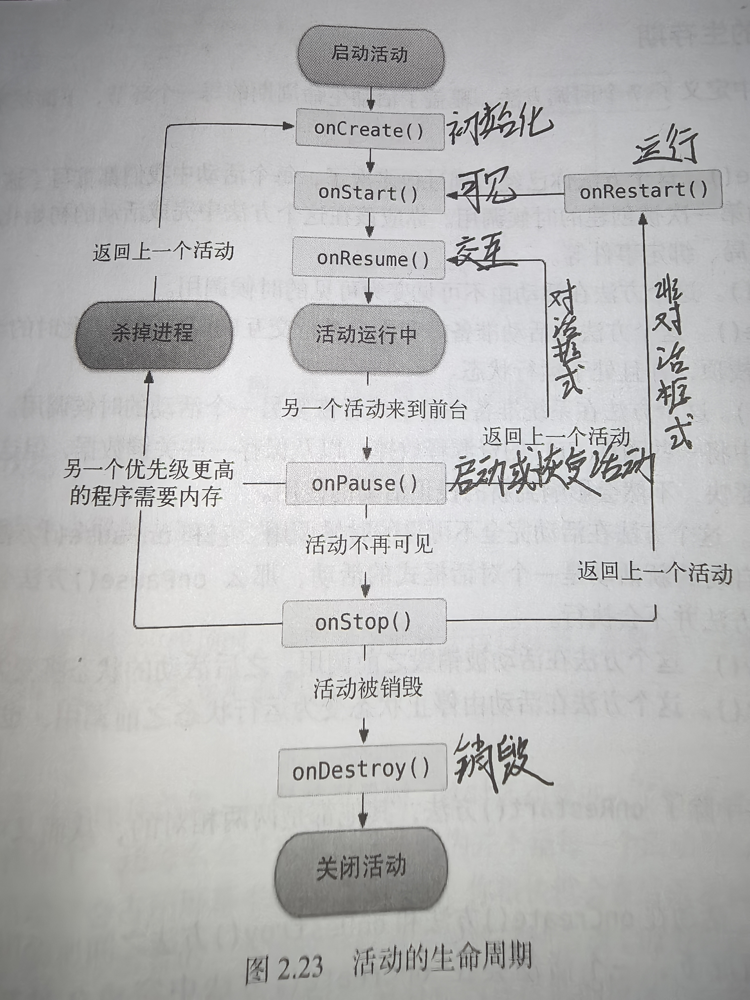
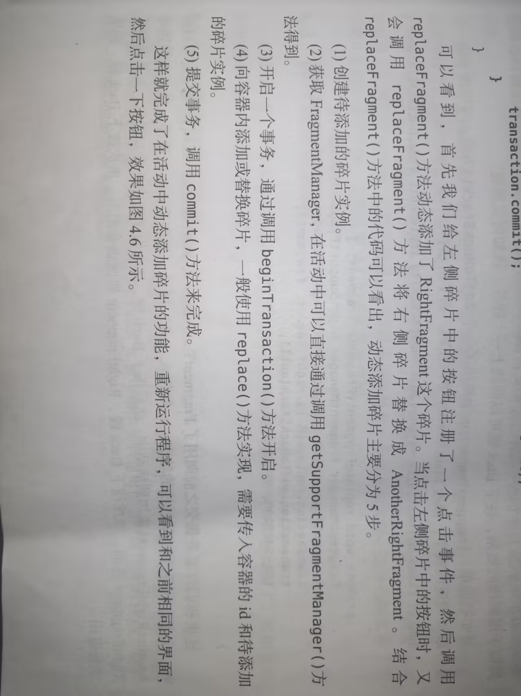
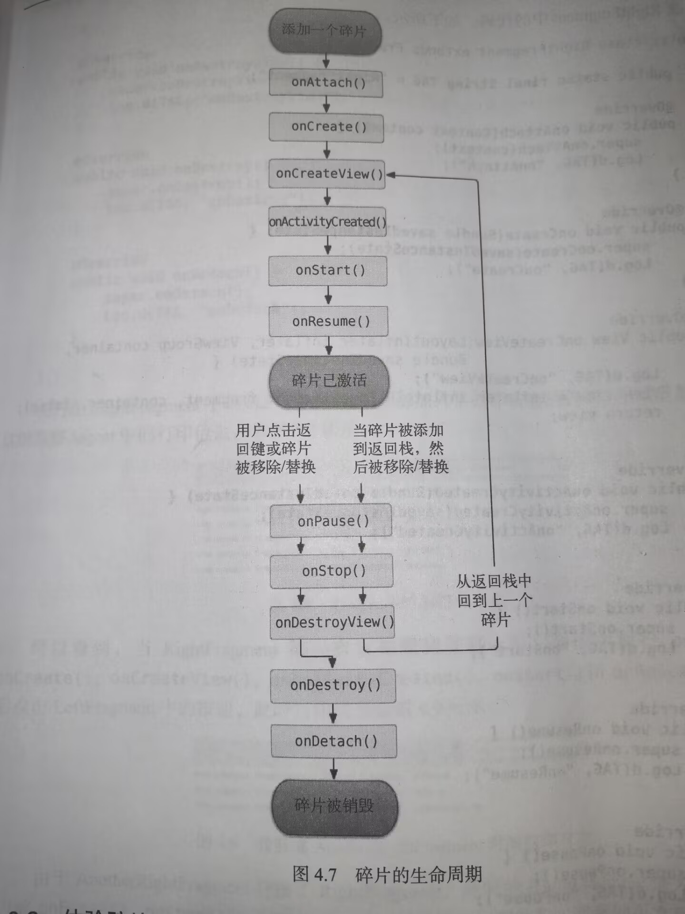
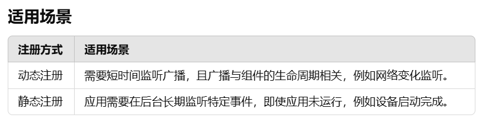
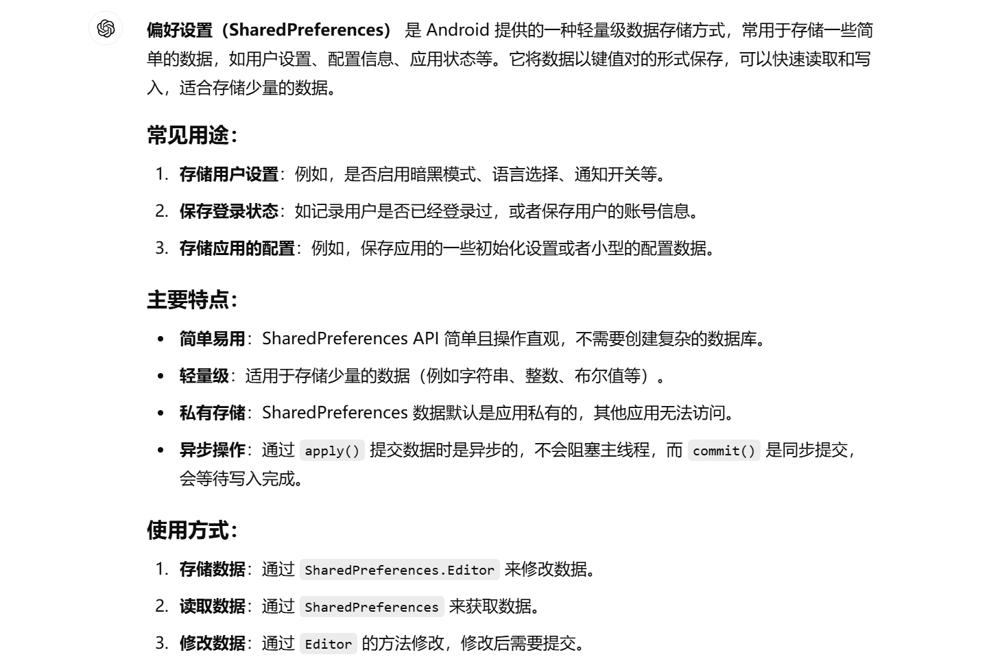
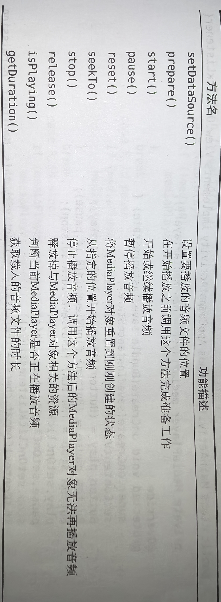
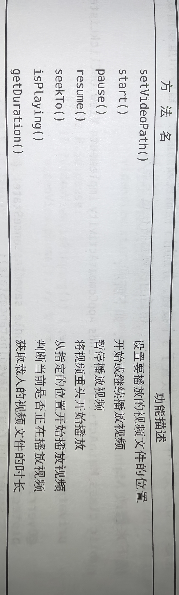
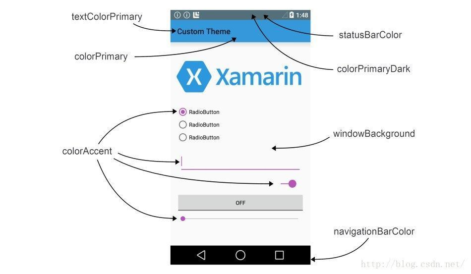

# No money out of way


## Android应用开发特色

四大组件:活动(Activity),服务(Service),广播接收器(Broadcast Receiver)和内容提供器(Content Provider)。

---


## 引入布局

~~~Java
@Override
protected void onCreate(Bundle savedInstanceState){
    super.onCreate(saveInstanceState);
    setContentView(R.layout.hello_world_layout);//引入布局
}
~~~

```java
R.string.app_name//字符串引用
R.drawable.app_name//图片引用
R.mipmap.app_name//应用图标引用
R.layout.app_name//布局文件引用
```

```xml
@string/app_name//字符串引用
@drawable/app_name//图片引用
@mipmap/app_name//应用图标引用
@layout/app_name//布局文件引用
```

---


## Log日志打印

```java
级别由高到低
Log.v()//打印繁琐意义小的日志信息
Log.d()//打印调试信息
Log.i()//打印比较重要的数据
Log.w()//打印一些警告信息
Log.e()//打印错误信息
    
private static final String TAG = "HelloWorldActivity"
Log.d("TAG", "hahaha")
//第一个tag传入类名,第二个msg传入想打印的内容
    
快捷键:logd
```

---


## 设置主活动

```xml
<intent-filter>
    <action android:name="android.intent.action.MAIN" />
    <category android:name="android.intent.category.LAUNCHER" />
</intent-filter>
```

---


## 方法重写

快捷键:Ctrl+O

---


## Toast

```java
Toast.makeText(LoginActivity.this, "登录成功啦!", Toast.LENGTH_SHORT).show();
```

---


## 菜单设置(menu)

```java
重写onCreateOptionsMenu和onOptionsItemSelected(if else)方法
```

修改themes.xml文件

```xml
<resources xmlns:tools="http://schemas.android.com/tools">
    <!-- Base application theme. -->
    <style name="Base.Theme.NoteTest" parent="Theme.MaterialComponents.DayNight.DarkActionBar">
```

---


## intent跳转活动

### 1.显式intent

```java
private Button login; 
login.setOnClickListener(new View.OnClickListener() { //登录按钮的监听器
            @Override
            public void onClick(View v) {
                    Intent intent = new Intent(LoginActivity.this, MainActivity.class);
                    startActivity(intent);  // 启动主界面活动
                    finish();  // 结束当前活动
                }
```


### 2.隐式intent

#### AndroidManifest.xml

```xml
<activity
            android:name=".SecondActivity"
            android:exported="true"
            android:launchMode="singleInstance">
            <intent-filter>
                <action android:name="com.example.activitytest.ACTION_START" /> //action
                <category android:name="android.intent.category.DEFAULT" /> //category默认附加信息
                <category android:name="com.example.activitytest.MY_CATEGORY" /> //category默认附加信息
            </intent-filter>
        </activity>
```


要同时匹配action和category才能响应该Intent

#### FirstActivity.java

```java
button1.setOnClickListener(new View.OnClickListener(){//注册监听器并调用onClick()方法
            @Override
            public void onClick(View v){  //按钮点击的方法   
                Intent intent=new Intent("com.example.activitytest.ACTION_START");
                intent.addCategory("com.example.activitytest.MY_CATEGORY");

                Intent intent=new Intent(Intent.ACTION_VIEW);
                intent.setData(Uri.parse("http://www.baidu.com")); //打开百度
               
                startActivity(intent);
            }
        });

// 匿名 new View.OnClickListener() 可被替换为 lambda
button1.setOnClickListener(v -> {
            Intent intent=new Intent("com.example.activitytest.ACTION_START");
            intent.addCategory("com.example.activitytest.MY_CATEGORY");

            Intent intent=new Intent(Intent.ACTION_VIEW);
            intent.setData(Uri.parse("http://www.baidu.com"));

            //startActivityForResult(intent,1);
            startActivity(intent);
        });
```

---


## 传递数据

```java
private EditText editText;
//onCreate方法里面添加
editText=(EditText)findViewById(R.id.edit_text) //相对应的布局
String inputText = editText.getText().toString(); //获取输入的内容
```


### 1.传出数据

```java
holder.rlContainer.setOnClickListener(v -> {
            Intent intent = new Intent(mContext, EditActivity.class);
            intent.putExtra("extra_note", note);  // 传递数据(键,真正的数据)
            mContext.startActivity(intent);
            // startActivity(intent);
        });
```

### 2.获取数据

```java
Intent intent = getIntent();  // 获取启动该活动时传递的 Intent
note = (Note) intent.getSerializableExtra("extra_note");  // 获取传递的笔记对象
```

---


## 返回数据给上一个活动

startActivityForResult方法(FirstActivity)

```java
Intent intent = new IntentFirstActivity.this, SecondActivity.class);
startActivityForResult(intent,1); //通过startActivityForResult启动活动,请求码为1
```

1.点击按钮返回数据:setResult方法(SecondActivity)

```java
holder.rlContainer.setOnClickListener(v -> {
            Intent intent = new Intent(mContext, EditActivity.class);
            intent.putExtra("note", note);  // 传递数据
            setResult(RESULT_OK, intent);
            finish();
        });
```

2.back返回数据:重写onBackPressed方法(SecondActivity)

```java
            @Override
            public void onBackPressed(){
                Intent intent=new Intent();
                intent.putExtra("data_return","Hello FirstActivity");
                setResult(RESULT_OK,intent);
                finish();
            }
```

重写onActivityResult方法(FirstActivity)

```java
@SuppressLint("MissingSuperCall")
    @Override
    protected void onActivityResult(int requestCode, int resultCode,Intent data) {
        switch (requestCode){
            case 1:
                if(resultCode==RESULT_OK){
                    String returnedData=data.getStringExtra("data_return");
                    Log.d("FirstActivity",returnedData);
                }
                break;
            default:
        }
    }
```

---


## 活动的生命周期



注:如果活动是对话框式的,要设置AndroidManifest.xml的主题

```xml
<activity android:name=".DialogActivity"
          android:theme="@style/Theme.AppCompat.Dialog.Alert">
</activity>
```


#### 活动被回收前的历史数据保存

使用onSaveInstanceState方法

---


## ProgressBar进度条

```xml	
<ProgressBar
        android:id="@+id/progressBar"
        style="?android:attr/progressBarStyle"
        android:layout_width="match_parent"
        android:layout_height="wrap_content"
        android:visibility="gone" //刚开始不显示
        />
```

```java
 // 显示 ProgressBar
                progressBar.setVisibility(View.VISIBLE);
                Intent intent=new Intent(LoginActivity.this, DialogActivity.class);
                // 888毫秒后隐藏 ProgressBar
                new Handler().postDelayed(new Runnable() {
                    @Override
                    public void run() {
                        progressBar.setVisibility(View.GONE); // 隐藏 ProgressBar
                        startActivity(intent);  // 启动主界面活动
                    }
                }, 888); // 延迟 888 毫秒
```

---


## Visibility(控件属性)

### **`visibility` 的使用场景**

#### **1. `visible`**

- 当需要正常显示视图时。
- 默认状态下所有视图都是 `visible`。

#### **2. `invisible`**

- 当需要临时隐藏视图，但又需要保留其空间时。
- 常用于占位布局或切换内容时。
- 示例：隐藏未加载的数据占位布局，避免布局重新排列。

#### **3. `gone`**

- 当需要完全移除视图，并让其他视图调整布局时。

- 常用于条件显示的内容，例如动态菜单、可选功能等。

- 示例：表单中某些字段仅在用户选择某个选项时显示。

  

---


## 布局

### 线性布局(LinearLayout)

```xml
android:orientation="vertical" //垂直排列
android:orientation="horizontal" //水平排列

android:gravity=center_vertical|center_horizontal//文字在控件中的对齐方式
android:layout_gravity="top" //控件在布局中的对齐方式

android:layout_widtn="0dp"
android:layout_weight="1"; //水平宽度占一份

android:layoutLeft="5dp" //在某个方向偏移的距离(左)
```


### 相对布局(RelativeLayout)

```xml
相对于父布局
android:layout_alignParentLeft="ture"
android:layout_alignParentRight="ture"
android:layout_alignParentBottom="ture"
android:layout_alignParentTop="ture"
android:layout_centerInParent="true"

位于控件的位置
android:layout_above="@id/button3"
android:layout_below="@id/button3"
android:layout_toLeftOf="@id/button3"
android:layout_toRightOf="@id/button3"

对齐的位置
android:layout_alignLeft="@id/button3"
android:layout_alignRight="@id/button3"
android:layout_alignBottom="@id/button3"
android:layout_alignTop="@id/button3"
```


### 帧布局(Framelayout)

默认情况下控件都位于左上角

```xml
android:layout_gravity="left"
android:layout_gravity="right"
```

#### 注:所有控件都是直接或间接继承自View的,所有的布局都是直接或间接继承自ViewGroup的,ViewGroup是一种特殊的View.


### 引入布局与自定义控件

看书!!!

---


## RecyclerView(牛逼控件)

### 1.app/build.gradle文件的dependencies闭包添加依赖库

```gradle
implementation("androidx.recyclerview:recyclerview:1.3.2")
```


### 2.在布局中添加RecyclerView控件

```xml
<androidx.recyclerview.widget.RecyclerView
     android:id="@+id/rlv"
     android:layout_width="match_parent"
     android:layout_height="match_parent"
     />

```


### 3.准备适配器

新建适配器MyAdapter并继承自RecyclerView.Adapter,泛型为RecyclerView.ViewHolder,ViewHolder是内部类

1.MyViewHolder继承RecyclerView.ViewHolder,在里面的MyViewHolder构造函数中传入参数view(布局)

2.MyAdapter构造函数赋值

3.重写onCreateViewHolder,onBindViewHolder,getItemCount()三个方法

```java
public class MyAdapter extends RecyclerView.Adapter<RecyclerView.ViewHolder> {

    private List<Note> mBeanList;  // 存储数据的列表
   
    private Context mContext;  // 上下文对象，用于访问应用资源和启动活动

    private NoteDbOpenHelper mNoteDbOpenHelper;  // 数据库帮助类，用于与数据库交互

    //private int viewType;  // 当前视图类型

    // 定义两种视图类型：线性布局和网格布局
    //public static int TYPE_LINEAR_LAYOUT = 0;
    //public static int TYPE_GRID_LAYOUT = 1;

    // 构造方法，传入上下文和数据列表
    public MyAdapter(Context context, List<Note> mBeanList){
        this.mBeanList = mBeanList;
        this.mContext = context;
        mLayoutInflater = LayoutInflater.from(mContext);  // 初始化布局膨胀器
        mNoteDbOpenHelper = new NoteDbOpenHelper(mContext);  // 初始化数据库帮助类
    }


    // 创建 ViewHolder，根据视图类型加载不同的布局
    @NonNull
    @Override
    public RecyclerView.ViewHolder onCreateViewHolder(@NonNull ViewGroup parent, int viewType) {
        if(viewType == TYPE_LINEAR_LAYOUT){
            // 加载线性布局
            View view = mLayoutInflater.inflate(R.layout.list_item_layout, parent, false);
            MyViewHolder myViewHolder = new MyViewHolder(view);
            return myViewHolder;
        }else if(viewType == TYPE_GRID_LAYOUT){
            // 加载网格布局
            View view = mLayoutInflater.inflate(R.layout.list_item_grid_layout, parent, false);
            MyGridViewHolder myGridViewHolder = new MyGridViewHolder(view);
            return myGridViewHolder;
        }
        return null;  // 默认返回 null（应该永远不会执行到）
    }

    // 绑定数据到对应的 ViewHolder
    @Override
    public void onBindViewHolder(@NonNull RecyclerView.ViewHolder holder, int position) {
        if (holder == null) {
            return;
        }
        if(holder instanceof MyViewHolder){
            // 绑定线性布局的视图
            bindMyViewHolder((MyViewHolder) holder, position);
        } else if (holder instanceof MyGridViewHolder) {
            // 绑定网格布局的视图
            bindGridViewHolder((MyGridViewHolder) holder, position);
        }
    }

    // 获取列表项数量
    @Override
    public int getItemCount() {
        return mBeanList.size();
    }

    // 线性布局的 ViewHolder
    static class MyViewHolder extends RecyclerView.ViewHolder {
        TextView mTvTitle;
        TextView mTvContent;
        TextView mTvTime;
        ViewGroup rlContainer;

        public MyViewHolder(@NonNull View itemView) {
            super(itemView);
            this.mTvTitle = itemView.findViewById(R.id.tv_title);
            this.mTvContent = itemView.findViewById(R.id.tv_content);
            this.mTvTime = itemView.findViewById(R.id.tv_time);
            this.rlContainer = itemView.findViewById(R.id.rl_item_container);
        }
    }

    // 网格布局的 ViewHolder
     static class MyGridViewHolder extends RecyclerView.ViewHolder {
        TextView mTvTitle;
        TextView mTvContent;
        TextView mTvTime;
        ViewGroup rlContainer;

        public MyGridViewHolder(@NonNull View itemView) {
            super(itemView);
            this.mTvTitle = itemView.findViewById(R.id.tv_title);
            this.mTvContent = itemView.findViewById(R.id.tv_content);
            this.mTvTime = itemView.findViewById(R.id.tv_time);
            this.rlContainer = itemView.findViewById(R.id.rl_item_container);
        }
    }
}

```


### 4.使用RecyclerView

```java
public class MainActivity extends AppCompatActivity {

    private RecyclerView mRecyclerView;  // RecyclerView 用于显示列表
    private List<Note> mNotes;  // 存储笔记数据的列表
    private MyAdapter mMyAdapter;  // RecyclerView 的适配器

    @Override
    protected void onCreate(Bundle savedInstanceState) {
        super.onCreate(savedInstanceState);
        setContentView(R.layout.activity_main);  // 设置布局文件
        initView();  // 初始化视图
        initData();  // 初始化数据
        initEvent();  // 初始化事件
    }
    
    // 根据存储的布局模式设置列表布局
    private void setListLayout() {
        currentListLayoutMode = SpfUtil.getIntWithDefault(this, KEY_LAYOUT_MODE, MODE_LINEAR);
        if (currentListLayoutMode == MODE_LINEAR) {
            setToLinearList();  // 如果是线性布局，设置为线性布局
        } else {
            setToGridList();  // 如果是网格布局，设置为网格布局
        }
    }

    // 从数据库获取笔记数据并刷新适配器
    private void refreshDataFromDb() {
        mNotes = getDataFromDB();  // 从数据库获取数据
        mMyAdapter.refreshData(mNotes);  // 刷新适配器的数据
    }

    private void initEvent() {
        mMyAdapter = new MyAdapter(this, mNotes);  // 初始化适配器
        mRecyclerView.setAdapter(mMyAdapter);  // 设置 RecyclerView 的适配器
        setListLayout();  // 设置布局模式
    }

    // 初始化数据
    private void initData() {
        mNotes = new ArrayList<>();  // 初始化笔记列表
        mNoteDbOpenHelper = new NoteDbOpenHelper(this);  // 初始化数据库帮助类
    }

    // 初始化视图
    private void initView() {
        mRecyclerView = findViewById(R.id.rlv);  // 获取 RecyclerView 控件
    }

}
```


## 5.RecyclerView的点击事件(MyAdapter)

```java
 // 设置点击事件，跳转到编辑页面
        holder.rlContainer.setOnClickListener(v -> {
            Intent intent = new Intent(mContext, EditActivity.class);
            intent.putExtra("note", note);  // 传递数据
            mContext.startActivity(intent);
        });

        // 设置长按事件，弹出弹窗
        holder.rlContainer.setOnLongClickListener(v -> {
            Dialog dialog = new Dialog(mContext, android.R.style.ThemeOverlay_Material_Dialog_Alert);
            View dialogView = mLayoutInflater.inflate(R.layout.list_item_dialog_layout, null);
            TextView tvDelete = dialogView.findViewById(R.id.tv_delete);
            TextView tvEdit = dialogView.findViewById(R.id.tv_edit);

            // 删除操作
            tvDelete.setOnClickListener(v1 -> {
                int row = mNoteDbOpenHelper.deleteFromDbById(note.getId());  // 从数据库删除
                if (row > 0) {
                    removeData(position);  // 从列表中移除
                }
                dialog.dismiss();  // 关闭对话框
            });

            // 编辑操作
            tvEdit.setOnClickListener(v2 -> {
                Intent intent = new Intent(mContext, EditActivity.class);
                intent.putExtra("note", note);  // 传递数据
                mContext.startActivity(intent);
                dialog.dismiss();  // 关闭对话框
            });

            dialog.setContentView(dialogView);  // 设置对话框内容
            dialog.setCanceledOnTouchOutside(true);  // 点击外部区域关闭对话框
            dialog.show();  // 显示对话框
            return true;
        });
    }
```

---


## 碎片(Fragment)

### 简单用法

新建left_fragment.xml和right_fragment_xml(和普通的一样)

新建LeftFragment和RightFragment类,继承自Fragment

```java
public class LeftFragment extends Fragment {
    @Nullable
    @Override
    public View onCreateView(@NonNull LayoutInflater inflater, @Nullable ViewGroup container, @Nullable Bundle savedInstanceState) {
        View view=inflater.inflate(R.layout.left_fragment,container,false);/*
1.整体功能(添加多层布局)
作用：将 R.layout.left_fragment（一个 XML 布局文件）解析为对应的 View 对象。
返回值：解析后的根视图对象（View 类型），可以用来操作 UI 元素或返回到调用者。
2. 参数解析
(1) R.layout.left_fragment
定义：指定要加载的布局文件的资源 ID，通常在 res/layout 文件夹中定义。
类型：一个整数常量（资源 ID），由 Android 在编译时生成。
作用：告诉 LayoutInflater 需要加载哪个 XML 布局文件。
(2) container
定义：ViewGroup 类型，表示布局的父容器（容器的视图层级）。
来源：通常是当前布局所在的父容器，常见于 Fragment 或 RecyclerView 中。
作用：为加载的布局提供参考信息，例如继承父容器的布局参数（如 match_parent、wrap_content 等）。
注意：如果不需要父容器的布局信息，可以传 null。
(3) false
定义：一个布尔值，表示是否将解析后的布局直接添加到父容器中。
作用：
true：LayoutInflater 会自动将解析的 View 添加到父容器中。
false：不会添加到父容器，只返回解析后的 View。
*/
        return view;
    }
}

```

修改activity_main.xml

```xml
<?xml version="1.0" encoding="utf-8"?>
<LinearLayout xmlns:android="http://schemas.android.com/apk/res/android"
    android:orientation="horizontal"
    android:layout_width="match_parent"
    android:layout_height="match_parent">

    <fragment
        android:id="@+id/left_fragment"
        android:name="com.example.fragmenttest.LeftFragment"
        android:layout_width="match_parent"
        android:layout_height="match_parent" />

    <fragment
        android:id="@+id/right_fragment"
        android:name="com.example.fragmenttest.RightFragment"
        android:layout_width="match_parent"
        android:layout_height="match_parent" />

</LinearLayout>
```


### 动态加载碎片

新建another_right_fragment.xml

```xml
<?xml version="1.0" encoding="utf-8"?>
<LinearLayout xmlns:android="http://schemas.android.com/apk/res/android"
    android:orientation="vertical"
    android:background="#ffff00"
    android:layout_width="match_parent"
    android:layout_height="match_parent">

    <TextView
        android:layout_width="wrap_content"
        android:layout_height="wrap_content"
        android:layout_gravity="center_horizontal"
        android:textSize="20sp"
        android:text="This is anothor right fragment"/>


</LinearLayout>
```


修改activity_main_xml

```xml
<?xml version="1.0" encoding="utf-8"?>
<LinearLayout xmlns:android="http://schemas.android.com/apk/res/android"
    android:orientation="horizontal"
    android:layout_width="match_parent"
    android:layout_height="match_parent">

    <fragment  <!--碎片  -->
        android:id="@+id/left_fragment"
        android:name="com.example.fragmenttest.LeftFragment"
        android:layout_width="match_parent"
        android:layout_height="match_parent" />

    <FrameLayout <!--布局  -->
        android:id="@+id/right_layout"
        android:layout_width="0dp"
        android:layout_height="match_parent"
        android:layout_weight="1">
    </FrameLayout>
    
</LinearLayout>
```


修改MainActivity

```java
public class MainActivity extends AppCompatActivity implements View.OnClickListener{

    @Override
    protected void onCreate(Bundle savedInstanceState) {
        super.onCreate(savedInstanceState);
        setContentView(R.layout.activity_main);
        Button button=(Button)findViewById(R.id.button);//不用管
        button.setOnClickListener(this);
        replaceFragment(new RightFragment());
    }

    @Override
    public void onClick(View v) {
            if(v.getId()==R.id.button){
                replaceFragment(new AnotherRightFragment());
        }
    }

    private void replaceFragment(Fragment fragment){
        FragmentManager fragmentManager=getSupportFragmentManager();
        FragmentTransaction transaction=fragmentManager.beginTransaction();
        transaction.replace(R.id.right_layout,fragment);
        transaction.addToBackStack(null); //提供返回栈
        transaction.commit();
    }
}
```




### 碎片与活动之间进行通信

#### 在活动中调用碎片里的方法

```java
// 从布局文件中获取碎片的实例
RighrFragment rightFragment = (RightFragment)getSupportFragmentManager().findFragmentById(R.id.right_fragment)
```

#### 在碎片中调用活动里的方法

```java
MainActivity activity = (MainActivity)getActivity();
```


### 碎片的生命周期



```java
左: //不提供返回栈
右:transaction.addToBackStack(null); //提供返回栈
```


### 限定符

根据设备的分辨率或屏幕的大小来决定加载哪个布局

---


## 广播

### 注册广播(动态:在代码中注册):程序启动后才能接受广播

1.新建NetworkChangeReceiver继承BroadcastReceiver,并重写onReceive

2.在onCreate中添加广播并注册

3.取消注册

```java
public class MainActivity extends AppCompatActivity {

    private IntentFilter intentFilter;
    private NetworkChangeReceiver networkChangeReceiver;
    @Override
    protected void onCreate(Bundle savedInstanceState) {
        super.onCreate(savedInstanceState);
        setContentView(R.layout.activity_main);
        intentFilter = new IntentFilter();
        intentFilter.addAction("android.net.conn.CONNECTIVITY_CHANGE"); //网络变化时系统发出该广播,我们把他添加
        networkChangeReceiver = new NetworkChangeReceiver();
        registerReceiver(networkChangeReceiver, intentFilter); //进行注册,networkChangeReceiver能接受该广播

    @Override
    protected void onDestroy() { //动态注册一定要记得取消注册
        super.onDestroy();
        unregisterReceiver(networkChangeReceiver);
    }

    class NetworkChangeReceiver extends BroadcastReceiver{ //网络发生变化onReceive得到执行

        @Override
        public void onReceive(Context context, Intent intent) {
            ConnectivityManager connectionManager=(ConnectivityManager) getSystemService(Context.CONNECTIVITY_SERVICE); //系统服务系
            NetworkInfo networkInfo=connectionManager.getActiveNetworkInfo();
            if(networkInfo!=null && networkInfo.isAvailable()){
                Toast.makeText(context,"network is available",Toast.LENGTH_SHORT).show();
            }else {
                Toast.makeText(context,"network is unavailable",Toast.LENGTH_SHORT).show();
            }
        }
    }
}
```

添加权限(AndroidManifest.xml)

```xml
<?xml version="1.0" encoding="utf-8"?>
<manifest xmlns:android="http://schemas.android.com/apk/res/android"
    xmlns:tools="http://schemas.android.com/tools">

    <uses-permission android:name="android.permission.ACCESS_NETWORK_STATE" />
```


### 注册广播(静态:在AndroidManifest.xml中注册):程序启动前可以接受广播

1.用快捷注册自动生成(包-New-Other-Broadcast Receiver-全选)

2.修改该生成的广播接收器的代码

3.在AndroidManifest.xml添加相应的action

```java
public class BootCompleteReceiver extends BroadcastReceiver {

    @Override
    public void onReceive(Context context, Intent intent) {
        Toast.makeText(context,"Boot Complete",Toast.LENGTH_LONG).show();
    }
}
```


```xml
<uses-permission android:name="android.permission.RECEIVE_BOOT_COMPLETED" />

<receiver
            android:name=".BootCompleteReceiver"
            android:enabled="true"
            android:exported="true">
            <intent-filter>
                <action android:name="android.intent.action.BOOT_COMPLETED" /> <!--系统开机发送的广播  -->
            </intent-filter>
        </receiver>
```





### 发送标准广播

1.新建MyBroadcastReceiver

2.在AndroidManifest.xml添加相应的action

3.在MainActivity发送该广播

```java
public class MyBroadcastReceiver extends BroadcastReceiver {

    @Override
    public void onReceive(Context context, Intent intent) {
        Toast.makeText(context,"received in MyBroadcastReceiver",Toast.LENGTH_SHORT).show();
    }
}
```

```xml
<receiver
            android:name=".MyBroadcastReceiver"
            android:enabled="true"
            android:exported="true">
            <intent-filter>
                <action android:name="com.example.broadcasttest.MY_BROADCAST" />
            </intent-filter>
        </receiver>
```

```java
@Override
    protected void onCreate(Bundle savedInstanceState) {
        super.onCreate(savedInstanceState);
        setContentView(R.layout.activity_main);
        Button button=(Button) findViewById(R.id.button);
        button.setOnClickListener(new View.OnClickListener() {
            @Override
            public void onClick(View v) {
                Intent intent=new Intent("com.example.broadcasttest.MY_BROADCAST");
                intent.setPackage(getPackageName());
                sendBroadcast(intent);
            }
        });
    }
```


### 发送有序广播

1.把MainActivity中的 sendBroadcast方法改成sendOrderedBroadcast方法

2.在AndroidManifest.xml里面设置广播接收器的优先级

3.允许广播继续传递abortBroadcast();


```java
@Override
    protected void onCreate(Bundle savedInstanceState) {
        super.onCreate(savedInstanceState);
        setContentView(R.layout.activity_main);
        Button button=(Button) findViewById(R.id.button);
        button.setOnClickListener(new View.OnClickListener() {
            @Override
            public void onClick(View v) {
                Intent intent=new Intent("com.example.broadcasttest.MY_BROADCAST");
                sendOrderedBroadcast(intent,null);
            }
        });
    }

```

```xml
<receiver
            android:name=".MyBroadcastReceiver"
            android:enabled="true"
            android:exported="true">
            <intent-filter android:priority="100">
                <action android:name="com.example.broadcasttest.MY_BROADCAST" />
            </intent-filter>
        </receiver>
```

```java
public class MyBroadcastReceiver extends BroadcastReceiver {

    @Override
    public void onReceive(Context context, Intent intent) {
        Toast.makeText(context,"received in MyBroadcastReceiver",Toast.LENGTH_SHORT).show();
        abortBroadcast();
    }
}
```


### 使用本地广播(在应用程序的内部传递)

注:不能静态注册

```java
public class MainActivity extends AppCompatActivity {

    // 定义广播过滤器，用于指定接收的广播类型
    private IntentFilter intentFilter;
    // 自定义的本地广播接收器
    private LocalReceiver localReceiver;
    // 本地广播管理器，用于发送和接收广播
    private LocalBroadcastManager localBroadcastManager;

    @Override
    protected void onCreate(Bundle savedInstanceState) {
        super.onCreate(savedInstanceState);
        // 设置活动的布局文件
        setContentView(R.layout.activity_main);

        // 获取本地广播管理器实例
        localBroadcastManager = LocalBroadcastManager.getInstance(this);

        // 查找布局中的按钮并设置点击事件监听器
        Button button = (Button) findViewById(R.id.button);
        button.setOnClickListener(new View.OnClickListener() {
            @Override
            public void onClick(View v) {
                // 创建一个 Intent，指定广播的 action
                Intent intent = new Intent("com.example.broadcasttest.MY_BROADCAST");
                // 通过本地广播管理器发送广播
                localBroadcastManager.sendBroadcast(intent);
            }
        });

        // 初始化广播过滤器并添加过滤的 action
        intentFilter = new IntentFilter();
        intentFilter.addAction("com.example.broadcasttest.MY_BROADCAST");

        // 初始化自定义广播接收器
        localReceiver = new LocalReceiver();
        // 注册广播接收器到本地广播管理器，并设置过滤器
        localBroadcastManager.registerReceiver(localReceiver, intentFilter);
    }

    @Override
    protected void onDestroy() {
        super.onDestroy();
        // 取消注册广播接收器，防止内存泄漏
        localBroadcastManager.unregisterReceiver(localReceiver);
    }

    // 自定义本地广播接收器类，继承自 BroadcastReceiver
    class LocalReceiver extends BroadcastReceiver {
        @Override
        public void onReceive(Context context, Intent intent) {
            // 当接收到广播时，弹出 Toast 提示用户
            Toast.makeText(context, "received local broadcast", Toast.LENGTH_SHORT).show();
        }
    }
}
```

---


## 数据储存-持久化技术

### 文件储存

注:所有的文件都是默认储存到/data/data/<package name>/files/目录下的.

#### 储存数据

1.新建save方法(可不记),运用openFileOutput接收("文件名",保存模式(强制覆盖:MODE_PRIVATE,增添追加:MODE_APPEND)),通过BufferedWriter将其写入到文件.

2.重写onDestroy(),确保活动销毁前一定会调用save方法.

```java
public class MainActivity extends AppCompatActivity {

    // 声明 EditText 控件，用于输入文本
    private EditText edit;

    // onCreate 方法：Activity 创建时调用
    @Override
    protected void onCreate(Bundle savedInstanceState) {
        super.onCreate(savedInstanceState);
        setContentView(R.layout.activity_main);  // 设置布局文件
        edit = findViewById(R.id.edit);  // 初始化 EditText 控件
    }

    // onDestroy 方法：Activity 销毁时调用
    @Override
    protected void onDestroy() {
        super.onDestroy();
        // 获取 EditText 中输入的文本
        String inputText = edit.getText().toString();
        // 调用 save 方法保存文本内容
        save(inputText);
    }

    // save 方法：保存输入的文本到文件
    public void save(String inputText) {
        FileOutputStream out = null;  // 声明文件输出流
        BufferedWriter writer = null;  // 声明缓冲写入流
        try {
            // 打开文件输出流，MODE_PRIVATE 表示私有模式，文件只能被该应用访问
            out = openFileOutput("data", Context.MODE_PRIVATE);
            // 将输出流包装成缓冲写入流，使用 UTF-8 编码
            writer = new BufferedWriter(new OutputStreamWriter(out));
            // 将输入文本写入文件
            writer.write(inputText);
        } catch (IOException e) {
            e.printStackTrace();  // 捕获并打印异常
        } finally {
            try {
                // 关闭 writer 流
                if (writer != null) {
                    writer.close();
                }
            } catch (IOException e) {
                e.printStackTrace();  // 捕获并打印关闭流时的异常
            }
        }
    }
}

```


#### 读取数据

新建load方法(可不记),运用openFileInput接收("文件名"),通过BufferedReader一行一行读取对象.

```java
public String load() {
    FileInputStream in = null;  // 声明文件输入流
    BufferedReader reader = null;  // 声明缓冲读取流
    StringBuilder content = new StringBuilder();  // 使用 StringBuilder 来存储读取的内容
    try {
        // 打开文件输入流，读取名为 "data" 的文件
        in = openFileInput("data");
        // 将文件输入流包装成缓冲读取流，使用 UTF-8 编码
        reader = new BufferedReader(new InputStreamReader(in));
        String line = "";  // 用于存储每次读取的一行内容
        // 逐行读取文件内容，直到文件结束
        while ((line = reader.readLine()) != null) {
            content.append(line);  // 将读取的每一行内容追加到 content 中
        }
    } catch (IOException e) {
        e.printStackTrace();  // 捕获并打印异常
    } finally {
        // 确保 reader 流被关闭
        if (reader != null) {
            try {
                reader.close();  // 关闭缓冲读取流
            } catch (IOException e) {
                e.printStackTrace();  // 捕获并打印关闭流时的异常
            }
        }
    }
    return content.toString();  // 返回读取到的所有内容（作为字符串）
}

```

```java
public class MainActivity extends AppCompatActivity {

    private EditText edit;

    @Override
    protected void onCreate(Bundle savedInstanceState) {
        super.onCreate(savedInstanceState);
        setContentView(R.layout.activity_main);
        edit=findViewById(R.id.edit);
        String inputText=load();
        if(!TextUtils.isEmpty(inputText)){
            edit.setText(inputText);
            edit.setSelection(inputText.length());
            Toast.makeText(this,"Restoring succeeded", Toast.LENGTH_SHORT).show();
        }
    }

    @Override
    protected void onDestroy() {
        super.onDestroy();
        String inputText=edit.getText().toString();
        save(inputText);
    }

    public void save(String inputText){
        FileOutputStream out=null;
        BufferedWriter writer=null;
        try{
            out=openFileOutput("data", Context.MODE_PRIVATE);
            writer=new BufferedWriter(new OutputStreamWriter(out));
            writer.write(inputText);
        }catch(IOException e){
            e.printStackTrace();
        }finally{
            try{
                if(writer!=null){
                    writer.close();
                }
            }catch (IOException e){
                e.printStackTrace();
            }
        }
    }

    public String load(){
        FileInputStream in=null;
        BufferedReader reader=null;
        StringBuilder content=new StringBuilder();
        try{
            in=openFileInput("data");
            reader=new BufferedReader(new InputStreamReader(in));
            String line="";
            while((line=reader.readLine())!=null){
                content.append(line);
            }
        }catch (IOException e){
            e.printStackTrace();
        }finally {
            if(reader!=null){
                try{
                    reader.close();
                }catch(IOException e){
                    e.printStackTrace();
                }
            }
        }
        return content.toString();
    }
}
```


### SharedPreferences存储(应用于偏好设置功能)

注:所有的文件都是默认储存到/data/data/<package name>/shared_prefs/目录下的.

#### 储存数据

1.用getSharedPreferences设置存放的文件名与模式(唯一).

2.调用edit()获取对象.

2.存入数据并调用apply()进行提交.

```java
@Override
protected void onCreate(Bundle savedInstanceState) {
    super.onCreate(savedInstanceState);
    setContentView(R.layout.activity_main);  // 设置布局文件

    // 获取布局文件中的 Button 控件
    Button saveData = findViewById(R.id.save_data);
    
    // 为按钮设置点击事件监听器
    saveData.setOnClickListener(v -> {
        // 获取 SharedPreferences 对象，存储在 "data" 文件中，MODE_PRIVATE 表示私有模式
        SharedPreferences.Editor editor = getSharedPreferences("data", MODE_PRIVATE).edit();
        
        // 使用 SharedPreferences.Editor 存储数据
        editor.putString("name", "Tom");  // 存储字符串数据 "name" 为 "Tom"
        editor.putInt("age", 28);  // 存储整型数据 "age" 为 28
        editor.putBoolean("married", false);  // 存储布尔值数据 "married" 为 false
        
        // 提交数据（apply() 异步提交，不会返回结果）
        editor.apply();
    });
}
```


#### 读取数据

```java
// 获取布局文件中的 Button 控件，用于恢复数据
Button restoreData = findViewById(R.id.restore_data);

// 为按钮设置点击事件监听器
restoreData.setOnClickListener(v -> {
    // 获取 SharedPreferences 对象，用于读取 "data" 文件中的数据
    SharedPreferences pref = getSharedPreferences("data", MODE_PRIVATE);

    // 从 SharedPreferences 中读取存储的数据，如果没有找到，则使用默认值
    String name = pref.getString("name", "");  // 获取 "name" 的值，默认值为空字符串
    int age = pref.getInt("age", 0);  // 获取 "age" 的值，默认值为 0
    boolean married = pref.getBoolean("married", false);  // 获取 "married" 的值，默认值为 false

    // 输出日志，打印恢复的数据
    Log.d("MainActivity", "name is " + name);  // 打印 "name" 的值
    Log.d("MainActivity", "age is " + age);  // 打印 "age" 的值
    Log.d("MainActivity", "married is " + married);  // 打印 "married" 的值
});

```

注:get( 键 , 默认值 ):键找不到对应值时就会返回默认值



---


## SQL数据库储存(结构化查询语言)

注:所有的文件都是默认储存到/data/data/<package name>/databases/目录下的.

### SQL语句

#### 1.整型:integer

#### 2.浮点型:real

#### 3.文本类型:text

#### 4.二进制型:blob

```java
// 定义一个常量 CREATE_BOOK，表示创建 Book 表的 SQL 语句
1.public static final String CREATE_BOOK = "create table Book("  // 创建一个名为 Book 的表
        + "id integer primary key autoincrement,"  // 定义 id 字段，作为主键，并设置为自增
        + "author text,"  // 定义 author 字段，类型为文本，用于存储书籍的作者名
        + "price real,"  // 定义 price 字段，类型为实数，用于存储书籍的价格
        + "pages integer,"  // 定义 pages 字段，类型为整数，用于存储书籍的页数
        + "name text)";  // 定义 name 字段，类型为文本，用于存储书籍的名称

2.private static final String CREATE_TABLE_SQL = "create table " + TABLE_NAME_NOTE + " (id integer primary key autoincrement, title text, content text, create_time text)";

//两种方法都行
```


### 创建数据库

1.新建帮助类NoteDbOpenHelper继承自SQLiteOpenHelper

2.重写构造方法

3.重写onCreate调用execSQL执行建表语句

4.重写onUpgrade

5.之后可以调用getWritableDatabase()或getReadableDatabase()获取数据库

```java
 // 构造方法，初始化数据库
    public NoteDbOpenHelper(Context context) {
        super(context, DB_NAME, null, 1);  // 数据库名称、游标工厂、版本号
    }

    // 创建数据库表
    @Override
    public void onCreate(SQLiteDatabase db) {
        db.execSQL(CREATE_TABLE_SQL);  // 执行创建表的 SQL 语句
    }

    // 更新数据库表，暂时未实现
    @Override
    public void onUpgrade(SQLiteDatabase db, int oldVersion, int newVersion) {
        // 可以在此进行数据库版本升级时的操作
    }

```


### 升级数据库

如果你在原先已经创建好数据库的基础上还想增添几类数据就需要升级数据库

```java
public class MyDatabaseHelper extends SQLiteOpenHelper {

    public static final String  CREATE_BOOK="create table Book("
            +"id integer primary key autoincrement,"
            +"author text,"
            +"price real,"
            +"pages integer,"
            +"name text)";

    public static final String CREATE_CATEGORY="create table Category("
            +"id integer primary key autoincrement,"
            +"category_name text,"
            +"category_code integer)";
    private Context mContext;

    public NoteDbOpenHelper(Context context) {
        super(context, DB_NAME, null, 2);  // 提高版本
    }

    @Override
    public void onCreate(SQLiteDatabase db) {
        db.execSQL(CREATE_BOOK);
        db.execSQL(CREATE_CATEGORY);
        Toast.makeText(mContext,"Create succeeded",Toast.LENGTH_SHORT).show();
    }

    @Override
    public void onUpgrade(SQLiteDatabase db, int oldVersion, int newVersion) {
        db.execSQL("drop table if exists Book"); // 如果存在 Book 表，则删除
        db.execSQL("drop table if exists Category"); // 如果存在 Category 表，则删除
        onCreate(db); // 重新创建表格
    }
}

```


### CRUD:  **Create（创建）**、**Read（读取）**、**Update（更新）** 和 **Delete（删除）**

### 添加数据

`insert()` 方法通常用于向数据库表中插入新的记录。在 Android 开发中，通常是通过 `SQLiteDatabase` 类的 `insert()` 方法来完成数据库操作。这个方法用于将一条新的数据插入到表中。

### 基本语法：

```java
public long insert(String table, String nullColumnHack, ContentValues values)
```

### 参数说明：

- **`table`**：表的名称，表示你要插入数据的目标表。
- **`nullColumnHack`**：如果提供了该值并且 `values` 中的某个列值为 `null`，则该列将会插入 `null`。通常如果表中允许某些列为 `NULL`，可以传入 `null`。如果没有这种需求，通常传入 `null`。
- **`values`**：`ContentValues` 对象，它存储了要插入的数据。每个键值对代表一列和该列的值。

`insert()` 方法会返回一个 `long` 类型的值，表示插入数据后的行 ID。如果插入失败，则返回 `-1`。

```java
public long insertData(Note note) {
        SQLiteDatabase db = getWritableDatabase();  // 获取可写的数据库

        ContentValues values = new ContentValues();  // 创建 ContentValues 存储插入的数据
        values.put("title", note.getTitle());  // 插入标题
        values.put("content", note.getContent());  // 插入内容
        values.put("create_time", note.getCreatedTime());  // 插入创建时间

        return db.insert(TABLE_NAME_NOTE, null, values);  // 插入数据，返回插入的行号
    }
```


### 更新数据

在 Android 中，使用 `SQLiteDatabase` 类的 `update()` 方法来更新数据库中的记录。这个方法允许你根据一定的条件（通过 `WHERE` 子句）更新指定表格中的一条或多条记录。

### 基本语法：

```java
public int update(String table, ContentValues values, String whereClause, String[] whereArgs)
```

### 参数说明：

- **`table`**：要更新的表格的名称。
- **`values`**：一个 `ContentValues` 对象，包含了要更新的列和值。每个键值对代表一列和对应的值。
- **`whereClause`**：指定更新的条件，类似于 SQL 中的 `WHERE` 子句。如果不指定该参数，所有记录都将被更新。
- **`whereArgs`**：`whereClause` 中的占位符（`?`）的实际值。是一个字符串数组，用来替代 `whereClause` 中的参数。

`update()` 方法返回一个 `int` 值，表示受影响的行数。如果没有满足条件的记录，则返回 0。

```java
    public int updateData(Note note) {
        SQLiteDatabase db = getWritableDatabase();  // 获取可写的数据库

        ContentValues values = new ContentValues();  // 创建 ContentValues 存储更新的数据
        values.put("title", note.getTitle());  // 更新标题
        values.put("content", note.getContent());  // 更新内容
        values.put("create_time", note.getCreatedTime());  // 更新创建时间

        return db.update(TABLE_NAME_NOTE, values, "id like ?", new String[]{note.getId()});  // 执行更新操作
    }
/* like也可以改成=
id = ?：用于 精确匹配，适用于已知具体值时。
id like ?：用于 模糊匹配，适用于需要匹配部分值、前缀或后缀时。
如果你只希望更新 id 为某个特定值的记录，建议使用 id = ?。如果你希望根据某个模式进行匹配，则可以使用 id LIKE ?。*/
```


### 删除数据

在 Android 中，使用 `SQLiteDatabase` 类的 `delete()` 方法可以删除数据库表中的一条或多条记录。这个方法允许你根据条件删除特定的记录，或者删除整个表中的所有记录。

### 基本语法

```
public int delete(String table, String whereClause, String[] whereArgs)
```

### 参数说明：

- **`table`**：要删除数据的表名。
- **`whereClause`**：删除的条件（类似于 SQL 中的 `WHERE` 子句），只有符合条件的记录才会被删除。如果为 `null`，将删除表中所有记录。
- **`whereArgs`**：`whereClause` 中占位符（`?`）的实际值。它是一个字符串数组，用来替代 `whereClause` 中的参数。如果没有条件需要传入，通常可以传入 `null`。

`delete()` 方法返回一个 `int` 值，表示实际删除的行数。如果没有符合条件的记录被删除，返回 `0`。

```java
public int deleteFromDbById(String id) {
        SQLiteDatabase db = getWritableDatabase();  // 获取可写的数据库
        return db.delete(TABLE_NAME_NOTE, "id like ?", new String[]{id});  // 执行删除操作
    }
```


### 查询数据

在 Android 中，`SQLiteDatabase` 类的 `query()` 方法用于从数据库表中检索数据。通过 `query()` 方法，我们可以指定查询的表、要查询的列、查询的条件、排序方式等参数，以便灵活地从数据库中获取所需的数据。

### 基本语法：

```
public Cursor query(String table, String[] columns, String selection,
                    String[] selectionArgs, String groupBy, String having, String orderBy)
```

### 参数说明：

- **`table`**：要查询的表名。
- **`columns`**：要返回的列名数组。可以指定要查询的具体列，若为 `null`，表示查询所有列。
- **`selection`**：查询条件，相当于 SQL 中的 `WHERE` 子句。可以为 `null`，表示没有条件（即返回所有记录）。
- **`selectionArgs`**：`selection` 中占位符（`?`）的实际值，必须与 `selection` 中的 `?` 占位符一一对应。如果没有占位符，传入 `null`。
- **`groupBy`**：对查询结果进行分组的列名数组，通常与 `GROUP BY` 子句结合使用。如果不需要分组，可以传入 `null`。
- **`having`**：分组后筛选的条件，相当于 SQL 中的 `HAVING` 子句。如果不需要筛选分组后的数据，可以传入 `null`。
- **`orderBy`**：排序方式，相当于 SQL 中的 `ORDER BY` 子句。如果为 `null`，则不进行排序。

### 返回值：

`query()` 方法返回一个 `Cursor` 对象，它包含了查询的结果。通过 `Cursor`，你可以逐行遍历查询结果并获取每一行的数据。

```java
// 根据标题模糊查询笔记
public List<Note> queryFromDbByTitle(String title) {
    // 如果传入的 title 为 null 或空字符串，返回所有笔记
    if (TextUtils.isEmpty(title)) {
        return queryAllFromDb();  // 调用 queryAllFromDb() 方法返回所有笔记
    }

    // 获取可写的数据库对象，用于执行查询操作
    SQLiteDatabase db = getWritableDatabase();

    // 创建一个空的笔记列表，用于存放查询结果
    List<Note> noteList = new ArrayList<>();

    // 使用 query() 方法执行 SQL 查询，查询 title 字段包含传入 title 的笔记记录
    // "%" + title + "%" 用于模糊匹配，即查询所有标题中包含传入 title 字符串的记录
    Cursor cursor = db.query(TABLE_NAME_NOTE, null, "title like ?", new String[]{"%" + title + "%"}, null, null, null);

    // 如果 cursor 不为空，说明查询到了一些结果
    if (cursor != null) {
        // 遍历查询结果，每次移动到下一行
        while (cursor.moveToNext()) {
            // 使用 getColumnIndex() 获取列索引，使用索引来获取对应列的值
            @SuppressLint("Range") 
            String id = cursor.getString(cursor.getColumnIndex("id"));  // 获取 id 字段的值
            @SuppressLint("Range") 
            String title2 = cursor.getString(cursor.getColumnIndex("title"));  // 获取 title 字段的值
            @SuppressLint("Range") 
            String content = cursor.getString(cursor.getColumnIndex("content"));  // 获取 content 字段的值
            @SuppressLint("Range") 
            String createTime = cursor.getString(cursor.getColumnIndex("create_time"));  // 获取 create_time 字段的值

            // 创建一个新的 Note 对象，并将查询结果设置为 Note 对象的属性
            Note note = new Note();
            note.setId(id);
            note.setTitle(title2);
            note.setContent(content);
            note.setCreatedTime(createTime);

            // 将 Note 对象添加到 noteList 列表中
            noteList.add(note);
        }
        // 查询完成后关闭 cursor 以释放资源
        cursor.close();
    }

    // 返回包含所有匹配标题的笔记对象的列表
    return noteList;
}

```


### SQL语法

[SQL](https://blog.csdn.net/Innocence_0/article/details/132438303?fromshare=blogdetail&sharetype=blogdetail&sharerId=132438303&sharerefer=PC&sharesource=hqw11111&sharefrom=from_link "一个垃圾的搜索引擎")

```java
SQLiteDatabase db = this.getWritableDatabase();
String sql = "INSERT INTO Book (name, author) VALUES ('Book Name', 'Author Name')";
db.execSQL(sql);
db.close();
```

---


## 内容提供器

Android的内容提供器（Content Provider）是四大组件之一，用于在不同应用间共享数据。它提供统一的接口，允许应用访问或修改其他应用的数据，同时保护数据安全。

#### 主要功能

1. **数据共享**：支持应用间共享数据，如联系人、短信等。
2. **数据访问**：通过URI标识数据，使用ContentResolver进行查询、插入、更新和删除操作。
3. **数据安全**：通过权限控制保护数据访问。

#### 核心类

- **ContentProvider**：基类，需实现增删改查等方法。
- **ContentResolver**：用于与ContentProvider交互。
- **Uri**：标识数据，格式为`content://authority/path/id`。

#### 使用步骤

1. **定义ContentProvider**：继承并实现必要方法。
2. **声明Provider**：在`AndroidManifest.xml`中注册。
3. **访问数据**：通过ContentResolver操作数据。


### 在程序运行时申请权限(危险权限)

1.在activity_main.xml设置一个按钮

2.在MainActivity运用隐式intent(导入android.Manifest)

3.在AndroidManifest.xml添加权限

```java
import android.Manifest;

public class MainActivity extends AppCompatActivity {
    @Override
    protected void onCreate(Bundle savedInstanceState) {
        super.onCreate(savedInstanceState);
        // 设置布局文件
        setContentView(R.layout.activity_main);
        // 获取布局中的按钮
        Button makeCall = findViewById(R.id.make_call);
        // 设置按钮的点击事件
        makeCall.setOnClickListener(v -> {
            // 检查是否已经授予拨打电话的权限
            if (ContextCompat.checkSelfPermission(MainActivity.this, Manifest.permission.CALL_PHONE) != PackageManager.PERMISSION_GRANTED) {
                // 如果没有权限，请求权限 ContextCompat.checkSelfPermission(Context,权限名)
                ActivityCompat.requestPermissions(MainActivity.this, new String[]{Manifest.permission.CALL_PHONE}, 1);
/*方法签名
public static void requestPermissions(Activity activity, String[] permissions, int requestCode);
参数说明：
activity:当前活动的 Activity 实例。
通常是 this 或 MainActivity.this。

permissions:需要请求的权限数组。
例如：new String[]{Manifest.permission.CALL_PHONE}。

requestCode:请求的唯一标识码（自定义整数）。
用于在 onRequestPermissionsResult 中区分不同的权限请求。*/
            } else {
                // 如果已经有权限，直接拨打电话
                call();
            }
        });
    }
    
    // 拨打电话的方法
    private void call() {
        try {
            // 创建一个拨打电话的Intent
            Intent intent = new Intent(Intent.ACTION_CALL);
            // 设置拨打的电话号码
            intent.setData(Uri.parse("tel:10086"));
            // 启动拨打电话的Activity
            startActivity(intent);
        } catch (SecurityException e) {
            // 捕获权限异常并打印堆栈信息
            e.printStackTrace();
        }
    }

    // 处理权限请求结果的回调方法
    @Override
    public void onRequestPermissionsResult(int requestCode, @NonNull String[] permissions, @NonNull int[] grantResults, int deviceId) {
        switch (requestCode) {
            case 1:
                // 检查是否授予了拨打电话的权限
                if (grantResults.length > 0 && grantResults[0] == PackageManager.PERMISSION_GRANTED) {
                    // 如果授予了权限，拨打电话
                    call();
                } else {
                    // 如果拒绝了权限，显示提示信息
                    Toast.makeText(this, "You denied the permission", Toast.LENGTH_SHORT).show();
                }
                break;
            default:
                // 其他情况不做处理
                break;
        }
    }
}
```

```xml
 <uses-feature
        android:name="android.hardware.telephony"
        android:required="false" />
    <uses-permission android:name="android.permission.CALL_PHONE"/>
```


### 访问其他程序中的数据

### ContentResolver用法

`ContentResolver` 是 Android 中用于访问内容提供器（Content Provider）数据的核心类。它充当应用程序与内容提供器之间的桥梁，允许应用程序通过 URI 查询、插入、更新和删除其他应用程序提供的数据。

------

### 核心功能

1. **查询数据**：通过 `query()` 方法从内容提供器中获取数据。
2. **插入数据**：通过 `insert()` 方法向内容提供器中添加数据。
3. **更新数据**：通过 `update()` 方法修改内容提供器中的数据。
4. **删除数据**：通过 `delete()` 方法从内容提供器中删除数据。

------

### 使用步骤

1. **获取 ContentResolver 实例**
   通过 `getContentResolver()` 方法获取 `ContentResolver` 实例。
2. **定义 URI**
   URI 是访问内容提供器中数据的唯一标识符。格式通常为：
   `content://<authority>/<path>/<id>`
   例如：
   - 访问联系人数据：`content://com.android.contacts/contacts`
   - 访问媒体文件：`content://media/external/images/media`
3. **操作数据**
   使用 `ContentResolver` 的方法（如 `query()`、`insert()`、`update()`、`delete()`）操作数据。

------

### 示例代码

#### 1. 查询数据

以下示例演示如何查询联系人数据：

```java
import android.database.Cursor;
import android.net.Uri;
import android.os.Bundle;
import android.provider.ContactsContract;
import androidx.appcompat.app.AppCompatActivity;

public class MainActivity extends AppCompatActivity {

    @Override
    protected void onCreate(Bundle savedInstanceState) {
        super.onCreate(savedInstanceState);

        // 1. 定义 URI，访问联系人数据
        Uri uri = ContactsContract.Contacts.CONTENT_URI;

        // 2. 定义要查询的列
        String[] projection = new String[]{
                ContactsContract.Contacts._ID,           // 联系人 ID
                ContactsContract.Contacts.DISPLAY_NAME,  // 联系人名称
                ContactsContract.Contacts.HAS_PHONE_NUMBER // 是否有电话号码
        };

        // 3. 定义查询条件（可选）
        String selection = ContactsContract.Contacts.HAS_PHONE_NUMBER + " = ?"; // 查询有电话号码的联系人
        String[] selectionArgs = new String[]{"1"}; // 查询条件参数

        // 4. 定义排序方式（可选）
        String sortOrder = ContactsContract.Contacts.DISPLAY_NAME + " ASC"; // 按名称升序排序

        // 5. 获取 ContentResolver 实例并执行查询
        Cursor cursor = getContentResolver().query(uri, projection, selection, selectionArgs, sortOrder);

        // 6. 处理查询结果
        if (cursor != null) {
            while (cursor.moveToNext()) {
                // 获取联系人 ID、名称和是否有电话号码
                String id = cursor.getString(cursor.getColumnIndex(ContactsContract.Contacts._ID));
                String name = cursor.getString(cursor.getColumnIndex(ContactsContract.Contacts.DISPLAY_NAME));
                int hasPhoneNumber = cursor.getInt(cursor.getColumnIndex(ContactsContract.Contacts.HAS_PHONE_NUMBER));

                System.out.println("ID: " + id + ", Name: " + name + ", Has Phone: " + (hasPhoneNumber == 1 ? "Yes" : "No"));
            }
            // 7. 关闭游标
            cursor.close();
        }
    }
}
```

------

#### 2. 插入数据

以下示例演示如何向媒体库插入一张图片：

```java
import android.content.ContentValues;
import android.net.Uri;
import android.os.Bundle;
import android.provider.MediaStore;
import androidx.appcompat.app.AppCompatActivity;

public class MainActivity extends AppCompatActivity {

    @Override
    protected void onCreate(Bundle savedInstanceState) {
        super.onCreate(savedInstanceState);

        // 定义 URI，访问媒体库
        Uri uri = MediaStore.Images.Media.EXTERNAL_CONTENT_URI;

        // 创建 ContentValues 对象，存储要插入的数据
        ContentValues values = new ContentValues();
        values.put(MediaStore.Images.Media.DISPLAY_NAME, "my_image.jpg");
        values.put(MediaStore.Images.Media.MIME_TYPE, "image/jpeg");
        values.put(MediaStore.Images.Media.RELATIVE_PATH, "Pictures/MyApp");

        // 插入数据
        Uri insertedUri = getContentResolver().insert(uri, values);

        if (insertedUri != null) {
            System.out.println("Image inserted at: " + insertedUri.toString());
        } else {
            System.out.println("Failed to insert image.");
        }
    }
}
```

------

#### 3. 更新数据

以下示例演示如何更新联系人名称：

```java
import android.content.ContentValues;
import android.net.Uri;
import android.os.Bundle;
import android.provider.ContactsContract;
import androidx.appcompat.app.AppCompatActivity;

public class MainActivity extends AppCompatActivity {

    @Override
    protected void onCreate(Bundle savedInstanceState) {
        super.onCreate(savedInstanceState);

        // 定义 URI，指定要更新的联系人
        Uri uri = Uri.withAppendedPath(ContactsContract.Contacts.CONTENT_URI, "1"); // 更新 ID 为 1 的联系人

        // 创建 ContentValues 对象，存储要更新的数据
        ContentValues values = new ContentValues();
        values.put(ContactsContract.Contacts.DISPLAY_NAME, "New Name");

        // 更新数据
        int rowsUpdated = getContentResolver().update(uri, values, null, null);

        if (rowsUpdated > 0) {
            System.out.println("Contact updated successfully.");
        } else {
            System.out.println("Failed to update contact.");
        }
    }
}
```

------

#### 4. 删除数据

以下示例演示如何删除联系人：

```java
import android.net.Uri;
import android.os.Bundle;
import android.provider.ContactsContract;
import androidx.appcompat.app.AppCompatActivity;

public class MainActivity extends AppCompatActivity {

    @Override
    protected void onCreate(Bundle savedInstanceState) {
        super.onCreate(savedInstanceState);

        // 定义 URI，指定要删除的联系人
        Uri uri = Uri.withAppendedPath(ContactsContract.Contacts.CONTENT_URI, "1"); // 删除 ID 为 1 的联系人

        // 删除数据
        int rowsDeleted = getContentResolver().delete(uri, null, null);

        if (rowsDeleted > 0) {
            System.out.println("Contact deleted successfully.");
        } else {
            System.out.println("Failed to delete contact.");
        }
    }
}
```

------

### 关键点

1. **URI**
   URI 是访问内容提供器中数据的唯一标识符。不同的内容提供器有不同的 URI。

2. **权限**
   访问某些内容提供器（如联系人、媒体库）需要在 `AndroidManifest.xml` 中声明权限。例如：

   ```xml
   <uses-permission android:name="android.permission.READ_CONTACTS" />
   <uses-permission android:name="android.permission.WRITE_CONTACTS" />
   <uses-permission android:name="android.permission.READ_EXTERNAL_STORAGE" />
   <uses-permission android:name="android.permission.WRITE_EXTERNAL_STORAGE" />
   ```

   运行 HTML

3. **游标管理**
   使用 `Cursor` 查询数据后，务必调用 `cursor.close()` 关闭游标，避免内存泄漏。

4. **线程安全**
   `ContentResolver` 的操作通常是同步的，建议在子线程中执行耗时操作（如查询大量数据）。


### 创建内容提供器

1.新建Myprovider继承自ContentProvider,并重写6个方法

2.借助UriMatcher匹配内容内容URI

3.AndroidManifest.xml会自动注册

以下是 `ContentProvider` 的 6 个核心方法及其作用：

### 1. **onCreate()**

- **作用**：在 `ContentProvider` 创建时调用，用于执行初始化操作（如打开数据库连接）。

- **调用时机**：当 `ContentProvider` 第一次被访问时调用。

- **返回值**：`boolean`，表示 `ContentProvider` 是否初始化成功。

- **示例**：

  ```java
  @Override
  public boolean onCreate() {
      // 初始化数据库连接
      dbHelper = new MyDatabaseHelper(getContext());
      return true; // 返回 true 表示 ContentProvider 初始化成功
  }
  ```

------

### 2. **query()**

- **作用**：查询数据，返回一个 `Cursor` 对象。

- **参数**：

  - `uri`：数据的 URI，用于指定要查询的数据源。
  - `projection`：要查询的列（字段）数组。
  - `selection`：查询条件，类似于 SQL 中的 `WHERE` 子句。
  - `selectionArgs`：查询条件的参数值。
  - `sortOrder`：排序方式，类似于 SQL 中的 `ORDER BY` 子句。

- **返回值**：`Cursor`，包含查询结果。

- **示例**：

  ```java
  @Override
  public Cursor query(Uri uri, String[] projection, String selection, String[] selectionArgs, String sortOrder) {
      // 获取一个可读的SQLiteDatabase实例
      SQLiteDatabase db = dbHelper.getReadableDatabase();
      
      // 执行查询操作，查询"my_table"表，并根据传入的参数筛选、排序结果
      Cursor cursor = db.query("my_table", projection, selection, selectionArgs, null, null, sortOrder);
      
      // 设置内容通知URI，允许内容观察者在数据发生变化时收到通知
      cursor.setNotificationUri(getContext().getContentResolver(), uri);
      
      // 返回查询结果的Cursor对象
      return cursor;
  }
  
  ```

------

### 3. **insert()**

- **作用**：插入新数据，返回新插入数据的 URI。

- **参数**：

  - `uri`：数据的 URI，用于指定要插入的数据源。
  - `values`：要插入的数据，封装在 `ContentValues` 对象中。

- **返回值**：`Uri`，表示新插入数据的 URI。

- **示例**：

  ```java
  @Override
  public Uri insert(Uri uri, ContentValues values) {
      // 获取可写的SQLiteDatabase实例
      SQLiteDatabase db = dbHelper.getWritableDatabase();
      
      // 插入数据到数据库表"my_table"中，并获取插入的行ID
      long id = db.insert("my_table", null, values);
      
      // 如果插入成功（id大于0），则构造新插入数据的URI
      if (id > 0) {
          // 使用ContentUris.withAppendedId()为插入的记录生成一个唯一的URI
          Uri newUri = ContentUris.withAppendedId(uri, id);
          
          // 通知内容观察者该URI的数据已经发生变化
          getContext().getContentResolver().notifyChange(newUri, null);
          
          // 返回新插入数据的URI
          return newUri;
      }
      
      // 如果插入失败，抛出异常
      throw new SQLException("Failed to insert row into " + uri);
  }
  
  ```

------

### 4. **update()**

- **作用**：更新数据，返回受影响的行数。

- **参数**：

  - `uri`：数据的 URI，用于指定要更新的数据源。
  - `values`：要更新的数据，封装在 `ContentValues` 对象中。
  - `selection`：更新条件，类似于 SQL 中的 `WHERE` 子句。
  - `selectionArgs`：更新条件的参数值。

- **返回值**：`int`，表示受影响的行数。

- **示例**：

  ```java
  @Override
  public int update(Uri uri, ContentValues values, String selection, String[] selectionArgs) {
      // 获取可写的SQLiteDatabase实例，以便对数据库进行更新操作
      SQLiteDatabase db = dbHelper.getWritableDatabase();
      
      // 执行更新操作，将数据表"my_table"中符合条件的行更新为新的值
      int rowsUpdated = db.update("my_table", values, selection, selectionArgs);
      
      // 如果更新操作影响了至少一行数据，通知内容观察者数据已变化
      if (rowsUpdated > 0) {
          getContext().getContentResolver().notifyChange(uri, null);
      }
      
      // 返回更新的行数
      return rowsUpdated;
  }
  
  ```

------

### 5. **delete()**

- **作用**：删除数据，返回被删除的行数。

- **参数**：

  - `uri`：数据的 URI，用于指定要删除的数据源。
  - `selection`：删除条件，类似于 SQL 中的 `WHERE` 子句。
  - `selectionArgs`：删除条件的参数值。

- **返回值**：`int`，表示被删除的行数。

- **示例**：

  ```java
  @Override
  public int delete(Uri uri, String selection, String[] selectionArgs) {
      // 获取可写的SQLiteDatabase实例，以便对数据库进行删除操作
      SQLiteDatabase db = dbHelper.getWritableDatabase();
      
      // 执行删除操作，删除表"my_table"中符合条件的行
      int rowsDeleted = db.delete("my_table", selection, selectionArgs);
      
      // 如果删除操作影响了至少一行数据，通知内容观察者数据已变化
      if (rowsDeleted > 0) {
          getContext().getContentResolver().notifyChange(uri, null);
      }
      
      // 返回删除的行数
      return rowsDeleted;
  }
  
  ```

------

### 6. **getType()**

- **作用**：返回指定 URI 对应的 MIME 类型。

- **参数**：

  - `uri`：数据的 URI。

- **返回值**：`String`，表示 MIME 类型。

- **MIME 类型格式**：

  - 单条数据：`vnd.android.cursor.item/vnd.<authority>.<path>`
  - 多条数据：`vnd.android.cursor.dir/vnd.<authority>.<path>`

- **示例**：

  ```java
  @Override
  public String getType(Uri uri) {
      // 如果 URI 的最后一个路径段为空，返回表示多条数据的 MIME 类型
      if (uri.getLastPathSegment() == null) {
          return "vnd.android.cursor.dir/vnd.com.example.provider.my_table";
      } else {
          // 否则，返回表示单条数据的 MIME 类型
          return "vnd.android.cursor.item/vnd.com.example.provider.my_table";
      }
  }
  
  ```

------

### 完整示例

以下是一个简单的 `ContentProvider` 实现示例：

```java
import android.content.ContentProvider;
import android.content.ContentUris;
import android.content.ContentValues;
import android.content.UriMatcher;
import android.database.Cursor;
import android.database.sqlite.SQLiteDatabase;
import android.net.Uri;

public class MyContentProvider extends ContentProvider {

    // 定义 ContentProvider 的授权标识（authority），通常是应用的包名
    private static final String AUTHORITY = "com.example.provider";

    // 定义数据表的路径
    private static final String PATH = "my_table";

    // 定义 ContentProvider 的 URI，格式为：content://<authority>/<path>
    public static final Uri CONTENT_URI = Uri.parse("content://" + AUTHORITY + "/" + PATH);

    // 定义 URI 匹配码
    private static final int ITEMS = 1;      // 匹配多条数据
    private static final int ITEM_ID = 2;    // 匹配单条数据

    // 创建 UriMatcher 对象，用于匹配 URI
    private static final UriMatcher uriMatcher = new UriMatcher(UriMatcher.NO_MATCH);
    static {
        // 添加 URI 匹配规则
        uriMatcher.addURI(AUTHORITY, PATH, ITEMS); // 匹配 content://com.example.provider/my_table
        uriMatcher.addURI(AUTHORITY, PATH + "/#", ITEM_ID); // 匹配content://com.example.provider/my_table/1
    }

    // 数据库帮助类对象，用于管理数据库的创建和版本控制
    private MyDatabaseHelper dbHelper;

    // ContentProvider 初始化方法
    @Override
    public boolean onCreate() {
        // 初始化数据库帮助类
        dbHelper = new MyDatabaseHelper(getContext());
        return true; // 返回 true 表示初始化成功
    }

    // 查询数据
    @Override
    public Cursor query(Uri uri, String[] projection, String selection, String[] selectionArgs, String sortOrder) {
        // 获取可读数据库
        SQLiteDatabase db = dbHelper.getReadableDatabase();
        Cursor cursor;

        // 根据 URI 匹配码执行不同的查询逻辑
        switch (uriMatcher.match(uri)) {
            case ITEMS:
                // 查询整个表
                cursor = db.query("my_table", projection, selection, selectionArgs, null, null, sortOrder);
                break;
            case ITEM_ID:
                // 查询单条数据，根据 ID 查询
                cursor = db.query("my_table", projection, "_id=?", new String[]{uri.getLastPathSegment()}, null, null, sortOrder);
                break;
            default:
                // 如果 URI 不匹配，抛出异常
                throw new IllegalArgumentException("Unknown URI: " + uri);
        }

        // 设置通知 URI，当数据变化时通知监听器
        cursor.setNotificationUri(getContext().getContentResolver(), uri);
        return cursor; // 返回查询结果
    }

    // 插入数据
    @Override
    public Uri insert(Uri uri, ContentValues values) {
        // 获取可写数据库
        SQLiteDatabase db = dbHelper.getWritableDatabase();
        // 插入数据并返回新行的 ID
        long id = db.insert("my_table", null, values);

        if (id > 0) {
            // 构造新插入数据的 URI
            Uri newUri = ContentUris.withAppendedId(CONTENT_URI, id);
            // 通知数据变化
            getContext().getContentResolver().notifyChange(newUri, null);
            return newUri; // 返回新插入数据的 URI
        }
        // 插入失败，抛出异常
        throw new IllegalArgumentException("Failed to insert row into " + uri);
    }

    // 更新数据
    @Override
    public int update(Uri uri, ContentValues values, String selection, String[] selectionArgs) {
        // 获取可写数据库
        SQLiteDatabase db = dbHelper.getWritableDatabase();
        // 更新数据并返回受影响的行数
        int rowsUpdated = db.update("my_table", values, selection, selectionArgs);

        if (rowsUpdated > 0) {
            // 通知数据变化
            getContext().getContentResolver().notifyChange(uri, null);
        }
        return rowsUpdated; // 返回受影响的行数
    }

    // 删除数据
    @Override
    public int delete(Uri uri, String selection, String[] selectionArgs) {
        // 获取可写数据库
        SQLiteDatabase db = dbHelper.getWritableDatabase();
        // 删除数据并返回被删除的行数
        int rowsDeleted = db.delete("my_table", selection, selectionArgs);

        if (rowsDeleted > 0) {
            // 通知数据变化
            getContext().getContentResolver().notifyChange(uri, null);
        }
        return rowsDeleted; // 返回被删除的行数
    }

    // 返回指定 URI 对应的 MIME 类型
    @Override
    public String getType(Uri uri) {
        // 根据 URI 匹配码返回不同的 MIME 类型
        switch (uriMatcher.match(uri)) {
            case ITEMS:
                // 多条数据的 MIME 类型
                return "vnd.android.cursor.dir/vnd.com.example.provider.my_table";
            case ITEM_ID:
                // 单条数据的 MIME 类型
                return "vnd.android.cursor.item/vnd.com.example.provider.my_table";
            default:
                // 如果 URI 不匹配，抛出异常
                throw new IllegalArgumentException("Unknown URI: " + uri);
        }
    }
}
```

------

### 总结

`ContentProvider` 的 6 个核心方法分别是：

1. `onCreate()`：初始化。
2. `query()`：查询数据。
3. `insert()`：插入数据。
4. `update()`：更新数据。
5. `delete()`：删除数据。
6. `getType()`：返回 MIME 类型。

通过实现这些方法，可以创建一个功能完整的 `ContentProvider`，用于在 Android 应用中共享数据。

---


## 手机多媒体

### 通知(进阶)

1.创建通知通道并请求通知权限

2.用getSystemService()获取一个NotificationManager对通知进行管理

3.创建Notification对象并进行一些基础设置

4.用notify()显示通知

```java

/**
 * 演示通知功能的主活动类
 */
public class MainActivity extends AppCompatActivity implements View.OnClickListener {

    @Override
    protected void onCreate(Bundle savedInstanceState) {
        super.onCreate(savedInstanceState);
        // 加载布局文件
        setContentView(R.layout.activity_main);

        // 创建通知通道（仅在 Android 8.0 及以上版本需要）
        createNotificationChannel();

        // 获取按钮控件并绑定点击事件
        Button sendNotice = findViewById(R.id.send_notice);
        sendNotice.setOnClickListener(this);
    }

    @Override
    public void onClick(View v) {
        // 判断是否是发送通知按钮被点击
        if (v.getId() == R.id.send_notice) {
            try {
                // 创建一个Intent，用于在通知被点击时启动NotificationActivity
                Intent intent = new Intent(this, NotificationActivity.class);
                // 创建一个PendingIntent，作为通知的点击动作
                PendingIntent pi = PendingIntent.getActivity(this, 0, intent, PendingIntent.FLAG_UPDATE_CURRENT);

                // 获取通知管理器实例
                NotificationManager manager = (NotificationManager) getSystemService(NOTIFICATION_SERVICE);

                // 构建通知对象
                Notification notification = new NotificationCompat.Builder(this, "default_channel_id")
                        // 设置通知标题
                        .setContentTitle("This is content title")
                        // 设置通知内容
                        .setContentText("Learn how to build notifications, send and sync data, and use voice actions. Get the official Android IDE and developer tools to build apps for Android.")
                        // 设置通知时间
                        .setWhen(System.currentTimeMillis())
                        // 设置小图标
                        .setSmallIcon(R.mipmap.ic_launcher)
                        // 设置大图标
                        .setLargeIcon(BitmapFactory.decodeResource(getResources(), R.mipmap.ic_launcher))
                        // 设置通知点击的Intent
                        .setContentIntent(pi)
                        // 设置自动取消通知
                        .setAutoCancel(true)
                        // 设置默认通知声音、震动、灯光
                        .setDefaults(NotificationCompat.DEFAULT_ALL)
                        // 使用大文本样式
                        .setStyle(new NotificationCompat.BigTextStyle().bigText("Learn how to build notifications, send and" +
                                "sync data, and use voice actions,Get the official Android IDE and developer tools to build apps for Android."))
                        // 设置通知优先级
                        .setPriority(NotificationCompat.PRIORITY_MAX)
                        // 构建通知对象
                        .build();

                // 处理 Android 13 及以上版本的 POST_NOTIFICATIONS 权限
                if (Build.VERSION.SDK_INT >= Build.VERSION_CODES.TIRAMISU) {
                    if (ContextCompat.checkSelfPermission(MainActivity.this, Manifest.permission.POST_NOTIFICATIONS) != PackageManager.PERMISSION_GRANTED) {
                        // 如果没有权限，请求权限
                        ActivityCompat.requestPermissions(MainActivity.this, new String[]{Manifest.permission.POST_NOTIFICATIONS}, 1);
                    } else {
                        // 如果有权限，发送通知
                        manager.notify(1, notification);
                    }
                } else {
                    // Android 13 以下版本直接发送通知
                    manager.notify(1, notification);
                }
            } catch (Exception e) {
                // 捕获并处理异常
                e.printStackTrace();
                Toast.makeText(this, "发送通知失败： " + e.getMessage(), Toast.LENGTH_LONG).show();
            }
        }
    }

    @Override
    public void onRequestPermissionsResult(int requestCode, @NonNull String[] permissions, @NonNull int[] grantResults) {
        super.onRequestPermissionsResult(requestCode, permissions, grantResults);
        // 获取通知管理器实例
        NotificationManager manager = (NotificationManager) getSystemService(NOTIFICATION_SERVICE);

        try {
            // 重新构建通知对象（与 onClick 中相同）
            Notification notification = new NotificationCompat.Builder(this, "default_channel_id")
                    .setContentTitle("This is content title")
                    .setContentText("Learn how to build notifications, send and sync data, and use voice actions. Get the official Android IDE and developer tools to build apps for Android.")
                    .setWhen(System.currentTimeMillis())
                    .setSmallIcon(R.mipmap.ic_launcher)
                    .setLargeIcon(BitmapFactory.decodeResource(getResources(), R.mipmap.ic_launcher))
                    .setAutoCancel(true)
                    .setDefaults(NotificationCompat.DEFAULT_ALL)
                    .setStyle(new NotificationCompat.BigTextStyle().bigText("Learn how to build notifications, send and" +
                            "sync data, and use voice actions,Get the official Android IDE and developer tools to build apps for Android."))
                    .setPriority(NotificationCompat.PRIORITY_MAX)
                    .build();

            // 根据请求码处理权限请求结果
            switch (requestCode) {
                case 1:
                    // 处理 POST_NOTIFICATIONS 权限请求结果
                    if (grantResults.length > 0 && grantResults[0] == PackageManager.PERMISSION_GRANTED) {
                        // 权限授予，发送通知
                        manager.notify(1, notification);
                    } else {
                        // 权限被拒绝，显示提示信息
                        Toast.makeText(this, "You denied the permission", Toast.LENGTH_SHORT).show();
                    }
                    break;
                default:
                    // 处理其他请求码
                    break;
            }
        } catch (Exception e) {
            // 捕获并处理异常
            e.printStackTrace();
            Toast.makeText(this, "发送通知失败： " + e.getMessage(), Toast.LENGTH_LONG).show();
        }
    }

    /**
     * 创建通知通道（仅在 Android 8.0 及以上版本需要）
     * 通知通道用于分组和管理不同的通知
     */
    private void createNotificationChannel() {
        if (Build.VERSION.SDK_INT >= Build.VERSION_CODES.O) {
            // 创建一个 NotificationChannel 对象
            NotificationChannel channel = new NotificationChannel(
                    "default_channel_id", // 通道 ID
                    "Default Channel",    // 通道名称
                    NotificationManager.IMPORTANCE_DEFAULT // 重要性级别
            );
            // 获取通知管理器实例
            NotificationManager manager = (NotificationManager) getSystemService(NOTIFICATION_SERVICE);
            // 创建通知通道
            manager.createNotificationChannel(channel);
        }
    }
}
```

```java
public class NotificationActivity extends AppCompatActivity {

    @Override
    protected void onCreate(Bundle savedInstanceState) {
        super.onCreate(savedInstanceState);
        setContentView(R.layout.notification_layout);

    }
}
```

```xml
<uses-permission android:name="android.permission.POST_NOTIFICATIONS" />
    <uses-permission android:name="android.permission.VIBRATE"/>
```


### 调用摄像头拍照

1.设置Button和ImageView控件

2.申请相机权限,创建File对象存放在SD卡的应用关联缓存目录下

3.把File转换为Uri,被内容提供器FileProvider通过getUriForFile()接收

4.构建intent启动相机

5.重写onActivityResult处理结果

6.在AndroidManifest.xml注册内容提供器,声明权限

7.在xml目录下创建file_paths.xml共享路径

```xml
<?xml version="1.0" encoding="utf-8"?>
<LinearLayout xmlns:android="http://schemas.android.com/apk/res/android"
    xmlns:app="http://schemas.android.com/apk/res-auto"
    xmlns:tools="http://schemas.android.com/tools"
    android:id="@+id/main"
    android:orientation="vertical"
    android:layout_width="match_parent"
    android:layout_height="match_parent"
    tools:context=".MainActivity">

    <Button
        android:id="@+id/take_photo"
        android:layout_width="match_parent"
        android:layout_height="wrap_content"
        android:text="Take Photo"/>

    <ImageView
        android:id="@+id/picture"
        android:layout_width="wrap_content"
        android:layout_height="wrap_content"
        android:layout_gravity="center_horizontal"/>

</LinearLayout>
```


```java
/**
 * 主活动类，实现了拍照和从相册选择图片的功能
 */
public class MainActivity extends AppCompatActivity {

    // 日志标签，用于日志输出
    public static final String TAG = "MainActivity";

    // 请求拍照的常量
    public static final int TAKE_PHOTO = 1;

    // 权限请求码
    public static final int REQUEST_PERMISSION = 2;

    // 用于显示图片的ImageView
    private ImageView picture;

    // 用于保存图片的Uri
    private Uri imageUri;

    @Override
    protected void onCreate(Bundle savedInstanceState) {
        super.onCreate(savedInstanceState);
        // 加载布局文件
        setContentView(R.layout.activity_main);

        // 获取控件实例
        Button takePhoto = findViewById(R.id.take_photo);
        Button chooseFromAlbum = findViewById(R.id.choose_from_album);
        picture = findViewById(R.id.picture);

        // 检查相机权限
        if (ContextCompat.checkSelfPermission(this, Manifest.permission.CAMERA) != PackageManager.PERMISSION_GRANTED) {
            // 如果没有权限，请求相机权限
            ActivityCompat.requestPermissions(this, new String[]{Manifest.permission.CAMERA}, REQUEST_PERMISSION);
            Log.d(TAG, "onCreate: 请求相机权限");
        }

        // 检查设备是否具备相机功能
        if (!getPackageManager().hasSystemFeature(PackageManager.FEATURE_CAMERA_ANY)) {
            // 如果设备没有相机，显示提示信息并返回
            Toast.makeText(this, "设备没有相机功能", Toast.LENGTH_SHORT).show();
            return;
        }

        // 设置拍照按钮的点击事件监听器
        takePhoto.setOnClickListener(v -> {
            // 创建一个文件用于保存拍摄的图片
            File outputImage = new File(getExternalCacheDir(), "output_image.jpg");
            try {
                if (outputImage.exists()) {
                    // 如果文件已存在，删除旧文件
                    outputImage.delete();
                }
                // 创建新文件
                outputImage.createNewFile();
            } catch (IOException e) {
                // 捕获并打印异常
                e.printStackTrace();
            }

            // 根据Android版本适配Uri的获取方式
            if (Build.VERSION.SDK_INT >= 24) {
                // Android 7.0及以上版本，使用FileProvider获取Uri
                Log.d(TAG, "onCreate: 3");
                imageUri = FileProvider.getUriForFile(MainActivity.this, "com.example.cameraalbumtest.fileprovider", outputImage);
            } else {
                // 旧版本直接使用Uri.fromFile()
                imageUri = Uri.fromFile(outputImage);
            }

            // 创建Intent启动相机应用
            Intent intent = new Intent("android.media.action.IMAGE_CAPTURE");
            // 将拍照保存路径传递给相机应用
            intent.putExtra(MediaStore.EXTRA_OUTPUT, imageUri);
            // 启动相机并等待结果
            startActivityForResult(intent, TAKE_PHOTO);
        });

    /**
     * 处理拍照和选择图片的结果
     * @param requestCode 请求码，用于区分不同的操作
     * @param resultCode 结果码，表示操作的结果
     * @param data 返回的数据，包含图片信息
     */
    @SuppressLint("MissingSuperCall")
    @Override
    protected void onActivityResult(int requestCode, int resultCode, Intent data) {
        // 确保返回的是拍照结果
        if (requestCode == TAKE_PHOTO) {
            // 如果拍照成功
            if (resultCode == RESULT_OK) {
                try {
                    // 使用 BitmapFactory.Options 缩放图片，避免内存溢出
                    BitmapFactory.Options options = new BitmapFactory.Options();
                    options.inSampleSize = 4; // 设置缩放比例，减少内存消耗
                    // 从Uri中获取图片并转换为Bitmap
                    Bitmap bitmap = BitmapFactory.decodeStream(getContentResolver().openInputStream(imageUri), null, options);
                    // 设置Bitmap到ImageView中显示
                    picture.setImageBitmap(bitmap);
                } catch (FileNotFoundException e) {
                    // 捕获文件未找到异常
                    e.printStackTrace();
                }
            }
        } 
    }

    /**
     * 处理权限请求的结果
     * @param requestCode 请求码
     * @param permissions 请求的权限数组
     * @param grantResults 权限授予结果数组
     */
    @Override
    public void onRequestPermissionsResult(int requestCode, String[] permissions, int[] grantResults) {
        super.onRequestPermissionsResult(requestCode, permissions, grantResults);
        // 如果请求的是相机权限
        if (requestCode == REQUEST_PERMISSION) {
            // 判断权限是否被授予
            if (grantResults.length > 0 && grantResults[0] == PackageManager.PERMISSION_GRANTED) {
                // 权限授予，提示用户
                Toast.makeText(this, "相机权限已授予", Toast.LENGTH_SHORT).show();
            } else {
                // 权限被拒绝，提示用户
                Toast.makeText(this, "相机权限被拒绝", Toast.LENGTH_SHORT).show();
            }
        } else if (requestCode == 1) {
            // 如果请求的是存储权限
            if (grantResults.length > 0 && grantResults[0] == PackageManager.PERMISSION_GRANTED) {
                // 权限授予，打开相册
                openAlbum();
            } else {
                // 权限被拒绝，提示用户
                Toast.makeText(this, "存储权限被拒绝，无法打开相册", Toast.LENGTH_SHORT).show();
            }
        }
    }
}
```

```xml
<uses-permission android:name="android.permission.CAMERA" />
    <uses-feature android:name="android.hardware.camera" />
    <uses-feature android:name="android.hardware.camera.autofocus" />
    <uses-permission android:name="android.permission.WRITE_EXTERNAL_STORAGE" />
    <uses-permission android:name="android.permission.READ_EXTERNAL_STORAGE" />


<!-- 声明一个内容提供者，用于在应用程序之间安全地共享文件 -->
<provider
    android:name="androidx.core.content.FileProvider"
    <!-- 指定内容提供者的类名，这里使用的是FileProvider -->
    android:authorities="com.example.cameraalbumtest.fileprovider"
    <!-- 定义内容提供者的authority，用于唯一标识这个provider，通常使用应用包名加上自定义后缀 -->
    android:exported="false"
    <!-- 设置provider是否可以被其他应用访问，这里设置为false，表示只有当前应用可以访问 -->
    android:grantUriPermissions="true">
    <!-- 设置是否允许共享URI权限，true表示允许其他应用访问指定的文件 -->
    <meta-data
        android:name="android.support.FILE_PROVIDER_PATHS"
        <!-- 指定meta-data的名称，这里使用FILE_PROVIDER_PATHS，用于FileProvider的路径配置 -->
        android:resource="@xml/file_paths" />
    <!-- 指定文件路径的配置文件，@xml/file_paths表示文件路径在res/xml/file_paths.xml中定义 -->
</provider>
```

```xml

<?xml version="1.0" encoding="utf-8"?>
<!-- 定义文件路径的根元素 -->
<paths xmlns:android="http://schemas.android.com/apk/res/android">
    <!-- 定义一个外部存储路径 -->
    <external-path
        name="my_images" <!-- 路径的名称，用于在应用中引用该路径 -->
        path="." /> <!-- 路径的位置，此处表示外部存储的根目录 -->
</paths>
```


### 从相册中选择图片

1.申请权限

2.创建并调用openAlum()方法

3.重写onActivityResult处理结果

4.针对不同图片格式进行不同操作

```java
/**
 * 主活动类，实现了拍照和从相册选择图片的功能
 */
public class MainActivity extends AppCompatActivity {

    // 日志标签，用于日志输出
    public static final String TAG = "MainActivity";

    // 请求拍照的常量
    public static final int TAKE_PHOTO = 1;

    // 权限请求码
    public static final int REQUEST_PERMISSION = 2;

    // 从相册选择图片的请求码
    public static final int CHOOSE_PHOTO = 3;

    // 用于显示图片的ImageView
    private ImageView picture;

    // 用于保存图片的Uri
    private Uri imageUri;

    @Override
    protected void onCreate(Bundle savedInstanceState) {
        super.onCreate(savedInstanceState);
        // 加载布局文件
        setContentView(R.layout.activity_main);

        // 获取控件实例
        Button takePhoto = findViewById(R.id.take_photo);
        Button chooseFromAlbum = findViewById(R.id.choose_from_album);
        picture = findViewById(R.id.picture);

        // 设置从相册选择图片按钮的点击事件监听器
        chooseFromAlbum.setOnClickListener(v -> {
            // 检查存储读取权限
            if (ContextCompat.checkSelfPermission(MainActivity.this, Manifest.permission.WRITE_EXTERNAL_STORAGE) != PackageManager.PERMISSION_GRANTED) {
                // 如果没有权限，请求权限
                ActivityCompat.requestPermissions(MainActivity.this, new String[]{Manifest.permission.WRITE_EXTERNAL_STORAGE}, 1);
            } else {
                // 如果有权限，打开相册
                openAlbum();
            }
        });
    }

    /**
     * 打开相册，选择图片
     */
    private void openAlbum() {
        Intent intent = new Intent("android.intent.action.GET_CONTENT");
        // 设置类型为图片
        intent.setType("image/*");
        // 启动相册并等待结果
        startActivityForResult(intent, CHOOSE_PHOTO);
    }

    /**
     * 处理拍照和选择图片的结果
     * @param requestCode 请求码，用于区分不同的操作
     * @param resultCode 结果码，表示操作的结果
     * @param data 返回的数据，包含图片信息
     */
    @SuppressLint("MissingSuperCall")
    @Override
    protected void onActivityResult(int requestCode, int resultCode, Intent data) {
        // 确保返回的是拍照结果
        if (requestCode == TAKE_PHOTO) {
            // 如果拍照成功
            if (resultCode == RESULT_OK) {
                try {
                    // 使用 BitmapFactory.Options 缩放图片，避免内存溢出
                    BitmapFactory.Options options = new BitmapFactory.Options();
                    options.inSampleSize = 4; // 设置缩放比例，减少内存消耗
                    // 从Uri中获取图片并转换为Bitmap
                    Bitmap bitmap = BitmapFactory.decodeStream(getContentResolver().openInputStream(imageUri), null, options);
                    // 设置Bitmap到ImageView中显示
                    picture.setImageBitmap(bitmap);
                } catch (FileNotFoundException e) {
                    // 捕获文件未找到异常
                    e.printStackTrace();
                }
            }
        } else if (requestCode == CHOOSE_PHOTO) {
            // 如果是从相册选择图片的结果
            if (resultCode == RESULT_OK) {
                // 根据Android版本处理图片
                if (Build.VERSION.SDK_INT >= 19) {
                    handleImageOnKitKat(data);
                } else {
                    handleImageBeforeKitKat(data);
                }
            }
        }
    }

    /**
     * 处理权限请求的结果
     * @param requestCode 请求码
     * @param permissions 请求的权限数组
     * @param grantResults 权限授予结果数组
     */
    @Override
    public void onRequestPermissionsResult(int requestCode, String[] permissions, int[] grantResults) {
        super.onRequestPermissionsResult(requestCode, permissions, grantResults);
        // 如果请求的是相机权限
        if (requestCode == REQUEST_PERMISSION) {
            // 判断权限是否被授予
            if (grantResults.length > 0 && grantResults[0] == PackageManager.PERMISSION_GRANTED) {
                // 权限授予，提示用户
                Toast.makeText(this, "相机权限已授予", Toast.LENGTH_SHORT).show();
            } else {
                // 权限被拒绝，提示用户
                Toast.makeText(this, "相机权限被拒绝", Toast.LENGTH_SHORT).show();
            }
        } else if (requestCode == 1) {
            // 如果请求的是存储权限
            if (grantResults.length > 0 && grantResults[0] == PackageManager.PERMISSION_GRANTED) {
                // 权限授予，打开相册
                openAlbum();
            } else {
                // 权限被拒绝，提示用户
                Toast.makeText(this, "存储权限被拒绝，无法打开相册", Toast.LENGTH_SHORT).show();
            }
        }
    }

    /**
     * 处理Android 4.4及以上版本的图片选择结果
     * @param data 包含图片信息的Intent
     */
    @TargetApi(19)
    private void handleImageOnKitKat(Intent data) {
        String imagePath = null;
        Uri uri = data.getData();
        if (DocumentsContract.isDocumentUri(this, uri)) {
            String docId = DocumentsContract.getDocumentId(uri);
            if ("com.android.providers.media.documents".equals(uri.getAuthority())) {
                // 处理媒体库中的图片
                String id = docId.split(":")[1];
                String selection = MediaStore.Images.Media._ID + "=" + id;
                imagePath = getImagePath(MediaStore.Images.Media.EXTERNAL_CONTENT_URI, selection);
            } else if ("com.android.providers.downloads.documents".equals(uri.getAuthority())) {
                // 处理下载目录中的图片
                Uri contentUri = ContentUris.withAppendedId(Uri.parse("content://downloads/public_downloads"), Long.valueOf(docId));
                imagePath = getImagePath(contentUri, null);
            }
        } else if ("content".equalsIgnoreCase(uri.getScheme())) {
            // 处理内容提供者中的图片
            imagePath = getImagePath(uri, null);
        } else if ("file".equalsIgnoreCase(uri.getScheme())) {
            // 处理文件路径中的图片
            imagePath = uri.getPath();
        }
        displayImage(imagePath);
    }

    /**
     * 处理Android 4.4以下版本的图片选择结果
     * @param data 包含图片信息的Intent
     */
    private void handleImageBeforeKitKat(Intent data) {
        Uri uri = data.getData();
        String imagePath = getImagePath(uri, null);
        displayImage(imagePath);
    }

    /**
     * 获取图片路径
     * @param uri 图片的Uri
     * @param selection 查询条件
     * @return 图片路径
     */
    @SuppressLint("Range")
    private String getImagePath(Uri uri, String selection) {
        String path = null;
        Cursor cursor = getContentResolver().query(uri, null, selection, null, null);
        if (cursor != null) {
            if (cursor.moveToFirst()) {
                path = cursor.getString(cursor.getColumnIndex(MediaStore.Images.Media.DATA));
            }
            cursor.close();
        }
        return path;
    }

    /**
     * 显示图片
     * @param imagePath 图片路径
     */
    private void displayImage(String imagePath) {
        if (imagePath != null) {
            // 将图片文件解码为Bitmap
            Bitmap bitmap = BitmapFactory.decodeFile(imagePath);
            // 显示Bitmap到ImageView中
            picture.setImageBitmap(bitmap);
        } else {
            Toast.makeText(this, "failed to get image", Toast.LENGTH_SHORT).show();
        }
    }
}
```


### 播放音频

1.创造一个MediaPlayer对象

2.动态申请权限

3.调用initMediaPlayer()进行初始化



```xml
<?xml version="1.0" encoding="utf-8"?>
<LinearLayout xmlns:android="http://schemas.android.com/apk/res/android"
    xmlns:app="http://schemas.android.com/apk/res-auto"
    xmlns:tools="http://schemas.android.com/tools"
    android:id="@+id/main"
    android:orientation="vertical"
    android:layout_width="match_parent"
    android:layout_height="match_parent"
    tools:context=".MainActivity">

    <Button
        android:id="@+id/play"
        android:layout_width="match_parent"
        android:layout_height="wrap_content"
        android:text="Play"/>

    <Button
        android:id="@+id/pause"
        android:layout_width="match_parent"
        android:layout_height="wrap_content"
        android:text="Pause"/>

    <Button
        android:id="@+id/stop"
        android:layout_width="match_parent"
        android:layout_height="wrap_content"
        android:text="Stop"/>

</LinearLayout>
```

```java
/**
 * MainActivity类，负责控制音频播放。
 */
public class MainActivity extends AppCompatActivity implements View.OnClickListener {

    // MediaPlayer对象，用于播放音频。
    private MediaPlayer mediaPlayer = new MediaPlayer();

    @Override
    protected void onCreate(Bundle savedInstanceState) {
        super.onCreate(savedInstanceState);
        setContentView(R.layout.activity_main);

        // 获取控件。
        Button play = (Button) findViewById(R.id.play);
        Button pause = (Button) findViewById(R.id.pause);
        Button stop = (Button) findViewById(R.id.stop);

        // 为控件设置点击监听器。
        play.setOnClickListener(this);
        pause.setOnClickListener(this);
        stop.setOnClickListener(this);

        // 检查是否有写外部存储权限，如果没有，则请求权限。
        if (ContextCompat.checkSelfPermission(MainActivity.this, Manifest.permission.WRITE_EXTERNAL_STORAGE) != PackageManager.PERMISSION_GRANTED) {
            ActivityCompat.requestPermissions(MainActivity.this, new String[]{Manifest.permission.WRITE_EXTERNAL_STORAGE}, 1);
        } else {
            // 如果有权限，则初始化MediaPlayer。
            initMediaPlayer();
        }
    }

    /**
     * 初始化MediaPlayer，设置音频文件路径和准备播放。
     */
    private void initMediaPlayer() {
        try {
            // 获取外部存储目录下的音频文件。
            File file = new File(Environment.getExternalStorageDirectory(), "music.mp3");
            // 设置音频文件路径。
            mediaPlayer.setDataSource(file.getPath());
            // 准备播放。
            mediaPlayer.prepare();
        } catch (Exception e) {
            // 如果发生异常，则打印异常信息。
            e.printStackTrace();
        }
    }

    @Override
    public void onRequestPermissionsResult(int requestCode, @NonNull String[] permissions, @NonNull int[] grantResults) {
        super.onRequestPermissionsResult(requestCode, permissions, grantResults);
        switch (requestCode) {
            case 1:
                // 如果用户同意了权限请求，则初始化MediaPlayer。
                if (grantResults.length > 0 && grantResults[0] == PackageManager.PERMISSION_GRANTED) {
                    initMediaPlayer();
                } else {
                    // 如果用户拒绝了权限请求，则提示用户无法使用程序。
                    Toast.makeText(this, "拒绝权限将无法使用程序", Toast.LENGTH_SHORT).show();
                    finish();
                }
                break;
            default:
        }
    }

    @Override
    public void onClick(View v) {
        // 根据点击的控件ID执行相应的操作。
        if (v.getId() == R.id.play) {
            // 如果点击的是播放按钮，则开始播放音频。
            if (!mediaPlayer.isPlaying()) {
                mediaPlayer.start();
            }
        } else if (v.getId() == R.id.pause) {
            // 如果点击的是暂停按钮，则暂停播放音频。
            if (mediaPlayer.isPlaying()) {
                mediaPlayer.pause();
            }
        } else if (v.getId() == R.id.stop) {
            // 如果点击的是停止按钮，则停止播放音频并重新初始化MediaPlayer。
            if (mediaPlayer.isPlaying()) {
                mediaPlayer.reset();
                initMediaPlayer();
            }
        }
    }

    @Override
    protected void onDestroy() {
        super.onDestroy();
        // 在程序销毁时释放MediaPlayer资源。
        if (mediaPlayer != null) {
            mediaPlayer.release();
        }
    }
}
```


### 播放视频

1.创造一个VideoView对象

2.动态申请权限

3.调用initVideoPath()进行初始化



```xml
<?xml version="1.0" encoding="utf-8"?>
<LinearLayout xmlns:android="http://schemas.android.com/apk/res/android"
    xmlns:app="http://schemas.android.com/apk/res-auto"
    xmlns:tools="http://schemas.android.com/tools"
    android:id="@+id/main"
    android:layout_width="match_parent"
    android:layout_height="match_parent"
    android:orientation="vertical"
    tools:context=".MainActivity">

    <LinearLayout
        android:layout_width="match_parent"
        android:layout_height="wrap_content">

        <Button
            android:id="@+id/play"
            android:layout_width="0dp"
            android:layout_height="wrap_content"
            android:layout_weight="1"
            android:text="Play"/>

        <Button
            android:id="@+id/pause"
            android:layout_width="0dp"
            android:layout_height="wrap_content"
            android:layout_weight="1"
            android:text="Pause"/>

        <Button
            android:id="@+id/replay"
            android:layout_width="0dp"
            android:layout_height="wrap_content"
            android:layout_weight="1"
            android:text="Replay"/>
    </LinearLayout>

    <VideoView
        android:id="@+id/video_view"
        android:layout_width="match_parent"
        android:layout_height="wrap_content"/>

</LinearLayout>
```


```java
/**
 * 主活动类，继承自AppCompatActivity，实现OnClickListener接口
 * 用于播放视频的基本操作：播放、暂停、重新播放
 */
public class MainActivity extends AppCompatActivity implements View.OnClickListener {

    // 声明VideoView控件，用于播放视频
    private VideoView videoView;

    @Override
    protected void onCreate(Bundle savedInstanceState) {
        super.onCreate(savedInstanceState);
        // 加载布局文件
        setContentView(R.layout.activity_main);

        // 初始化VideoView控件
        videoView = (VideoView) findViewById(R.id.video_view);

        // 初始化播放按钮
        Button play = (Button) findViewById(R.id.play);
        // 初始化暂停按钮
        Button pause = (Button) findViewById(R.id.pause);
        // 初始化重新播放按钮
        Button replay = (Button) findViewById(R.id.replay);

        // 为按钮设置点击事件监听器
        play.setOnClickListener(this);
        pause.setOnClickListener(this);
        replay.setOnClickListener(this);

        // 检查写入外部存储的权限
        if (ContextCompat.checkSelfPermission(MainActivity.this, Manifest.permission.WRITE_EXTERNAL_STORAGE) != PackageManager.PERMISSION_GRANTED) {
            // 如果没有权限，请求权限
            ActivityCompat.requestPermissions(MainActivity.this, new String[]{Manifest.permission.WRITE_EXTERNAL_STORAGE}, 1);
        } else {
            // 如果有权限，初始化视频路径
            initVideoPath();
        }
    }

    /**
     * 初始化视频文件路径
     * 从外部存储目录中查找名为movie.mp4的视频文件，并设置给VideoView
     */
    private void initVideoPath() {
        // 获取外部存储目录中的movie.mp4文件
        File file = new File(Environment.getExternalStorageDirectory(), "movie.mp4");
        // 设置视频路径到VideoView
        videoView.setVideoPath(file.getPath());
    }

    /**
     * 处理权限请求的回调
     * @param requestCode 请求码
     * @param permissions 请求的权限数组
     * @param grantResults 权限授予结果数组
     * @param deviceId 设备ID（这里未使用）
     */
    @Override
    public void onRequestPermissionsResult(int requestCode, @NonNull String[] permissions, @NonNull int[] grantResults, int deviceId) {
        switch (requestCode) {
            case 1:
                // 处理写入外部存储权限的结果
                if (grantResults.length > 0 && grantResults[0] == PackageManager.PERMISSION_GRANTED) {
                    // 如果权限授予，初始化视频路径
                    initVideoPath();
                } else {
                    // 如果权限拒绝，显示提示并结束活动
                    Toast.makeText(this, "拒绝权限将无法使用程序", Toast.LENGTH_SHORT).show();
                    finish();
                }
                break;
            default:
                // 处理其他请求码
        }
    }

    /**
     * 处理按钮点击事件
     * @param v 被点击的视图
     */
    @Override
    public void onClick(View v) {
        if (v.getId() == R.id.play) {
            // 播放按钮点击事件
            if (!videoView.isPlaying()) {
                // 如果没有在播放，开始播放
                videoView.start();
            }
        } else if (v.getId() == R.id.pause) {
            // 暂停按钮点击事件
            if (videoView.isPlaying()) {
                // 如果正在播放，暂停播放
                videoView.pause();
            }
        } else if (v.getId() == R.id.replay) {
            // 重新播放按钮点击事件
            if (videoView.isPlaying()) {
                // 如果正在播放，恢复播放
                videoView.resume();
            }
        }
    }

    /**
     * 活动销毁时的回调
     * 释放资源，避免内存泄漏
     */
    @Override
    protected void onDestroy() {
        super.onDestroy();
        if (videoView != null) {
            // 停止视频播放并释放资源
            videoView.suspend();
        }
    }
}
```

---


## WebView的用法

可以用WebView嵌入一个游览器

1.在activity_main.xml导入WebView控件

2.在MainActivity获取实例,并用getSettings设置属性

3.用setWebViewClient使目标网页在WebView显示

4.加入权限并加开http的读取(也可以直接使用更稳定的https连接)

```xml
<?xml version="1.0" encoding="utf-8"?>
<LinearLayout xmlns:android="http://schemas.android.com/apk/res/android"
    xmlns:app="http://schemas.android.com/apk/res-auto"
    xmlns:tools="http://schemas.android.com/tools"
    android:id="@+id/main"
    android:layout_width="match_parent"
    android:layout_height="match_parent"
    tools:context=".MainActivity">

    <WebView
        android:id="@+id/web_view"
        android:layout_width="match_parent"
        android:layout_height="match_parent"/>

</LinearLayout>
```

```java
public class MainActivity extends AppCompatActivity {

    @Override
    protected void onCreate(Bundle savedInstanceState) {
        super.onCreate(savedInstanceState);
        setContentView(R.layout.activity_main);
        WebView webView =(WebView) findViewById(R.id.web_view);
        webView.getSettings().setJavaScriptEnabled(true); // 让WebView支持JavaScript脚本
        webView.setWebViewClient(new WebViewClient()); // 使目标网页在WebView显示
        webView.loadUrl("https://www.baidu.com/");
    }
}
```

```xml
<manifest xmlns:android="http://schemas.android.com/apk/res/android"
    xmlns:tools="http://schemas.android.com/tools">
    <uses-permission android:name="android.permission.INTERNET"/>

    <application
        android:usesCleartextTraffic="true"
```


## 运用HTTP协议访问网络

### 使用HttpURLConnection

1.调用sendRequestWithHttpURLConnection()方法开启子线程,并使用HttpURLConnection发出HTTP请求

2.利用BufferedReader对服务器返回的流进行读取,并将结果传到showResponse方法中

3.在showResponse里通过runOnUiThread将线程切换到主线程,然后更新UI元素

```java
/**
 * 主活动类，展示如何通过HttpURLConnection发送网络请求
 */
public class MainActivity extends AppCompatActivity implements View.OnClickListener {

    TextView responseText; // 用于显示服务器响应的文本视图

    @Override
    protected void onCreate(Bundle savedInstanceState) {
        super.onCreate(savedInstanceState);
        // 设置内容视图
        setContentView(R.layout.activity_main);

        // 初始化按钮和文本视图
        Button sendRequest = findViewById(R.id.send_request);
        responseText = findViewById(R.id.response_text);

        // 设置按钮的点击监听器
        sendRequest.setOnClickListener(this);
    }

    @Override
    public void onClick(View v) {
        // 判断是否是发送请求按钮的点击事件
        if (v.getId() == R.id.send_request) {
            // 调用发送请求的方法
            sendRequestWithHttpURLConnection();    
        }
    }

    /**
     * 使用HttpURLConnection发送网络请求
     * 在子线程中执行网络操作，避免阻塞主线程
     */
    private void sendRequestWithHttpURLConnection() {
        new Thread(new Runnable() {
            @Override
            public void run() {
                HttpURLConnection connection = null;
                BufferedReader reader = null;
                InputStream in = null;
                try {
                    // 创建URL对象
                    URL url = new URL("https://www.baidu.com");
                    // 打开HTTP连接
                    connection = (HttpURLConnection) url.openConnection();
                    // 设置请求方法为GET
                    
                    /*
                    GET:从服务器获取数据
                    POST:提交数据给服务器
                    */
                    
                    connection.setRequestMethod("GET");
                    // 设置连接超时时间（单位：毫秒）
                    connection.setConnectTimeout(8000);
                    // 设置读取超时时间（单位：毫秒）
                    connection.setReadTimeout(8000);

                    // 获取输入流，读取服务器响应内容
                    in = connection.getInputStream();
                    reader = new BufferedReader(new InputStreamReader(in));

                    // 读取响应内容
                    StringBuilder response = new StringBuilder();
                    String line;
                    while ((line = reader.readLine()) != null) {
                        response.append(line);
                    }

                    // 更新UI显示响应内容
                    showResponse(response.toString());

                } catch (MalformedURLException e) {
                    // URL格式错误异常
                    e.printStackTrace();
                } catch (IOException e) {
                    // 网络IO异常
                    e.printStackTrace();
                } finally {
                    // 确保释放资源
                    try {
                        if (reader != null) {
                            reader.close();
                        }
                        if (in != null) {
                            in.close();
                        }
                    } catch (IOException e) {
                        e.printStackTrace();
                    }
                    if (connection != null) {
                        connection.disconnect();
                    }
                }
            }
        }).start();
    }

    /**
     * 在主线程中更新UI，显示服务器响应内容
     * @param response 服务器响应的内容
     */
    private void showResponse(final String response) {
        runOnUiThread(new Runnable() {
            @Override
            public void run() {
                // 更新文本视图显示响应内容
                responseText.setText(response);
            }
        });
    }
}
```

---


## 服务(Service)

### Android多线程编程

```java
new Thread(new Runnable(){
    @Override
    public void run(){
        // 处理具体的逻辑
    }
}).start();
```

### 在子线程中更新UI

如果想要更新程序里的UI元素必须在主线程中进行(UI线程不安全)

1.在主线程进行操作

2.在子线程进行回调

```java
<?xml version="1.0" encoding="utf-8"?>
<RelativeLayout xmlns:android="http://schemas.android.com/apk/res/android"
    android:fitsSystemWindows="true"
    android:layout_width="match_parent"
    android:layout_height="match_parent">

    <Button
        android:id="@+id/change_text"
        android:layout_width="match_parent"
        android:layout_height="wrap_content"
        android:text="Change Text" />

    <TextView
        android:id="@+id/text"
        android:layout_width="wrap_content"
        android:layout_height="wrap_content"
        android:layout_centerInParent="true"
        android:text="Hello world"
        android:textSize="20sp"/>

</RelativeLayout>
```

```java
public class MainActivity extends AppCompatActivity implements View.OnClickListener {

    // 定义一个常量，用于标识更新文本的消息类型
    public static final int UPDATE_TEXT = 1;

    // 声明一个TextView对象，用于显示文本
    private TextView text;

    // 声明一个Handler对象，用于处理线程之间的消息通信
    private Handler handler = new Handler() {
        // 重写处理消息的方法
        public void handleMessage(Message msg) {
            // 判断消息类型，如果是UPDATE_TEXT类型，则更新文本
            if (msg.what == UPDATE_TEXT) {
                text.setText("Nice to meet you");
            }
        }
    };

    // activity创建时的回调方法
    @Override
    protected void onCreate(Bundle savedInstanceState) {
        // 调用父类的 onCreate 方法
        super.onCreate(savedInstanceState);
        // 加载布局文件
        setContentView(R.layout.activity_main);
        // 通过ID找到TextView对象，并赋值给text变量
        text = (TextView) findViewById(R.id.text);
        // 通过ID找到Button对象
        Button changeText = (Button) findViewById(R.id.change_text);
        // 为Button设置点击监听器
        changeText.setOnClickListener(this);
    }

    // OnClickListener接口的回调方法，处理点击事件
    @Override
    public void onClick(View v) {
        // 判断点击的View是否是change_text按钮
        if (v.getId() == R.id.change_text) {
            // 启动一个新的线程
            new Thread(new Runnable() {
                // 线程的run方法
                @Override
                public void run() {
                    // 创建一个消息对象
                    Message message = new Message();
                    // 设置消息类型为UPDATE_TEXT
                    message.what = UPDATE_TEXT;
                    // 通过Handler发送消息到主线程
                    handler.sendMessage(message);
                }
            }).start();
        }
    }
}
```

### 异步消息处理机制

1. #### **Handler**：

   - **定义**：Handler是一个接口，用于在不同线程之间发送和处理消息。
   - **功能**：通过Handler，可以将消息或Runnable对象发送到与之绑定的Looper所在的线程，处理消息或执行任务。
   - **使用场景**：常用于更新UI，因为Android不允许在子线程直接修改UI，需要通过Handler将UI操作发送到主线程执行。

2. #### **Message**：

   - **定义**：Message是Handler处理的消息对象，用于封装需要传递的数据。
   - **功能**：Message可以包含数据和标识信息，通过Handler发送到目标线程，供相应的处理逻辑使用。
   - **使用场景**：当需要在不同线程之间传递数据时，使用Message来封装数据，并通过Handler发送。

3. #### **Runnable**：

   - **定义**：Runnable是一个接口，表示可以被执行的任务。
   - **功能**：通过实现Runnable的run方法，可以定义需要在不同线程执行的任务。Handler可以通过post方法执行Runnable。
   - **使用场景**：当需要在子线程执行某些任务，并通过Handler在主线程更新UI时，使用Runnable定义任务。

4. #### **Looper**：

   - **定义**：Looper是消息队列的管理者，负责不断地从消息队列中取出消息，并分发给相应的Handler处理。
   - **功能**：每个线程如果需要处理消息，必须有一个Looper，它会运行一个无限循环，处理消息队列中的消息。
   - **使用场景**：主线程默认有一个Looper，子线程如果需要使用Handler处理消息，必须手动创建Looper并启动消息循环。


### 服务的基本用法

1.启动服务(onCreate()在第一次执行,onStartCommand()每次启动都执行)

2.停止服务(在服务里的任何位置调用stopSelf()也可以停止服务)

3.绑定服务与解绑服务 : 

在服务里创建一个新的Binder对象(新建一个内部类继承自Binder).

在活动中创建一个ServiceConnection的匿名类,并重写onServiceConnected(绑定调用)与onServiceDisconnected(解绑调用)方法

调用bindService和unbindService方法


```java

/**
 * MyService是一个Android服务类，用于演示服务的基本使用和生命周期管理。
 * 该服务提供了绑定接口，允许活动与服务进行交互。
 */
public class MyService extends Service {
    // 用于与活动交互的Binder实例
    private DownloadBinder mBinder = new DownloadBinder();
    // 日志标签，用于输出日志信息
    public static final String TAG = "Myservice";

    /**
     * DownloadBinder是一个Binder内部类，提供了服务的接口方法。
     * 通过该Binder，活动可以调用服务的方法。
     */
    class DownloadBinder extends Binder {
        /**
         * 开始下载的方法。
         * 当前仅输出日志信息，具体下载逻辑需在此实现。
         */
        public void startDownload() {
            Log.d(TAG, "startDownload: executed");
        }

        /**
         * 获取下载进度的方法。
         * 当前返回0，具体实现需根据实际下载进度来返回。
         *
         * @return 下载进度，范围0-100
         */
        public int getProgress() {
            Log.d(TAG, "getProgress: executed");
            return 0;
        }
    }

    /**
     * 服务构造方法。
     * Android服务的构造方法，不建议在此进行耗时操作。
     */
    public MyService() {
    }

    /**
     * onBind方法，返回一个IBinder接口，供活动与服务交互。
     * 当活动调用bindService()时，系统会调用此方法。
     *
     * @param intent 绑定服务的意图
     * @return 提供给活动的IBinder接口
     */
    @Override
    public IBinder onBind(Intent intent) {
        // TODO: Return the communication channel to the service.
        return mBinder;
    }

    /**
     * onCreate方法，服务被创建时调用。
     * 适用于一些一次性初始化的操作。
     */
    @SuppressLint("ForegroundServiceType")
    @Override
    public void onCreate() {
        super.onCreate();
        Log.d(TAG, "onCreate: onCreate executed");
        // 创建一个intent，用于从通知中启动MainActivity
        Intent intent = new Intent(this, MainActivity.class);
        // 创建一个PendingIntent，作为通知的点击处理
        PendingIntent pi = PendingIntent.getActivity(this, 0, intent, PendingIntent.FLAG_IMMUTABLE);
    }

    /**
     * onStartCommand方法，服务被启动时调用。
     * 适用于 IntentService 或者不需要绑定的服务。
     * 当服务通过startService()启动时，系统会调用此方法。
     *
     * @param intent 启动服务的意图
     * @param flags  服务启动的标志
     * @param startId 服务的启动ID
     * @return 服务的启动行为，常用返回值：
     *         START_STICKY：服务被杀后，会重新创建
     *         START_NOT_STICKY：服务被杀后，不会重新创建
     *         START_REDELIVER_INTENT：服务被杀后，会重新调佣onStartCommand()，并传递最后的intent
     */
    @Override
    public int onStartCommand(Intent intent, int flags, int startId) {
        // 启动一个新线程，执行一些异步任务
        new Thread(new Runnable() {
            @Override
            public void run() {
                // 在新线程中调用stopSelf()，停止服务
                stopSelf();
            }
        }).start();
        return super.onStartCommand(intent, flags, startId);
    }

    /**
     * onDestroy方法，服务被销毁时调用。
     * 可以在此进行资源的释放和清理操作。
     */
    @Override
    public void onDestroy() {
        super.onDestroy();
        Log.d(TAG, "onDestroy: onDestory executed");
    }
}
```


```java
public class MainActivity extends AppCompatActivity implements View.OnClickListener {

    // 声明一个DownloadBinder类型的变量，用于与服务通信
    private MyService.DownloadBinder downloadBinder;

    // 定义一个ServiceConnection的匿名类，处理服务连接和断开的情况
    private ServiceConnection connection = new ServiceConnection() {

        // 当服务连接成功时回调此方法
        @Override
        public void onServiceConnected(ComponentName name, IBinder service) {
            // 将IBinder对象转换为DownloadBinder类型
            downloadBinder = (MyService.DownloadBinder) service;
            // 调用DownloadBinder的方法开始下载
            downloadBinder.startDownload();
            // 调用DownloadBinder的方法获取下载进度
            downloadBinder.getProgress();
        }

        // 当服务断开连接时回调此方法
        @Override
        public void onServiceDisconnected(ComponentName name) {
            // 此处可以添加断开连接后的处理逻辑
        }
    };

    // activity创建时的回调方法
    @Override
    protected void onCreate(Bundle savedInstanceState) {
        // 调用父类的 onCreate 方法
        super.onCreate(savedInstanceState);
        // 设置activity的布局文件
        setContentView(R.layout.activity_main);

        // 检查是否有POST_NOTIFICATIONS权限（适用于Android 13及以上版本）
        if (Build.VERSION.SDK_INT >= Build.VERSION_CODES.TIRAMISU) {
            if (checkSelfPermission(Manifest.permission.POST_NOTIFICATIONS) != PackageManager.PERMISSION_GRANTED) {
                // 如果没有权限，请求权限
                requestPermissions(new String[]{Manifest.permission.POST_NOTIFICATIONS}, 1);
            }
        }

        // 找到布局文件中的按钮，并为它们设置点击监听器
        Button startService = (Button) findViewById(R.id.start_service);
        Button stopService = (Button) findViewById(R.id.stop_service);
        Button startIntentService = (Button) findViewById(R.id.start_intent_service);

        // 为按钮设置点击事件监听器
        startService.setOnClickListener(this);
        stopService.setOnClickListener(this);
        startIntentService.setOnClickListener(this);
    }

    // OnClickListener接口的回调方法，处理按钮点击事件
    @Override
    public void onClick(View v) {
        // 根据点击的按钮ID执行不同的操作
        if (v.getId() == R.id.start_service) {
            // 创建Intent，用于启动MyService服务
            Intent startIntent = new Intent(this, MyService.class);
            startService(startIntent); // 启动服务
        } else if (v.getId() == R.id.stop_service) {
            // 创建Intent，用于停止MyService服务
            Intent stopIntent = new Intent(this, MyService.class);
            stopService(stopIntent); // 停止服务
        } else if (v.getId() == R.id.bind_service) {
            // 创建Intent，用于绑定到MyService服务
            Intent bindIntent = new Intent(this, MyService.class);
            // 绑定服务，并传入ServiceConnection实例
            bindService(bindIntent, connection, BIND_AUTO_CREATE);
        } else if (v.getId() == R.id.unbind_service) {
            // 解绑服务
            unbindService(connection);
        } else if (v.getId() == R.id.start_intent_service) {
            // 在日志中打印当前线程的ID
            Log.d("MainActivity", "Thread id is " + Thread.currentThread().getId());
            // 创建Intent，用于启动MyIntentService服务
            Intent intentService = new Intent(this, MyIntentService.class);
            startService(intentService); // 启动服务
        }
    }
}

```


### IntentService(简单创建异步的,会自动停止的服务)

```java
public class MyIntentService extends IntentService {

    public static final String TAG = "MyIntentService";
    public MyIntentService() {
        super("MyIntentService");
    }

    @Override
    protected void onHandleIntent(@Nullable Intent intent) {
        Log.d(TAG, "Thread id is "+Thread.currentThread().getId());
    }

    @Override
    public void onDestroy() {
        super.onDestroy();
        Log.d(TAG, "onDestroy executed");
    }
}
```

```java
if (v.getId() == R.id.start_intent_service) {
            // 在日志中打印当前线程的ID
            Log.d("MainActivity", "Thread id is " + Thread.currentThread().getId());
            // 创建Intent，用于启动MyIntentService服务
            Intent intentService = new Intent(this, MyIntentService.class);
            startService(intentService); // 启动服务
        }
```

```xml
 <service android:name=".MyIntentService" />
```


## 服务的最佳实践---完整版的下载实例

1.添加一个OKHttp的依赖

2.定义一个DownloadListener回调接口

3.新建一个DownloadTask继承自AsyncTask:

doInBackground()用于后台执行具体的下载逻辑

onProgressUpdate()用于在界面上更新当前的下载进度

onPostExecute()用于通知最终的下载结果

4.创建DownloadService服务(记得创建通道,用DownloadBinder实现服务与活动之间的通信)

5.修改activity_main.xml

6.修改MainActivity(活动销毁了,一定要记得对服务进行解绑)

7.注册权限

```kts
implementation("com.squareup.okhttp3:okhttp:4.9.0")
```

```java3
public interface DownloadListener {
    void onProgress(int progress);
    void onSuccess();
    void onFailed();
    void onPaused();
    void onCanceled();
}

```

```java
public class DownloadTask extends AsyncTask<String, Integer, Integer> {

    /**
     * 下载状态：成功
     */
    public static final int TYPE_SUCCESS = 0;
    /**
     * 下载状态：失败
     */
    public static final int TYPE_FAILED = 1;
    /**
     * 下载状态：暂停
     */
    public static final int TYPE_PAUSED = 2;
    /**
     * 下载状态：取消
     */
    public static final int TYPE_CANCELED = 3;

    /**
     * 下载事件监听器，用于接收下载状态和进度更新
     */
    private DownloadListener listener;

    /**
     * 标记下载是否被取消
     */
    private boolean isCanceled = false;

    /**
     * 标记下载是否被暂停
     */
    private boolean isPaused = false;

    /**
     * 记录最后一次上传的进度值，避免重复更新
     */
    private int lastProgress;

    /**
     * 构造函数，初始化下载监听器
     *
     * @param listener 下载事件的回调接口
     */
    public DownloadTask(DownloadListener listener) {
        this.listener = listener;
    }

    /**
     * 后台执行下载任务的主方法
     *
     * @param params 参数数组，第一个元素为下载 URL
     * @return 下载状态，取值为 TYPE_SUCCESS、TYPE_FAILED、TYPE_PAUSED、TYPE_CANCELED
     */
    @Override
    protected Integer doInBackground(String... params) {
        InputStream is = null;
        RandomAccessFile savedFile = null;
        File file = null;
        try {
            long downloadedLength = 0;

            // 获取下载 URL 和文件名
            String downloadUrl = params[0];
            String fileName = downloadUrl.substring(downloadUrl.lastIndexOf("/"));

            // 设置下载目录为公共下载目录
            String directory = Environment.getExternalStoragePublicDirectory(Environment.DIRECTORY_DOWNLOADS).getPath();
            file = new File(directory + fileName);

            // 如果文件已存在，记录已下载的长度
            if (file.exists()) {
                downloadedLength = file.length();
            }

            // 获取文件总长度
            long contentLength = getContentLength(downloadUrl);
            if (contentLength == 0) {
                return TYPE_FAILED;
            } else if (contentLength == downloadedLength) {
                return TYPE_SUCCESS;
            }

            // 发送带有 Range 头的请求，继续断点下载
            OkHttpClient client = new OkHttpClient();
            Request request = new Request.Builder()
                    .addHeader("RANGE", "bytes=" + downloadedLength + "-")
                    .url(downloadUrl)
                    .build();
            Response response = client.newCall(request).execute();

            if (response != null) {
                is = response.body().byteStream();
                savedFile = new RandomAccessFile(file, "rw");
                savedFile.seek(downloadedLength);

                byte[] b = new byte[1024];
                int total = 0;
                int len;
                while ((len = is.read(b)) != -1) {
                    if (isCanceled) {
                        return TYPE_CANCELED;
                    } else if (isPaused) {
                        return TYPE_PAUSED;
                    } else {
                        total += len;
                        savedFile.write(b, 0, len);

                        // 计算并发布进度
                        int progress = (int) ((total + downloadedLength) * 100 / contentLength);
                        publishProgress(progress);
                    }
                }

                response.body().close();
                return TYPE_SUCCESS;
            }
        } catch (Exception e) {
            e.printStackTrace();
        } finally {
            try {
                // 释放资源
                if (is != null) {
                    is.close();
                }
                if (savedFile != null) {
                    savedFile.close();
                }
                // 如果下载被取消，删除已下载的文件
                if (isCanceled && file != null) {
                    file.delete();
                }
            } catch (Exception e) {
                e.printStackTrace();
            }
        }
        return TYPE_FAILED;
    }

    /**
     * 在主线程更新下载进度
     *
     * @param values 进度数组，第一个元素为当前进度
     */
    @Override
    protected void onProgressUpdate(Integer... values) {
        int progress = values[0];
        if (progress > lastProgress) {
            listener.onProgress(progress);
            lastProgress = progress;
        }
    }

    /**
     * 在主线程执行下载完成后的处理
     *
     * @param status 下载状态，取值为 TYPE_SUCCESS、TYPE_FAILED、TYPE_PAUSED、TYPE_CANCELED
     */
    @Override
    protected void onPostExecute(Integer status) {
        switch (status) {
            case TYPE_SUCCESS:
                listener.onSuccess();
                break;
            case TYPE_FAILED:
                listener.onFailed();
                break;
            case TYPE_PAUSED:
                listener.onPaused();
                break;
            case TYPE_CANCELED:
                listener.onCanceled();
                break;
            default:
                break;
        }
    }

    /**
     * 暂停下载
     */
    public void pauseDownload() {
        isPaused = true;
    }

    /**
     * 取消下载
     */
    public void cancelDownload() {
        isCanceled = true;
    }

    /**
     * 获取下载文件的总长度
     *
     * @param downloadUrl 下载 URL
     * @return 文件总长度
     * @throws IOException 网络请求异常
     */
    private long getContentLength(String downloadUrl) throws IOException {
        OkHttpClient client = new OkHttpClient();
        Request request = new Request.Builder()
                .url(downloadUrl)
                .build();
        Response response = client.newCall(request).execute();
        if (response != null && response.isSuccessful()) {
            long contentLength = response.body().contentLength();
            response.body().close();
            return contentLength;
        }
        return 0;
    }
}
```


```java
public class DownloadService extends Service {

    private DownloadTask downloadTask; // 声明下载任务对象，用于执行下载操作
    private String downloadUrl; // 用于存储下载的URL

    // 创建一个下载监听器，监听下载过程中的不同状态（进度、成功、失败、暂停、取消）
    private DownloadListener listener = new DownloadListener() {
        @Override
        public void onProgress(int progress) {
            // 在下载过程中更新通知，显示当前的下载进度
            getNotificationManager().notify(1, getNotification("Downloading...", progress));
        }

        @Override
        public void onSuccess() {
            // 下载成功，停止前台服务并更新通知显示“下载成功”
            downloadTask = null; // 清空下载任务
            stopForeground(true); // 停止前台服务
            getNotificationManager().notify(1, getNotification("Download Success", -1)); // 更新通知，显示“下载成功”
            Toast.makeText(DownloadService.this, "Download Success", Toast.LENGTH_SHORT).show(); // 弹出Toast提示
        }

        @Override
        public void onFailed() {
            // 下载失败，停止前台服务并更新通知显示“下载失败”
            downloadTask = null; // 清空下载任务
            stopForeground(true); // 停止前台服务
            getNotificationManager().notify(1, getNotification("Download Failed", -1)); // 更新通知，显示“下载失败”
            Toast.makeText(DownloadService.this, "Download Failed", Toast.LENGTH_SHORT).show(); // 弹出Toast提示
        }

        @Override
        public void onPaused() {
            // 下载暂停，清空下载任务并显示暂停的Toast提示
            downloadTask = null;
            Toast.makeText(DownloadService.this, "Paused", Toast.LENGTH_SHORT).show(); // 弹出Toast提示
        }

        @Override
        public void onCanceled() {
            // 下载被取消，停止前台服务并清空下载任务
            downloadTask = null; // 清空下载任务
            stopForeground(true); // 停止前台服务
            Toast.makeText(DownloadService.this, "Canceled", Toast.LENGTH_SHORT).show(); // 弹出Toast提示
        }
    };

    // 自定义Binder类，用于Activity与Service之间的通信
    private DownloadBinder mBinder = new DownloadBinder();

    @Override
    public IBinder onBind(Intent intent) {
        return mBinder; // 返回DownloadBinder对象，允许Activity与Service之间进行通信
    }

    // 自定义Binder类，提供下载控制方法
    class DownloadBinder extends Binder {
        @SuppressLint("ForegroundServiceType")
        public void startDownload(String url) {
            // 开始下载
            if (downloadTask == null) { // 如果当前没有正在进行的下载任务
                downloadUrl = url; // 保存下载URL
                downloadTask = new DownloadTask(listener); // 创建新的下载任务，并传入监听器
                downloadTask.execute(downloadUrl); // 执行下载任务
                startForeground(1, getNotification("Downloading...", 0)); // 开始前台服务，显示通知
                Toast.makeText(DownloadService.this, "Downloading...", Toast.LENGTH_SHORT).show(); // 弹出Toast提示
            }
        }

        public void pauseDownload() {
            // 暂停下载
            if (downloadTask != null) {
                downloadTask.pauseDownload(); // 调用下载任务的暂停方法
            }
        }

        public void cancelDownload() {
            // 取消下载
            if (downloadTask != null) {
                downloadTask.cancelDownload(); // 调用下载任务的取消方法
            }
            if (downloadUrl != null) {
                // 删除已下载的文件
                String fileName = downloadUrl.substring(downloadUrl.lastIndexOf("/")); // 获取文件名
                String directory = Environment.getExternalStoragePublicDirectory(Environment.DIRECTORY_DOWNLOADS).getPath(); // 获取下载目录路径
                File file = new File(directory + fileName); // 创建文件对象
                if (file.exists()) {
                    file.delete(); // 如果文件存在，删除文件
                }
                getNotificationManager().cancel(1); // 取消当前通知
                stopForeground(true); // 停止前台服务
                Toast.makeText(DownloadService.this, "Canceled", Toast.LENGTH_SHORT).show(); // 弹出Toast提示
            }
        }
    }

    // 获取NotificationManager对象
    private NotificationManager getNotificationManager() {
        return (NotificationManager) getSystemService(NOTIFICATION_SERVICE); // 返回系统的通知管理器
    }

    // 创建通知
    private Notification getNotification(String title, int progress) {
        // 创建Intent，当点击通知时打开MainActivity
        Intent intent = new Intent(this, MainActivity.class);
        PendingIntent pi = PendingIntent.getActivity(this, 0, intent, PendingIntent.FLAG_UPDATE_CURRENT);

        // 如果系统版本是 Android 8.0 或更高，创建通知通道
        if (Build.VERSION.SDK_INT >= Build.VERSION_CODES.O) {
            NotificationChannel channel = new NotificationChannel(
                    "default_channel_id",  // 通道 ID
                    "Default Channel",     // 通道名称
                    NotificationManager.IMPORTANCE_DEFAULT
            );
            NotificationManager manager = (NotificationManager) getSystemService(Context.NOTIFICATION_SERVICE);
            manager.createNotificationChannel(channel);
        }

        // 构建通知
        NotificationCompat.Builder builder = new NotificationCompat.Builder(this, "default_channel_id"); // 使用通知通道
        builder.setSmallIcon(R.mipmap.ic_launcher); // 设置小图标
        builder.setLargeIcon(BitmapFactory.decodeResource(getResources(), R.mipmap.ic_launcher)); // 设置大图标
        builder.setContentIntent(pi); // 设置点击通知时的行为，打开MainActivity
        builder.setContentTitle(title); // 设置通知标题
        if (progress >= 0) {
            builder.setContentText(progress + "%"); // 设置通知文本，显示下载进度
            builder.setProgress(100, progress, false); // 设置进度条，最大值100，当前进度为progress
        }
        return builder.build(); // 返回构建好的通知
    }

}

```

```java

// 主活动类，继承自AppCompatActivity，并实现了View.OnClickListener接口
public class MainActivity extends AppCompatActivity implements View.OnClickListener {

    // 日志标签，用于输出日志信息
    public static final String TAG = "MainActivity";
    
    // 权限请求代码
    private static final int PERMISSION_REQUEST_CODE = 1;
    
    // 下载服务的绑定器，用于与下载服务进行交互
    private DownloadService.DownloadBinder downloadBinder;

    // 服务连接对象，用于绑定服务的回调
    private ServiceConnection connection = new ServiceConnection() {
        // 当服务连接成功时回调
        @Override
        public void onServiceConnected(ComponentName name, IBinder service) {
            // 将服务绑定器强制转换为DownloadBinder类型
            downloadBinder = (DownloadService.DownloadBinder) service;
        }

        // 当服务断开连接时回调
        @Override
        public void onServiceDisconnected(ComponentName name) {
            // 此处可添加断开连接后的处理逻辑
        }
    };

    // 活动创建时的回调方法
    @Override
    protected void onCreate(Bundle savedInstanceState) {
        super.onCreate(savedInstanceState);
        // 设置活动的布局文件
        setContentView(R.layout.activity_main);

        // 获取开始下载按钮，并设置点击监听器
        Button startDownload = (Button) findViewById(R.id.start_download);
        // 获取暂停下载按钮，并设置点击监听器
        Button pauseDownload = (Button) findViewById(R.id.pause_download);
        // 获取取消下载按钮，并设置点击监听器
        Button cancelDownload = (Button) findViewById(R.id.cancel_download);

        // 为按钮设置点击事件监听器
        startDownload.setOnClickListener(this);
        pauseDownload.setOnClickListener(this);
        cancelDownload.setOnClickListener(this);

        // 创建启动下载服务的意图
        Intent intent = new Intent(this, DownloadService.class);
        // 启动下载服务
        startService(intent);
        // 绑定服务，确保活动与服务能够交互
        bindService(intent, connection, BIND_AUTO_CREATE);

        // 检查应用是否具有写入外部存储的权限
        if (ContextCompat.checkSelfPermission(MainActivity.this, Manifest.permission.WRITE_EXTERNAL_STORAGE) != PackageManager.PERMISSION_GRANTED) {
            // 如果没有权限，请求权限
            ActivityCompat.requestPermissions(MainActivity.this, new String[]{Manifest.permission.WRITE_EXTERNAL_STORAGE}, 1);
        }
    }

    // 点击事件处理方法
    @Override
    public void onClick(View v) {
        // 如果downloadBinder为空，说明服务尚未绑定成功，直接返回
        if (downloadBinder == null) {
            return;
        }

        // 根据点击的按钮执行相应的操作
        if (v.getId() == R.id.start_download) {
            // 开始下载按钮被点击
            String url = "https://raw.githubusercontent.com/guolindev/eclipse/master/eclipse-inst-win64.exe";
            // 调用下载服务开始下载
            downloadBinder.startDownload(url);
        } else if (v.getId() == R.id.pause_download) {
            // 暂停下载按钮被点击
            downloadBinder.pauseDownload();
        } else if (v.getId() == R.id.cancel_download) {
            // 取消下载按钮被点击
            downloadBinder.cancelDownload();
        }
    }

    // 权限请求结果的回调方法
    @Override
    public void onRequestPermissionsResult(int requestCode, @NonNull String[] permissions, @NonNull int[] grantResults, int deviceId) {
        // 根据请求码处理权限请求结果
        switch (requestCode) {
            case 1:
                // 如果用户拒绝了权限申请
                if (grantResults.length > 0 && grantResults[0] != PackageManager.PERMISSION_GRANTED) {
                    // 提示用户权限被拒绝
                    Toast.makeText(this, "拒绝权限将无法使用程序", Toast.LENGTH_SHORT).show();
                    // 退出活动
                    finish();
                }
                break;
            default:
                break;
        }
    }

    // 活动销毁时的回调方法
    @Override
    protected void onDestroy() {
        super.onDestroy();
        // 解除服务绑定，释放资源
        unbindService(connection);
    }
}
```

```java
<uses-permission android:name="android.permission.POST_NOTIFICATIONS" />
    <uses-permission android:name="android.permission.INTERNET"/>
    <uses-permission android:name="android.permission.WRITE_EXTERNAL_STORAGE"/>
    <uses-permission android:name="android.permission.FOREGROUND_SERVICE" />
```

---


## Material Design设计原则

### Toolbar(标题栏)

1.设置主题为Theme.AppCompat.Light.NoActionBar(淡色主题)

2.在activity_main.xml用Toolbar替代ActionBar

3.在menu下创建一个toolbar.xml文件,并设计相应item

4.在Mainactivity获取toolbar实例并设置点击事件



```xml
<resources xmlns:tools="http://schemas.android.com/tools">
    <!-- Base application theme. -->
    <style name="Base.Theme.MaterialTest" parent="Theme.AppCompat.Light.NoActionBar">
        <!-- Customize your light theme here. -->
        <item name="colorPrimary">#F2B3C8</item>
        <item name="colorAccent">#F2B4C9</item>
        <item name="colorPrimaryVariant">#F492B4</item>
        <item name="colorOnPrimary">#C77E99</item>
        <!-- Secondary brand color. -->
        <item name="colorSecondary">#EFA2BC</item>
        <item name="colorSecondaryVariant">#E7155B</item>
        <item name="colorOnSecondary">#CCCE7F7F</item>
        <!-- Status bar color. -->
        <item name="android:statusBarColor" tools:targetApi="l">#F6D3D3</item>
    </style>

    <style name="Theme.MaterialTest" parent="Base.Theme.MaterialTest" />
</resources>
```

```xml
<androidx.appcompat.widget.Toolbar
                android:id="@+id/toolbar"
                android:layout_width="match_parent"
                android:layout_height="?attr/actionBarSize"
                android:background="?attr/colorPrimary"
                android:theme="@style/ThemeOverlay.AppCompat.Dark.ActionBar"
                app:popupTheme="@style/ThemeOverlay.AppCompat.Light"
                app:layout_scrollFlags="scroll|enterAlways|snap"/>

```

```java
 Toolbar toolbar = (Toolbar) findViewById(R.id.toolbar);
        setSupportActionBar(toolbar);

@Override
    public boolean onOptionsItemSelected(@NonNull MenuItem item) {
        if (item.getItemId()==R.id.backup){
            Toast.makeText(this, "You clicked Backup", Toast.LENGTH_SHORT).show();
        } else if (item.getItemId()==R.id.delete) {
            Toast.makeText(this, "You clicked Delete", Toast.LENGTH_SHORT).show();
        } else if (item.getItemId()==R.id.settings) {
            Toast.makeText(this, "You clicked Settings", Toast.LENGTH_SHORT).show();
        } else if (item.getItemId()==android.R.id.home) {
            mDrawerLayout.openDrawer(GravityCompat.START);
        }
        return true;
    }
```

```toolbar.xml
<?xml version="1.0" encoding="utf-8"?>
<menu xmlns:tools="http://schemas.android.com/tools"
    xmlns:android="http://schemas.android.com/apk/res/android"
    xmlns:app="http://schemas.android.com/apk/res-auto">

    <item
        android:id="@+id/menu1"
        android:icon="@drawable/nav_friends"
        android:title="Mune"
        app:showAsAction="always" />

    <item
        android:id="@+id/backup"
        android:icon="@drawable/ic_backup"
        android:title="Backup"
        app:showAsAction="always" />
    <item
        android:id="@+id/delete"
        android:icon="@drawable/ic_delete"
        android:title="Delete"
        app:showAsAction="ifRoom" />
    <item
        android:id="@+id/settings"
        android:icon="@drawable/ic_settings"
        android:title="Settings"
        app:showAsAction="never" />
</menu>
```


### 滑动菜单

#### DrawerLayout控件

1.在activity_main.xml添加DrawerLayout

2.在MainActivity添加一个导航按钮

```xml
<?xml version="1.0" encoding="utf-8"?>
<androidx.drawerlayout.widget.DrawerLayout
    xmlns:android="http://schemas.android.com/apk/res/android"
    xmlns:app="http://schemas.android.com/apk/res-auto"
    xmlns:tools="http://schemas.android.com/tools"
    android:id="@+id/drawer_layout"
    android:layout_width="match_parent"
    android:layout_height="match_parent">
```

```java
// DrawerLayout对象
private DrawerLayout mDrawerLayout;

 mDrawerLayout = (DrawerLayout) findViewById(R.id.drawer_layout);
           // 获取ActionBar对象
        ActionBar actionBar = getSupportActionBar();
        if (actionBar != null) {
            // 显示HomeAsUp按钮
            actionBar.setDisplayHomeAsUpEnabled(true);
            // 设置HomeAsUp按钮的图标
            // actionBar.setHomeAsUpIndicator(R.drawable.ic_menu);
        }

} else if (item.getItemId() == android.R.id.home) {
            // 打开DrawerLayout
            mDrawerLayout.openDrawer(GravityCompat.START);
        }
```


#### NavigationView(滑动菜单页面)

1.导入依赖库

2.在menu下创建nav_menu.xml文件,并设计相应item

3.在layout下创建一个nav_header.xml文件(头像区)

4.在activity_main.xml使用NavigationView

5.创建点击事件

```gradle
implementation("de.hdodenhof:circleimageview:2.1.0")
    implementation("androidx.core:core:1.13.0")
```

```xml
<?xml version="1.0" encoding="utf-8"?>
<menu xmlns:android="http://schemas.android.com/apk/res/android">
    <group android:checkableBehavior="single">

        <item
            android:id="@+id/nav_call"
            android:icon="@drawable/nav_call"
            android:title="Call"/>
        <item
            android:id="@+id/nav_friends"
            android:icon="@drawable/nav_friends"
            android:title="Friends"/>
        <item
            android:id="@+id/location"
            android:icon="@drawable/nav_location"
            android:title="Location"/>
        <item
            android:id="@+id/nav_task"
            android:icon="@drawable/nav_task"
            android:title="Task"/>

    </group>
</menu>
```

```xml
<?xml version="1.0" encoding="utf-8"?>
<RelativeLayout xmlns:android="http://schemas.android.com/apk/res/android"
    xmlns:tools="http://schemas.android.com/tools"
    android:layout_width="match_parent"
    android:layout_height="180dp"
    android:padding="10dp"
    android:background="?attr/colorPrimary"
    tools:ignore="ExtraText">

    <de.hdodenhof.circleimageview.CircleImageView
        android:id="@+id/icon_image"
        android:layout_width="70dp"
        android:layout_height="70dp"
        android:src="@drawable/nav_icon"
        android:layout_centerInParent="true" />


    <TextView
        android:id="@+id/mail"
        android:layout_width="wrap_content"
        android:layout_height="wrap_content"
        android:layout_alignParentBottom="true"
        android:text="240236946@qq.com"
        android:textColor="#FFF"
        android:textSize="14sp"/>

    <TextView
        android:id="@+id/username"
        android:layout_width="wrap_content"
        android:layout_height="wrap_content"
        android:layout_above="@+id/mail"
        android:text="左红柊"
        android:textColor="#FFF"
        android:textSize="14sp"/>

</RelativeLayout>
```

```xml
 <com.google.android.material.navigation.NavigationView
        android:id="@+id/nav_view"
        android:layout_width="match_parent"
        android:layout_height="match_parent"
        android:layout_gravity="start"
        app:menu="@menu/nav_menu"
        app:headerLayout="@layout/nav_header"
        tools:ignore="MissingClass" />
```

```java
 // 获取NavigationView对象
        NavigationView navView = (NavigationView) findViewById(R.id.nav_view);

 // 设置NavigationView的选中项
        navView.setCheckedItem(R.id.nav_call);

        // 设置NavigationView的点击事件
        navView.setNavigationItemSelectedListener(new NavigationView.OnNavigationItemSelectedListener() {
            @Override
            public boolean onNavigationItemSelected(MenuItem menuItem) {
                // 关闭DrawerLayout
                mDrawerLayout.closeDrawers();
                return true;
            }
        });
```


### 悬浮按钮和可交互显示

#### FloatingActionButton

1.在activity_main.xml

2.设置点击事件

```xml
<com.google.android.material.floatingactionbutton.FloatingActionButton
            android:id="@+id/fab"
            android:layout_width="wrap_content"
            android:layout_height="wrap_content"
            android:layout_gravity="bottom|end"
            android:layout_margin="16dp"
            android:src="@android:drawable/ic_input_add"
            android:contentDescription="添加"
            app:tint="#E27298"
            app:elevation="8dp" /> //投影高度
```

```java
  // 获取FloatingActionButton对象
        FloatingActionButton fab = (FloatingActionButton) findViewById(R.id.fab);

        // 设置FloatingActionButton的点击事件
        fab.setOnClickListener(v -> {
            // 显示Snackbar
            Snackbar.make(v, "Data deleted", Snackbar.LENGTH_SHORT).setAction("Undo", new View.OnClickListener() {
                @Override
                public void onClick(View v) {
                    // 显示Toast
                    Toast.makeText(MainActivity.this, "Data restored", Toast.LENGTH_SHORT).show();
                }
            }).show();
        });
```


#### Snackbar(可交互的Toast)

```java
// 设置FloatingActionButton的点击事件
        fab.setOnClickListener(v -> {
            // 显示Snackbar
            Snackbar.make(v, "Data deleted", Snackbar.LENGTH_SHORT).setAction("Undo", new View.OnClickListener() {
                @Override
                public void onClick(View v) {
                    // 显示Toast
                    Toast.makeText(MainActivity.this, "Data restored", Toast.LENGTH_SHORT).show();
                }
            }).show();
        });
```


#### CoordinatorLayout(加强版FrameLayout)

```xml
<androidx.coordinatorlayout.widget.CoordinatorLayout
        android:layout_width="match_parent"
        android:layout_height="match_parent">

        <com.google.android.material.appbar.AppBarLayout
            android:layout_width="match_parent"
            android:layout_height="wrap_content">

            <androidx.appcompat.widget.Toolbar
                android:id="@+id/toolbar"
                android:layout_width="match_parent"
                android:layout_height="?attr/actionBarSize"
                android:background="?attr/colorPrimary"
                android:theme="@style/ThemeOverlay.AppCompat.Dark.ActionBar"
                app:popupTheme="@style/ThemeOverlay.AppCompat.Light"
                app:layout_scrollFlags="scroll|enterAlways|snap"/>

            </com.google.android.material.appbar.AppBarLayout>


        <androidx.swiperefreshlayout.widget.SwipeRefreshLayout
            android:id="@+id/swipe_refresh"
            android:layout_width="match_parent"
            android:layout_height="match_parent"
            app:layout_behavior="@string/appbar_scrolling_view_behavior"
            tools:ignore="MissingClass">

            <androidx.recyclerview.widget.RecyclerView
                android:id="@+id/recycler_view"
                android:layout_width="match_parent"
                android:layout_height="match_parent"/>

        </androidx.swiperefreshlayout.widget.SwipeRefreshLayout>


        <com.google.android.material.floatingactionbutton.FloatingActionButton
            android:id="@+id/fab"
            android:layout_width="wrap_content"
            android:layout_height="wrap_content"
            android:layout_gravity="bottom|end"
            android:layout_margin="16dp"
            android:src="@android:drawable/ic_input_add"
            android:contentDescription="添加"
            app:tint="#E27298"
            app:elevation="8dp" />


    </androidx.coordinatorlayout.widget.CoordinatorLayout>
```


### 卡片式布局

#### CardView(提供圆角与阴影等效果)

1.添加依赖库(CardView与RecyclerView)

2.在activity_main.xml调用RecyclerView

3.定义一个实体类(构造方法Fruit)与一个自定义布局(Fruit_item.xml)

4.创建RecyclerView适配器

5.在MainActivity展示卡片

```gradle
implementation("androidx.recyclerview:recyclerview:1.3.2")
    implementation("androidx.cardview:cardview:1.0.0")
```

```xml
<androidx.recyclerview.widget.RecyclerView
                android:id="@+id/recycler_view"
                android:layout_width="match_parent"
                android:layout_height="match_parent"/>
```

```java
package com.example.materialtest;

public class Fruit {
    private String name;
    private  int imageId;

    public Fruit(String name,int imageId){
        this.name=name;
        this.imageId=imageId;
    }
    public String getName() {
        return name;
    }

    public int getImageId() {
        return imageId;
    }

}

```

``` xml
<?xml version="1.0" encoding="utf-8"?>
<androidx.cardview.widget.CardView xmlns:android="http://schemas.android.com/apk/res/android"
    android:layout_width="match_parent"
    android:layout_height="wrap_content"
    xmlns:app="http://schemas.android.com/apk/res-auto"
    android:layout_margin="5dp"
    app:cardCornerRadius="4dp">
    <LinearLayout
        android:orientation="vertical"
        android:layout_width="match_parent"
        android:layout_height="wrap_content" >
        <ImageView
            android:id="@+id/fruit_image"
            android:layout_width="match_parent"
            android:layout_height="120dp"
            android:scaleType="centerCrop"
            />
        <TextView
            android:id="@+id/fruit_name"
            android:layout_width="wrap_content"
            android:layout_height="wrap_content"
            android:layout_gravity="center_horizontal"
            android:layout_margin="5dp"
            android:textSize="16sp"
            />
    </LinearLayout>

</androidx.cardview.widget.CardView>
```

```java
public class FruitAdapter extends RecyclerView.Adapter<FruitAdapter.ViewHolder> {

    // 上下文对象
    private Context mContext;

    // 水果列表
    private List<Fruit> mFruitList;

    /**
     * ViewHolder类，负责显示单个水果的信息。
     */
    static class ViewHolder extends RecyclerView.ViewHolder {
        // 卡片视图
        CardView cardView;

        // 水果图片
        ImageView fruitImage;

        // 水果名称
        TextView fruitName;

        /**
         * 构造函数，初始化视图。
         *
         * @param view 视图对象
         */
        public ViewHolder(View view) {
            super(view);
            // 获取卡片视图
            cardView = (CardView) view;

            // 获取水果图片
            fruitImage = (ImageView) view.findViewById(R.id.fruit_image);

            // 获取水果名称
            fruitName = (TextView) view.findViewById(R.id.fruit_name);
        }
    }

    /**
     * 构造函数，初始化水果列表。
     *
     * @param fruitList 水果列表
     */
    public FruitAdapter(List<Fruit> fruitList) {
        // 初始化水果列表
        mFruitList = fruitList;
    }

    /**
     * 创建ViewHolder对象。
     *
     * @param parent  父视图
     * @param viewType 视图类型
     * @return ViewHolder对象
     */
    @NonNull
    @Override
    public ViewHolder onCreateViewHolder(@NonNull ViewGroup parent, int viewType) {
        // 如果上下文对象为空，则获取父视图的上下文
        if (mContext == null) {
            mContext = parent.getContext();
        }

        // 获取视图
        View view = LayoutInflater.from(mContext).inflate(R.layout.fruit_item, parent, false);

        // 创建ViewHolder对象
        final ViewHolder holder = new ViewHolder(view);

        // 设置卡片视图的点击事件
        holder.cardView.setOnClickListener(new View.OnClickListener() {
            @Override
            public void onClick(View v) {
                // 获取当前位置
                int position = holder.getAdapterPosition();

                // 获取当前水果
                Fruit fruit = mFruitList.get(position);

                // 创建意图
                Intent intent = new Intent(mContext, FruitActivity.class);

                // 设置意图的参数
                intent.putExtra(FruitActivity.FRUIT_NAME, fruit.getName());
                intent.putExtra(FruitActivity.FRUIT_IMAGE_ID, fruit.getImageId());

                // 启动活动
                mContext.startActivity(intent);
            }
        });

        // 返回ViewHolder对象
        return holder;
    }

    /**
     * 绑定数据到ViewHolder对象。
     *
     * @param holder ViewHolder对象
     * @param position 位置
     */
    @Override
    public void onBindViewHolder(@NonNull FruitAdapter.ViewHolder holder, int position) {
        // 获取当前水果
        Fruit fruit = mFruitList.get(position);

        // 设置水果名称
        holder.fruitName.setText(fruit.getName());

        // 加载水果图片
        Glide.with(mContext).load(fruit.getImageId()).into(holder.fruitImage);
    }

    /**
     * 获取数据项数量。
     *
     * @return 数据项数量
     */
    @Override
    public int getItemCount() {
        // 返回水果列表的大小
        return mFruitList.size();
    }
}
```

```java
private Fruit[] fruits = new Fruit[]{
            new Fruit("劳左福利套餐_黑暗系劳左", R.drawable.nav_icon),
            new Fruit("劳左福利套餐_白月光劳左", R.drawable.banana),
            new Fruit("劳左福利套餐_小仙女劳左", R.drawable.orange)
    };

    // 水果列表
    private List<Fruit> fruitList = new ArrayList<>();

    // 适配器
    private FruitAdapter adapter;


//OnCreate()
// 初始化水果数据
        initFruits();

        // 获取RecyclerView对象
        RecyclerView recyclerView = (RecyclerView) findViewById(R.id.recycler_view);

        // 设置RecyclerView的布局管理器
        GridLayoutManager layoutManager = new GridLayoutManager(this, 2);
        recyclerView.setLayoutManager(layoutManager);

        // 设置RecyclerView的适配器
        adapter = new FruitAdapter(fruitList);
        recyclerView.setAdapter(adapter);


 /**
     * 初始化水果数据。
     */
    private void initFruits() {
        // 清空水果列表
        fruitList.clear();

        // 生成50个随机水果
        for (int i = 0; i < 50; i++) {
            Random random = new Random();
            int index = random.nextInt(fruits.length);
            fruitList.add(fruits[index]);
        }
    }

```


#### AppBarLayout(垂直方向上的Linearlayout,滚动事件的封装)

1.将Toolbar嵌套到AppBarLayout

2.给RecyclerView指定一个布局行为

3.在activity_main.xml添加app:layout_scrollFlags="scroll|enterAlways|snap"(滑动时隐藏Toolbar)

```xml
<com.google.android.material.appbar.AppBarLayout
            android:layout_width="match_parent"
            android:layout_height="wrap_content">

            <androidx.appcompat.widget.Toolbar
                android:id="@+id/toolbar"
                android:layout_width="match_parent"
                android:layout_height="?attr/actionBarSize"
                android:background="?attr/colorPrimary"
                android:theme="@style/ThemeOverlay.AppCompat.Dark.ActionBar"
                app:popupTheme="@style/ThemeOverlay.AppCompat.Light"
                app:layout_scrollFlags="scroll|enterAlways|snap"/>

            </com.google.android.material.appbar.AppBarLayout>
```

```xml
 // androidx.swiperefreshlayout.widget.SwipeRefreshLayout

app:layout_behavior="@string/appbar_scrolling_view_behavior"
```

```xml
app:layout_scrollFlags="scroll|enterAlways|snap"
```


### 下拉刷新

1.在activity_main.xml中实现SwipeRefreshLayout核心类

2.在MainActivity处理刷新逻辑

```xml
<androidx.swiperefreshlayout.widget.SwipeRefreshLayout
            android:id="@+id/swipe_refresh"
            android:layout_width="match_parent"
            android:layout_height="match_parent"
            app:layout_behavior="@string/appbar_scrolling_view_behavior"
            tools:ignore="MissingClass">

            <androidx.recyclerview.widget.RecyclerView
                android:id="@+id/recycler_view"
                android:layout_width="match_parent"
                android:layout_height="match_parent"/>

        </androidx.swiperefreshlayout.widget.SwipeRefreshLayout>
```

```java
private SwipeRefreshLayout swipeRefresh;

 // 获取SwipeRefreshLayout对象
        swipeRefresh = (SwipeRefreshLayout) findViewById(R.id.swipe_refresh);

        // 设置SwipeRefreshLayout的颜色
        swipeRefresh.setColorSchemeResources(R.color.pink);

        // 设置SwipeRefreshLayout的刷新监听器
        swipeRefresh.setOnRefreshListener(() -> refreshFruits());
    }

    /**
     * 刷新水果数据。
     */
    private void refreshFruits() {
        // 创建线程
        new Thread(new Runnable() {
            @Override
            public void run() {
                try {
                    // 等待1秒
                    Thread.sleep(999);
                } catch (InterruptedException e) {
                    e.printStackTrace();
                }
                // 刷新UI
                runOnUiThread(new Runnable() {
                    @Override
                    public void run() {
                        // 初始化水果数据
                        initFruits();
                        // 通知适配器更新数据
                        adapter.notifyDataSetChanged();
                        // 停止SwipeRefreshLayout的刷新
                        swipeRefresh.setRefreshing(false);
                    }
                });
            }
        }).start();
    }

```


### 可折叠式标题栏

#### CollapsingToolbarLayout(作用于Toolbar之上的布局)

1.设置FruitActivity作为详情展示界面

2.修改activity_fruit.xml

3.在AppBarLayout嵌套一个CollapsingToolbarLayout

4.在FruitActivity编写功能逻辑

```xml
<?xml version="1.0" encoding="utf-8"?>
<androidx.coordinatorlayout.widget.CoordinatorLayout
    xmlns:android="http://schemas.android.com/apk/res/android"
    xmlns:app="http://schemas.android.com/apk/res-auto"
    xmlns:tools="http://schemas.android.com/tools"
    android:layout_width="match_parent"
    android:layout_height="match_parent"
    android:fitsSystemWindows="true">

    <com.google.android.material.appbar.AppBarLayout
        android:id="@+id/appBar"
        android:layout_width="match_parent"
        android:layout_height="250dp"
        android:fitsSystemWindows="true">

        <com.google.android.material.appbar.CollapsingToolbarLayout
            android:id="@+id/collapsing_toolbar"
            android:layout_width="match_parent"
            android:layout_height="match_parent"
            android:theme="@style/ThemeOverlay.AppCompat.Dark.ActionBar"
            android:fitsSystemWindows="true"
            app:contentScrim="?attr/colorPrimary"
            app:layout_scrollFlags="scroll|exitUntilCollapsed">

            <ImageView
                android:id="@+id/fruit_image_view"
                android:layout_width="match_parent"
                android:layout_height="match_parent"
                android:scaleType="centerCrop"
                android:fitsSystemWindows="true"
                app:layout_collapseMode="parallax" />

            <androidx.appcompat.widget.Toolbar
                android:id="@+id/toolbar"
                android:layout_width="match_parent"
                android:layout_height="?attr/actionBarSize"
                app:layout_collapseMode="pin" />

        </com.google.android.material.appbar.CollapsingToolbarLayout>

    </com.google.android.material.appbar.AppBarLayout>

    <androidx.core.widget.NestedScrollView
        android:layout_width="match_parent"
        android:layout_height="match_parent"
        app:layout_behavior="@string/appbar_scrolling_view_behavior">
        <LinearLayout
            android:orientation="vertical"
            android:layout_width="match_parent"
            android:layout_height="wrap_content">

            <androidx.cardview.widget.CardView
                android:layout_width="match_parent"
                android:layout_height="wrap_content"
                android:layout_marginBottom="15dp"
                android:layout_marginLeft="15dp"
                android:layout_marginRight="15dp"
                android:layout_marginTop="35dp"
                app:cardCornerRadius="4dp">

                <TextView
                    android:id="@+id/fruit_content_text"
                    android:layout_width="wrap_content"
                    android:layout_height="wrap_content"
                    android:layout_margin="10dp" />

            </androidx.cardview.widget.CardView>
        </LinearLayout>
    </androidx.core.widget.NestedScrollView>

    <com.google.android.material.floatingactionbutton.FloatingActionButton
        android:layout_width="wrap_content"
        android:layout_height="wrap_content"
        android:layout_margin="16dp"
        android:src="@drawable/ic_backup"
        app:layout_anchor="@id/appBar"
        app:layout_anchorGravity="bottom|end" />

</androidx.coordinatorlayout.widget.CoordinatorLayout>
```

```java
public class FruitActivity extends AppCompatActivity {

    // 水果名称的意图键值
    public static final String FRUIT_NAME = "fruit_name";

    // 水果图片ID的意图键值
    public static final String FRUIT_IMAGE_ID = "fruit_image_id";

    @Override
    protected void onCreate(Bundle savedInstanceState) {
        // 调用父类的onCreate方法
        super.onCreate(savedInstanceState);

        // 设置布局文件
        setContentView(R.layout.activity_fruit);

        // 获取意图
        Intent intent = getIntent();

        // 获取水果名称和图片ID
        String fruitName = intent.getStringExtra(FRUIT_NAME);
        int fruitImageId = intent.getIntExtra(FRUIT_IMAGE_ID, 0);

        // 获取Toolbar和CollapsingToolbarLayout
        Toolbar toolbar = (Toolbar) findViewById(R.id.toolbar);
        CollapsingToolbarLayout collapsingToolbar = (CollapsingToolbarLayout) findViewById(R.id.collapsing_toolbar);

        // 获取水果图片和内容文本
        ImageView fruitImageView = (ImageView) findViewById(R.id.fruit_image_view);
        TextView fruitContentText = (TextView) findViewById(R.id.fruit_content_text);

        // 设置Toolbar为ActionBar
        setSupportActionBar(toolbar);

        // 获取ActionBar
        ActionBar actionBar = getSupportActionBar();

        // 如果ActionBar不为空，则显示返回按钮
        if (actionBar != null) {
            actionBar.setDisplayHomeAsUpEnabled(true);
        }

        // 设置CollapsingToolbarLayout的标题
        collapsingToolbar.setTitle(fruitName);

        // 加载水果图片
        Glide.with(this).load(fruitImageId).into(fruitImageView);

        // 生成水果内容文本
        String fruitContent = generateFruitContent(fruitName);

        // 设置水果内容文本
        fruitContentText.setText(fruitContent);
    }

    /**
     * 生成水果内容文本。
     *
     * @param fruitName 水果名称
     * @return 水果内容文本
     */
    private String generateFruitContent(String fruitName) {
        // 创建StringBuilder对象
        StringBuilder fruitContent = new StringBuilder();

        // 生成500个水果名称
        for (int i = 0; i < 500; i++) {
            fruitContent.append(fruitName);
        }

        // 返回水果内容文本
        return fruitContent.toString();
    }

    @Override
    public boolean onOptionsItemSelected(@NonNull MenuItem item) {
        // 判断是否是返回按钮
        switch (item.getItemId()) {
            case android.R.id.home:
                // 如果是返回按钮，则finish当前活动
                finish();
                return true;
        }

        // 如果不是返回按钮，则调用父类的onOptionsItemSelected方法
        return super.onOptionsItemSelected(item);
    }
}

```


#### 充分利用系统空间状态栏

1.使用android:fitsSystemWindows="true"

2.在values-v21创建一个styles.xml

3.创建values的styles.xml

4.在AndroidManifest.xml应用FruitActivityTheme主题

```xml
android:fitsSystemWindows="true"
```

```xml
<?xml version="1.0" encoding="utf-8"?>
<resources>
    <style name="AppTheme" parent="Theme.AppCompat.Light.NoActionBar">
        <item name="colorPrimary">@color/pink</item>
        <item name="colorPrimaryDark">@color/pink</item>
        <item name="colorAccent">@color/pink</item>
    </style>
    <style name="FruitActivityTheme" parent="AppTheme">
    </style>
</resources>
```

```xml
<?xml version="1.0" encoding="utf-8"?>

<resources>
    <style name="FruitActivityTheme" parent="AppTheme">
        <item name="android:statusBarColor">@android:color/transparent</item>
    </style>
</resources>
```

---


## 使用Intent传递对象

### 一、Serializable（Java 原生接口）

#### 1. 核心特点

- **简单易用**：仅需实现接口，无需额外代码。
- **性能一般**：依赖反射机制，序列化和反序列化速度较慢。
- **适用场景**：数据存储到文件、网络传输等对性能要求不高的场景。

#### 2. 实现步骤

```
import java.io.Serializable;

public class User implements Serializable {
    // 建议手动指定 serialVersionUID（避免类结构修改时反序列化失败）
    private static final long serialVersionUID = 1L;
    
    private String name;
    private int age;

    // 构造方法、Getter/Setter...
}
```

#### 3. 序列化与反序列化

```
// 发送方
Intent intent = new Intent(this, TargetActivity.class);
intent.putExtra("user_data", user);
startActivity(intent);

// 接收方
User user = getIntent().getSerializableExtra("user_data");
```

------

### 二、Parcelable（Android 专用接口）

#### 1. 核心特点

- **高效**：基于内存的二进制流操作，速度极快。
- **复杂实现**：需要手动编写序列化/反序列化逻辑。
- **适用场景**：内存中数据传输（如 Activity 间传递对象）。

#### 2. 实现步骤

```
import android.os.Parcel;
import android.os.Parcelable;

public class User implements Parcelable {
    private String name;
    private int age;

    // 构造方法、Getter/Setter...

    // 反序列化逻辑（从 Parcel 构造对象）
    protected User(Parcel in) {
        name = in.readString();
        age = in.readInt();
    }

    // 序列化逻辑（将对象写入 Parcel）
    @Override
    public void writeToParcel(Parcel dest, int flags) {
        dest.writeString(name);
        dest.writeInt(age);
    }

    // 描述内容（通常返回 0）
    @Override
    public int describeContents() {
        return 0;
    }

    // 创建 Creator 静态字段（必须）
    public static final Creator<User> CREATOR = new Creator<User>() {
        @Override
        public User createFromParcel(Parcel in) {
            return new User(in);
        }

        @Override
        public User[] newArray(int size) {
            return new User[size];
        }
    };
}
```

#### 3. 在 Activity 间传递对象

```
// 发送方
Intent intent = new Intent(this, TargetActivity.class);
intent.putExtra("user_data", user);
startActivity(intent);

// 接收方
User user = getIntent().getParcelableExtra("user_data");
```

------

### 三、对比与选型建议

| **特性**             | Serializable   | Parcelable           |
| :------------------- | :------------- | :------------------- |
| **实现复杂度**       | 简单（自动）   | 复杂（手动编写代码） |
| **性能**             | 低（反射机制） | 高（直接内存操作）   |
| **适用场景**         | 存储/网络传输  | 内存中数据传输       |
| **Android 系统支持** | 支持           | 仅限 Android         |

- **选型原则**：
  - 需要跨平台或持久化存储 → **Serializable**。
  - Android 内存高效传输（如 Intent/Bundle） → **Parcelable**。
- **优化技巧**：
  - 使用 Kotlin 的 `@Parcelize` 注解可自动生成 Parcelable 代码。
  - 对复杂对象考虑使用 `Bundle` 或第三方库（如 Gson + Serializable）。

---


## 全局获取Context

1.定制一个Application类MyApplication

2.在AndroidManifest.xml对其进行指定

3.在需要的地方调用

```java
public class MyApplication extends Application {
    private static Context context;
    public void onCreate() {
        super.onCreate();
        context = getApplicationContext();
    }
    public static Context getContext() {
        return context;
    }
}
```

```xml
<application
        android:name="com.example.materialtest.MyApplication"
```

```java
 Toast.makeText(MyApplication.getContext(), "You clicked Backup", Toast.LENGTH_SHORT).show();
```

---


## 定制日志工具

1.新建一个LogUtil类

2.用LogUtil打印日志

```java
public class LogUtil {
    public static final int VERBOSE = 1;
    public static final int DEBUG = 2;
    public static final int INFO = 3;
    public static final int WARN = 4;
    public static final int ERROR = 5;
    public static final int NOTHING = 6;
    public static final int LEVEL = VERBOSE; // 设定日志显示级别

    public static void v(String tag, String msg) {
        if (LEVEL <= VERBOSE) {
            Log.v(tag, msg);
        }
    }
    public static void d(String tag, String msg) {
        if (LEVEL <= DEBUG) {
            Log.d(tag, msg);
        }
    }
    public static void i(String tag, String msg) {
        if (LEVEL <= INFO) {
            Log.i(tag, msg);
        }
    }
    public static void w(String tag, String msg) {
        if (LEVEL <= WARN) {
            Log.w(tag, msg);
        }
    }
    public static void e(String tag, String msg) {
        if (LEVEL <= ERROR) {
            Log.e(tag, msg);
        }
    }
}

```

```java
LogUtil.d("MainActivity", "You clicked Delete");
```

---


## 多窗口模式

#### 1.取消进入多窗口时活动的重新创建

```xml
android:configChanges="orientation|keyboardHidden|screenSize|screenLayout">
```

#### 2.禁用多窗口模式

```xml
android:resizeableActivity="false">
```

