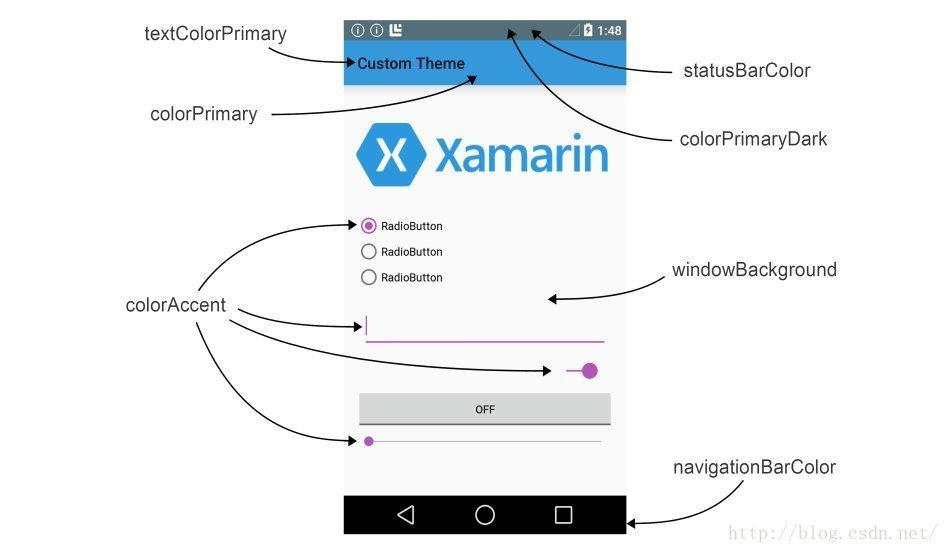

#  **KFC疯狂星期四**


## 1.探究Activity

### 在Activity中使用Toast

```kotlin
val button3 = findViewById<Button>(R.id.button3)
        button3.setOnClickListener {
            Toast.makeText(this, "ThirdActivity", Toast.LENGTH_SHORT).show()
        }
```


### ViewBinding的使用

1. 在`build.gradle.kts`导入`ViewBinding`
2. 在活动中导入自动生成的 `ViewBinding `类并对其进行声明(根据活动)
3. 绑定布局

```kotlin
android {
    // 启用 ViewBinding
    viewBinding {
        enable = true
    }
}
```

```kotlin
import com.example.activitytest.databinding.FirstLayoutBinding  // 自动生成的 ViewBinding 类(根据该活动)

class FirstActivity : BaseActivity() {
    private lateinit var binding: FirstLayoutBinding  // 声明 ViewBinding 变量
    private val TAG = "FirstActivity"

    override fun onCreate(savedInstanceState: Bundle?) {
        super.onCreate(savedInstanceState)
        Log.d(TAG, "Task id is $taskId")
        // 绑定布局
        binding = FirstLayoutBinding.inflate(layoutInflater)
        setContentView(binding.root)

        // 设置按钮点击事件
        binding.button1.setOnClickListener {
          
        }
    }
```


### 在布局中直接调用图像

```xml
android:src="@android:drawable/ic_menu_call"
app:srcCompat="@android:drawable/ic_menu_edit"
```


### 在活动中使用Menu

1. 在`res`目录下新建`menu`文件夹并生成`main`文件
2. 在活动中重写`onCreateOptionsMenu()`方法与`onOptionsItemSelected()`方法
3. 修改主题

```kotlin
override fun onCreateOptionsMenu(menu: Menu?): Boolean {
        menuInflater.inflate(R.menu.main, menu)
        return true
    }
    override fun onOptionsItemSelected(item: MenuItem): Boolean {
        when (item.itemId) {
            R.id.add_item -> Toast.makeText(this, "You clicked Add", Toast.LENGTH_SHORT).show()
            R.id.remove_item -> Toast.makeText(this, "You clicked Remove", Toast.LENGTH_SHORT).show()
        }
        return true
    }
```

```kotlin
<resources xmlns:tools="http://schemas.android.com/tools">
    <!-- Base application theme. -->
    <style name="Theme.ActivityTest" parent="Theme.MaterialComponents.DayNight.DarkActionBar">
        <!-- Primary brand color. -->
        <item name="colorPrimary">#FDD3E1</item>
        <item name="colorPrimaryVariant">#EBB7C9</item>
        <item name="colorOnPrimary">#F8EBEF</item>
        <!-- Secondary brand color. -->
        <item name="colorSecondary">#E2B5C4</item>
        <item name="colorSecondaryVariant">#F29AB8</item>
        <item name="colorOnSecondary">#D95D88</item>
        <!-- Status bar color. -->
        <item name="android:statusBarColor">?attr/colorPrimaryVariant</item>
        <!-- Customize your theme here. -->
    </style>
</resources>
```


### 使用Intent在Activity之间穿梭

#### 显式Intent

```kotlin
binding.button1.setOnClickListener {
           val intent = Intent(this, SecondActivity::class.java)
           startActivity(intent)
        }
```


#### 隐式Intent(指定对应action和category等信息去响应)

1. 指定当前`Activity`能够响应的`action`和`category`
2. 调用`addCategory()`方法添加一个category

```kotlin
<activity
            android:name=".SecondActivity"
            android:launchMode="singleInstance"
            android:exported="false">
            <intent-filter>
                <action android:name="com.example.activitytest.ACTION_START" />
                <category android:name="android.intent.category.DEFAULT" />
                <category android:name="com.example.activitytest.MY_CATEGORY" />
            </intent-filter>
        </activity>
```

```kotlin
 binding.button1.setOnClickListener {
           val intent = Intent("com.example.activitytest.ACTION_START")
           intent.addCategory("com.example.activitytest.MY_CATEGORY")
           startActivity(intent)
        }
    }
```

**打开百度**

```kotlin
 binding.button1.setOnClickListener {
           val intent = Intent(Intent.ACTION_VIEW)
           intent.data = Uri.parse("https://www.baidu.com")
           startActivity(intent)
        }
    }
```

**打开电话**

```kotlin
binding.button1.setOnClickListener {
           val intent = Intent(Intent.ACTION_DIAL)
           intent.data = Uri.parse("tel:10086")
           startActivity(intent)
        }
    }
```


#### 向下一个Activity传递数据

运用`putExtra()`方法的重载

```kotlin
binding.button1.setOnClickListener {
           val data = "Hello SecondActivity"
           val intent = Intent(this, SecondActivity::class.java)
           intent.putExtra("extra_data", data) // 第一个参数是键,第二个是要传递的数据
           startActivity(intent)
        }
    }
```

```kotlin
override fun onCreate(savedInstanceState: Bundle?) {
        super.onCreate(savedInstanceState)
        setContentView(R.layout.second_layout)
        val extraData = intent.getStringExtra("extra_data")
    }

```


#### 返回数据给上一个Activity

1. 用`startActivityForResult()`启动活动
2. 用`setResult()`方法向上一个Activity返回数据
3. 在上一个活动重写`onActivityResult`方法

```kotlin
binding.button1.setOnClickListener {
           val intent = Intent(this, SecondActivity::class.java)
           startActivityForResult(intent, 1) // 第二个是请求码
        }
    }
```

```kotlin
class SecondActivity : AppCompatActivity() {
    private lateinit var binding: SecondActivityBinding  // 使用生成的绑定类
    private val TAG = "SecondActivity"

    override fun onCreate(savedInstanceState: Bundle?) {
        super.onCreate(savedInstanceState)
        Log.d(TAG, "Task id is $taskId")
        // 绑定布局
        binding = SecondActivityBinding.inflate(layoutInflater)
        setContentView(binding.root)

        // 使用 binding.button2 访问视图（确保在布局中存在 id 为 button2 的控件）
        binding.button2.setOnClickListener {
           val intent = Intent().apply {
                putExtra("data_return", "Hello FirstActivity")
            }
            setResult(RESULT_OK, intent)
            finish()
        }
    }
```

```kotlin
override fun onActivityResult(requestCode: Int, resultCode: Int, data: Intent?) {
    // 首先调用父类的onActivityResult方法，确保默认行为得到执行
    super.onActivityResult(requestCode, resultCode, data)
    
    // 根据requestCode判断是哪个Activity返回的结果
    when (requestCode) {
        // requestCode为1时，表示是特定的Activity返回结果
        1 -> {
            // 如果返回结果为成功（RESULT_OK）
            if (resultCode == RESULT_OK) {
                // 从Intent中获取返回的字符串数据，key为"data_return"
                val returnedData = data?.getStringExtra("data_return")
                
                // 使用Log.d输出日志，打印返回的数据，TAG为类标识
                Log.d(TAG, "returned data is $returnedData")
            }
        }
    }
}
```


### Activity的生命周期

#### 1. onCreate()

- 作用

  ：当 Activity 第一次被创建时调用。在这个方法中，你通常会完成以下工作：

  - 设置布局文件（例如调用 `setContentView()`）
  - 初始化控件、变量和数据
  - 配置基本组件（如 Toolbar、Fragment 等）

- 示例代码

  ```kotlin
  override fun onCreate(savedInstanceState: Bundle?) {
      super.onCreate(savedInstanceState)
      setContentView(R.layout.activity_main)
      // 初始化操作
  }
  ```

#### 2. onStart()

- **作用**：在 `onCreate()` 之后调用，此时 Activity 已经对用户可见，但还未获得焦点，也就是还不能进行用户交互。通常在这里启动一些即将进入前台的操作。

- 示例代码

  ```kotlin
  override fun onStart() {
      super.onStart()
      // Activity 对用户可见，但尚未获得焦点
  }
  ```

#### 3. onResume()

- **作用**：在 `onStart()` 之后调用，此时 Activity 已经位于前台，并且可以接收用户的输入和交互。这也是应用处于“运行”状态的主要阶段。

- 示例代码

  ```kotlin
  override fun onResume() {
      super.onResume()
      // 开始处理用户交互，如启动动画、注册传感器等
  }
  ```

#### 4. onPause()

- **作用**：当系统准备启动或恢复另一个 Activity 时调用，此时当前 Activity 仍然部分可见，但失去了用户焦点。通常在这里进行轻量级的保存工作，比如暂停动画、保存数据或释放一些占用较多资源的操作。

- **注意**：此方法的执行时间应该尽可能短，以免阻塞其他 Activity 的启动。

- 示例代码

  ```kotlin
  override fun onPause() {
      super.onPause()
      // 暂停动画、保存数据、释放资源等
  }
  ```

#### 5. onStop()

- **作用**：当 Activity 完全对用户不可见时调用，可能是因为新的 Activity 覆盖在上面或 Activity 被销毁。通常在这里释放不再需要的资源，并执行较重的保存工作。

- 示例代码

  ```kotlin
  override fun onStop() {
      super.onStop()
      // 释放资源、保存数据等
  }
  ```

#### 6. onDestroy()

- **作用**：在 Activity 被完全销毁之前调用。这可能是因为用户主动关闭 Activity 或系统由于资源不足而销毁 Activity。在此方法中需要清理所有占用的资源，确保内存没有泄漏。

- 示例代码

  ```kotlin
  override fun onDestroy() {
      super.onDestroy()
      // 清理资源、取消注册监听器等
  }
  ```

#### 7. onRestart()

- **作用**：当一个已停止的 Activity 将要重新启动时调用，此方法紧接在 `onStop()` 之后调用，然后进入 `onStart()`。常用于重新初始化在 `onStop()` 中释放的资源或状态恢复。

- 示例代码

  ```kotlin
  override fun onRestart() {
      super.onRestart()
      // 准备 Activity 重新对用户可见
  }
  ```

#### 生命周期的常见调用顺序

- **初次启动 Activity**：
   `onCreate()` → `onStart()` → `onResume()`
- **用户离开 Activity（例如启动另一个 Activity 或按下 Home 键）**：
   `onPause()` → `onStop()`
- **用户返回到 Activity**：
   `onRestart()` → `onStart()` → `onResume()`
- **销毁 Activity**：
   `onPause()` → `onStop()` → `onDestroy()`


### 如果Activity被回收了怎么办

1. 使用`onSaveInstanceState`回调方法保存数据
2. 在`onCreate()`方法里面对其进行恢复

```kotlin
class MainActivity : AppCompatActivity() {

    // 定义一个需要保存的变量
    private var counter: Int = 0

    override fun onCreate(savedInstanceState: Bundle?) {
        super.onCreate(savedInstanceState)
        setContentView(R.layout.activity_main)

        // 如果 savedInstanceState 不为 null，则恢复数据
        savedInstanceState?.let {
            counter = it.getInt("counter_key", 0)
        }

        // 其他初始化代码
    }

    // 在此回调中保存需要持久化的数据
    override fun onSaveInstanceState(outState: Bundle) {
        super.onSaveInstanceState(outState)
        // 将 counter 的值存入 Bundle 中
        outState.putInt("counter_key", counter)
    }
}

```


### Activity的启动方式

#### 1. AndroidManifest.xml 配置

在 `AndroidManifest.xml` 中，为每个 Activity 配置不同的启动模式：

```xml
<manifest xmlns:android="http://schemas.android.com/apk/res/android"
    package="com.example.launchmode">

    <application
        android:allowBackup="true"
        android:label="@string/app_name"
        android:theme="@style/AppTheme">

        <!-- Standard 模式：每次启动都会创建一个新实例 -->
        <activity
            android:name=".StandardActivity"
            android:launchMode="standard">
            <intent-filter>
                <action android:name="android.intent.action.MAIN" />
                <category android:name="android.intent.category.LAUNCHER" />
            </intent-filter>
        </activity>

        <!-- SingleTop 模式：如果该 Activity 已经处于任务栈顶部，则复用当前实例，
             否则创建新实例 -->
        <activity
            android:name=".SingleTopActivity"
            android:launchMode="singleTop">
        </activity>

        <!-- SingleTask 模式：系统保证全局只有一个该 Activity 实例，
             如果已存在，则清除它之上的 Activity，并通过 onNewIntent() 传递新的 Intent -->
        <activity
            android:name=".SingleTaskActivity"
            android:launchMode="singleTask">
        </activity>

        <!-- SingleInstance 模式：该 Activity 独占一个任务栈，
             栈中只有它自己，其他 Activity 将在其它任务栈中运行 -->
        <activity
            android:name=".SingleInstanceActivity"
            android:launchMode="singleInstance">
        </activity>

    </application>
</manifest>
```


#### 2. Kotlin 代码示例与注释

##### (1) StandardActivity

**说明**：Standard 模式是 Android 的默认模式，每次启动该 Activity 都会新建一个实例，即使之前已有相同类型的 Activity 存在于任务栈中。

```kotlin
/**
 * StandardActivity 使用 standard 模式，
 * 每次启动都会创建一个新的实例。
 */
class StandardActivity : AppCompatActivity() {
    override fun onCreate(savedInstanceState: Bundle?) {
        super.onCreate(savedInstanceState)
        setContentView(R.layout.activity_standard)
        // 此处执行初始化工作，每次启动该 Activity 都是一个全新的状态
    }
}
```

------

##### (2) SingleTopActivity

**说明**：SingleTop 模式下，如果目标 Activity 已经处于任务栈的顶部，则不会创建新的实例，而是调用 onNewIntent() 方法传递新的 Intent；如果不在栈顶，则会创建新实例。

```kotlin
/**
 * SingleTopActivity 使用 singleTop 模式，
 * 当该 Activity 已经在任务栈顶部时，新的启动请求不会创建新实例，
 * 而是通过 onNewIntent() 方法传递新的 Intent。
 */
class SingleTopActivity : AppCompatActivity() {
    override fun onCreate(savedInstanceState: Bundle?) {
        super.onCreate(savedInstanceState)
        setContentView(R.layout.activity_single_top)
        // 初始化工作
    }

    /**
     * 当 SingleTopActivity 已经在任务栈顶部时，
     * 再次启动该 Activity 会调用此方法，传入新的 Intent。
     */
    override fun onNewIntent(intent: Intent?) {
        super.onNewIntent(intent)
        // 处理新的 Intent，例如更新界面数据或状态
    }
}
```

------

##### (3) SingleTaskActivity

**说明**：SingleTask 模式确保在系统中只存在一个该 Activity 的实例。当再次启动时，如果实例已存在，系统会将其上面的所有 Activity 清除，并调用 onNewIntent() 方法传递 Intent。

```kotlin
/**
 * SingleTaskActivity 使用 singleTask 模式，
 * 系统中全局只有一个该 Activity 的实例。
 * 如果该实例已存在，再次启动时会清除它之上的所有 Activity，
 * 并通过 onNewIntent() 传递新的启动 Intent。
 */
class SingleTaskActivity : AppCompatActivity() {
    override fun onCreate(savedInstanceState: Bundle?) {
        super.onCreate(savedInstanceState)
        setContentView(R.layout.activity_single_task)
        // 初始化代码
    }

    /**
     * 当 SingleTaskActivity 已存在且收到新的启动请求时，
     * 系统会调用此方法，并传递新的 Intent。
     */
    override fun onNewIntent(intent: Intent?) {
        super.onNewIntent(intent)
        // 处理新的 Intent，例如刷新界面或更新数据
    }
}
```

------

##### (4) SingleInstanceActivity

**说明**：SingleInstance 模式是最严格的启动模式，该 Activity 所在的任务栈中只允许存在它本身，其它 Activity 会在其他任务栈中运行，从而实现高度隔离。

```kotlin
/**
 * SingleInstanceActivity 使用 singleInstance 模式，
 * 该模式下，该 Activity 独占一个任务栈，
 * 任务栈中只包含它自己，其他 Activity 将不会进入此任务栈。
 */
class SingleInstanceActivity : AppCompatActivity() {
    override fun onCreate(savedInstanceState: Bundle?) {
        super.onCreate(savedInstanceState)
        setContentView(R.layout.activity_single_instance)
        // 初始化代码
    }
}
```

------

#### 3. 总结

- **standard**
   每次启动时都会创建新的 Activity 实例，适用于不需要保留之前状态的场景。
- **singleTop**
   如果目标 Activity 已位于任务栈顶部，则复用实例（调用 onNewIntent()），否则创建新实例。适合频繁接收新 Intent 的场景。
- **singleTask**
   保证全局只有一个实例，启动时会清除目标实例之上的所有 Activity，并调用 onNewIntent()。适用于需要全局唯一实例的核心界面。
- **singleInstance**
   该 Activity 独占任务栈，其他 Activity 不会与其共存。适用于需要高度隔离的场景，如系统级界面或特殊业务场景。


### Activity的最佳实践

#### 知晓当前是在哪一个活动

```kotlin
open class BaseActivity : AppCompatActivity(){
    override fun onCreate(savedInstanceState: Bundle?) {
        super.onCreate(savedInstanceState)
        Log.d("BaseActivity", javaClass.simpleName)
    }
}
```


#### 随时随地退出程序

```kotlin
package com.example.activitytest

import android.app.Activity

object ActivityCollector {
    private val activities = ArrayList<Activity>()
    fun addActivity(activity: Activity) {
        activities.add(activity)
    }
    fun removeActivity(activity: Activity) {
        activities.remove(activity)
    }
    fun finishAll() {
        for (activity in activities) {
            if (!activity.isFinishing) {
                activity.finish()
            }
        }
        activities.clear()
    }
}
```

```kotlin
open class BaseActivity : AppCompatActivity(){
    override fun onCreate(savedInstanceState: Bundle?) {
        super.onCreate(savedInstanceState)
        Log.d("BaseActivity", javaClass.simpleName)
        ActivityCollector.addActivity(this)
    }
    override fun onDestroy() {
        super.onDestroy()
        ActivityCollector.removeActivity(this)
    }
}
```

```kotlin
val button3 = findViewById<Button>(R.id.button3)
        button3.setOnClickListener {
            ActivityCollector.finishAll()
            android.os.Process.killProcess(android.os.Process.myPid())
        }
```


#### 启动Activity的最佳写法

```kotlin
// 在要启动的活动内添加该静态方法

companion object {
    // 封装启动 SecondActivity 的静态方法
    fun actionStart(context: Context, data: String) {
        // 创建一个 Intent 对象，指定从当前上下文启动 SecondActivity
        val intent = Intent(context, SecondActivity::class.java)
        // 将传入的字符串数据作为额外参数存入 Intent，
        // "extra_data" 为键，用于在 SecondActivity 中提取该数据
        intent.putExtra("extra_data", data)
        // 通过上下文启动 SecondActivity
        context.startActivity(intent)
    }
}

```

```kotlin
 binding.button1.setOnClickListener {
         SecondActivity.actionStart(this, "data")
 }
```

---


## 2.UI开发

### 布局


### ListView控件

1.定义 `Fruit` 类，并在 `initFruits()` 方法中构建一个包含多个水果对象的数据列表。

2在 `activity_main.xml` 中定义 ListView，接着在 `MainActivity` 的 `onCreate()` 方法中设置布局、初始化数据、获取 ListView 控件。

3.实现 `FruitAdapter` 类，通过重写 `getView()` 方法和使用 ViewHolder 模式，将数据与列表项布局（fruit_item.xml）绑定，并返回每一项的视图。

4.在 `fruit_item.xml` 中定义每个列表项的视图结构，包括图片和文本。

5.在 `MainActivity` 中创建适配器、绑定 ListView 并设置点击事件，实现用户点击列表项时显示相应水果名称的 Toast 提示。


```kotlin
class MainActivity : AppCompatActivity() {

    // 水果数据列表，用于存储水果对象
    private val fruitList = ArrayList<Fruit>()

    /**
     * Activity创建时的回调方法
     * @param savedInstanceState Activity保存的状态
     */
    override fun onCreate(savedInstanceState: Bundle?) {
        // 调用父类的onCreate方法
        super.onCreate(savedInstanceState)
        // 设置Activity的布局
        setContentView(R.layout.activity_main)
        // 初始化水果数据
        initFruits()
        // 创建适配器，将水果数据绑定到ListView
        val adapter = FruitAdapter(this, R.layout.fruit_item, fruitList)
        // 获取ListView控件
        val listView = findViewById<ListView>(R.id.listView)
        // 将适配器设置给ListView
        listView.adapter = adapter
        // 设置ListView的点击事件监听器
        listView.setOnItemClickListener { _, _, position, _ ->
            // 获取点击位置的水果
            val fruit = fruitList[position]
            // 显示水果名称的Toast消息
            Toast.makeText(this, fruit.name, Toast.LENGTH_SHORT).show()
        }
    }

    /**
     * 初始化水果数据的方法
     * 重复20次，添加三种水果（苹果、香蕉、橙子）
     */
    private fun initFruits() {
        // 重复20次，用于添加多个水果项
        repeat(20) {
            // 添加苹果
            fruitList.add(Fruit("Apple", R.drawable.b1))
            // 添加香蕉
            fruitList.add(Fruit("Banana", R.drawable.b2))
            // 添加橙子
            fruitList.add(Fruit("Orange", R.drawable.b3))
        }
    }
}
```

```kotlin
class FruitAdapter(activity: Activity, val resourceId: Int, val data: List<Fruit>) : ArrayAdapter<Fruit>(activity, resourceId, data) {

    /**
     * ViewHolder类用于缓存每个列表项中的视图，以提高列表滚动时的性能。
     */
    inner class ViewHolder(val fruitImage: ImageView, val fruitName: TextView)

    override fun getView(position: Int, convertView: View?, parent: ViewGroup): View {
        val view: View
        val viewHolder: ViewHolder

        // 如果convertView为空，创建一个新的视图，否则复用convertView
        if (convertView == null) {
            // 从XML布局文件中加载视图
            view = LayoutInflater.from(context).inflate(resourceId, parent, false)
            // 初始化ImageView和TextView
            val fruitImage: ImageView = view.findViewById(R.id.fruit_image)
            val fruitName: TextView = view.findViewById(R.id.fruit_name)
            // 创建ViewHolder并绑定到view的tag中
            viewHolder = ViewHolder(fruitImage, fruitName)
            view.tag = viewHolder
        } else {
            view = convertView
            // 从convertView的tag中获取缓存的ViewHolder
            viewHolder = view.tag as ViewHolder
        }

        // 获取当前位置的Fruit对象
        val fruit = getItem(position)
        if (fruit != null) {
            // 设置水果的图片
            viewHolder.fruitImage.setImageResource(fruit.imageId)
            // 设置水果的名称
            viewHolder.fruitName.text = fruit.name
        }

        // 返回准备好的视图
        return view
    }
}

```

```kotlin
class Fruit(val name: String, val imageId: Int)
```

```xml
<?xml version="1.0" encoding="utf-8"?>
<LinearLayout xmlns:android="http://schemas.android.com/apk/res/android"
    xmlns:app="http://schemas.android.com/apk/res-auto"
    xmlns:tools="http://schemas.android.com/tools"
    android:id="@+id/main"
    android:layout_width="match_parent"
    android:layout_height="match_parent"
    tools:context=".MainActivity">

    <ListView
        android:id="@+id/listView"
        android:layout_width="match_parent"
        android:layout_height="match_parent"/>

</LinearLayout>
```

```xml
<?xml version="1.0" encoding="utf-8"?>
<LinearLayout xmlns:android="http://schemas.android.com/apk/res/android"
    android:layout_width="match_parent"
    android:layout_height="60dp">

    <ImageView
        android:id="@+id/fruit_image"
        android:layout_width="40dp"
        android:layout_height="40dp"
        android:layout_marginLeft="10dp"
        android:layout_gravity="center_vertical" />

    <TextView
        android:id="@+id/fruit_name"
        android:layout_width="wrap_content"
        android:layout_height="wrap_content"
        android:layout_gravity="center_vertical"
        android:layout_marginLeft="10dp"
    />
</LinearLayout>
```


### RecyclerView控件

1.**添加依赖库**

2.**数据模型定义**
 `Fruit` 类定义了水果的数据结构。

3.**适配器实现**
 在 `FruitAdapter` 中：

- 定义 ViewHolder 缓存 item 内的控件；
- 在 `onCreateViewHolder` 中加载 item 布局、创建 ViewHolder 并设置点击事件；
- 在 `onBindViewHolder` 中绑定数据；
- `getItemCount` 返回数据总数。

4.**item 布局定义**
 `fruit_item.xml` 描述了每个列表项的外观（图片和名称）。

5.**MainActivity 配置**
 在 `onCreate()` 中：

- 调用 `initFruits()` 初始化数据；

- 设置 RecyclerView 的布局管理器（瀑布流效果）；

- 绑定适配器，实现数据展示。

  

```xml
implementation("androidx.recyclerview:recyclerview:1.3.2")
```

```kotlin
class MainActivity : AppCompatActivity() {

    // 定义一个 ArrayList 用于存储水果数据
    private val fruitList = ArrayList<Fruit>()

    override fun onCreate(savedInstanceState: Bundle?) {
        super.onCreate(savedInstanceState)
        // 设置当前 Activity 的布局为 activity_main.xml
        setContentView(R.layout.activity_main)

        // 初始化水果数据
        initFruits()

        // 使用 StaggeredGridLayoutManager 设置 RecyclerView 为瀑布流布局，3列垂直排列
        val layoutManager = StaggeredGridLayoutManager(3, LinearLayoutManager.VERTICAL)
        // 获取布局中的 RecyclerView 控件
        val recyclerView = findViewById<RecyclerView>(R.id.recyclerView)
        // 设置 RecyclerView 的布局管理器
        recyclerView.layoutManager = layoutManager

        // 创建自定义适配器，并传入水果数据列表
        val adapter = FruitAdapter(fruitList)
        // 将适配器设置给 RecyclerView
        recyclerView.adapter = adapter
    }

    // 初始化水果数据的方法
    private fun initFruits() {
        // 重复 50 次，每次添加三种水果数据（Apple、Banana、Orange）
        repeat(50) {
            // 添加 Apple，名称通过 getRandomLengthString() 方法随机生成长度，图片资源为 R.drawable.b1
            fruitList.add(Fruit(getRandomLengthString("Apple"), R.drawable.b1))
            // 添加 Banana，图片资源为 R.drawable.b2
            fruitList.add(Fruit(getRandomLengthString("Banana"), R.drawable.b2))
            // 添加 Orange，图片资源为 R.drawable.b3
            fruitList.add(Fruit(getRandomLengthString("Orange"), R.drawable.b3))
        }
    }

    // 根据传入的字符串随机重复生成一个新的字符串
    private fun getRandomLengthString(str: String): String {
        // 随机生成重复次数（1 到 20 之间）
        val n = (1..20).random()
        val builder = StringBuilder()
        // 重复追加字符串 n 次
        repeat(n) {
            builder.append(str)
        }
        // 返回生成的字符串
        return builder.toString()
    }
}

```

```kotlin
class Fruit(val name: String, val imageId: Int)
```

```kotlin
class FruitAdapter(val fruitList: List<Fruit>) : RecyclerView.Adapter<FruitAdapter.ViewHolder>() {

    // 内部类 ViewHolder 用于缓存 item 视图中的控件，提高滚动性能
    inner class ViewHolder(view: View) : RecyclerView.ViewHolder(view) {
        // 获取 item 布局中的 ImageView 控件
        val fruitImage: ImageView = view.findViewById(R.id.fruit_image)
        // 获取 item 布局中的 TextView 控件
        val fruitName: TextView = view.findViewById(R.id.fruit_name)
    }

    // 创建新的 ViewHolder 时调用该方法
    override fun onCreateViewHolder(parent: ViewGroup, viewType: Int): ViewHolder {
        // 通过 LayoutInflater 加载 item 布局文件 fruit_item.xml
        val view = LayoutInflater.from(parent.context).inflate(R.layout.fruit_item, parent, false)
        // 创建 ViewHolder 对象，传入加载好的视图
        val viewHolder = ViewHolder(view)

        // 设置整个 item 视图的点击事件
        view.setOnClickListener {
            // 通过 adapterPosition 获取当前点击的 item 位置
            val position = viewHolder.adapterPosition
            // 根据位置从数据列表中获取对应的水果对象
            val fruit = fruitList[position]
            // 显示点击提示，提示中包含水果名称
            Toast.makeText(parent.context, "you clicked view ${fruit.name}", Toast.LENGTH_SHORT).show()
        }

        // 为 item 中的 ImageView 设置点击事件
        viewHolder.fruitImage.setOnClickListener {
            // 同样通过 adapterPosition 获取点击项的位置
            val position = viewHolder.adapterPosition
            // 根据位置获取对应的水果对象
            val fruit = fruitList[position]
            // 显示点击提示，提示中包含水果名称
            Toast.makeText(parent.context, "you clicked image ${fruit.name}", Toast.LENGTH_SHORT).show()
        }
        // 返回创建好的 ViewHolder 对象
        return viewHolder
    }

    // 将数据绑定到 ViewHolder 上时调用
    override fun onBindViewHolder(holder: ViewHolder, position: Int) {
        // 根据 position 获取对应的水果对象
        val fruit = fruitList[position]
        // 设置 ImageView 显示水果的图片资源
        holder.fruitImage.setImageResource(fruit.imageId)
        // 设置 TextView 显示水果的名称
        holder.fruitName.text = fruit.name
    }

    // 返回数据列表的大小，决定 RecyclerView 的 item 个数
    override fun getItemCount() = fruitList.size
}
```

```xml
<LinearLayout xmlns:android="http://schemas.android.com/apk/res/android"
    xmlns:app="http://schemas.android.com/apk/res-auto"
    xmlns:tools="http://schemas.android.com/tools"
    android:id="@+id/main"
    android:layout_width="match_parent"
    android:layout_height="match_parent"
    tools:context=".MainActivity">

    <androidx.recyclerview.widget.RecyclerView
        android:id="@+id/recyclerView"
        android:layout_width="match_parent"
        android:layout_height="match_parent"/>

</LinearLayout>
```

```xml
<?xml version="1.0" encoding="utf-8"?>
<LinearLayout xmlns:android="http://schemas.android.com/apk/res/android"
    android:orientation="vertical"
    android:layout_width="match_parent"
    android:layout_height="wrap_content"
    android:layout_margin="5dp">

    <ImageView
        android:id="@+id/fruit_image"
        android:layout_width="40dp"
        android:layout_height="40dp"
        android:layout_gravity="center_horizontal"
        android:layout_marginTop="10dp"/>

    <TextView
        android:id="@+id/fruit_name"
        android:layout_width="wrap_content"
        android:layout_height="wrap_content"
        android:layout_gravity="left"
        android:layout_marginTop="10dp" />

</LinearLayout>
```

---


### Fragment碎片

Fragment是一种可以嵌入在Activity的UI片段

### Fragment的简单用法

1. 写左右两个Fragment布局
2. 新建左右两个Fragment类
3. 在`activity_main`中引入两个Fragment

```xml
<?xml version="1.0" encoding="utf-8"?>
<LinearLayout xmlns:android="http://schemas.android.com/apk/res/android"
    android:orientation="vertical"
    android:layout_width="match_parent"
    android:layout_height="match_parent">

    <Button
        android:id="@+id/button"
        android:layout_width="wrap_content"
        android:layout_height="wrap_content"
        android:layout_gravity="center_horizontal"
        android:text="Button" />

</LinearLayout>
```

```xml
<?xml version="1.0" encoding="utf-8"?>
<LinearLayout xmlns:android="http://schemas.android.com/apk/res/android"
    android:orientation="vertical"
    android:background="#F2CAD8"
    android:layout_width="match_parent"
    android:layout_height="match_parent">

    <TextView
        android:layout_width="wrap_content"
        android:layout_height="wrap_content"
        android:layout_gravity="center_horizontal"
        android:textSize="24sp"
        android:text="This is right fragment" />
</LinearLayout>
```

```kotlin
class LeftFragment : Fragment() {
    override fun onCreateView(
        inflater: LayoutInflater,
        container: ViewGroup?,
        savedInstanceState: Bundle?
    ): View? {
        return inflater.inflate(R.layout.left_fragment, container, false)
    }
}
```

```kotlin
class RightFragment: Fragment() {
    companion object {
        const val TAG = "RightFragment"
    }

    override fun onCreateView(
        inflater: LayoutInflater,
        container: ViewGroup?,
        savedInstanceState: Bundle?
    ): View? {
        return inflater.inflate(R.layout.right_fragment, container, false)
    }
}
```

```xml
<LinearLayout xmlns:android="http://schemas.android.com/apk/res/android"
    xmlns:app="http://schemas.android.com/apk/res-auto"
    xmlns:tools="http://schemas.android.com/tools"
    android:id="@+id/main"
    android:orientation="horizontal"
    android:layout_width="match_parent"
    android:layout_height="match_parent"
    tools:context=".MainActivity"
    android:fitsSystemWindows="true">

    <fragment
        android:id="@+id/leftFrag"
        android:layout_width="match_parent"
        android:layout_height="match_parent"
        android:name="com.example.fragmenttest.LeftFragment"
        tools:layout="@layout/left_fragment"/>

    <frameLayout
        android:id="@+id/rightLayout"
        android:layout_width="match_parent"
        android:layout_height="match_parent"
        android:name="com.example.fragmenttest.RightFragment"
        tools:layout="@layout/right_fragment"/>

</LinearLayout>
```


### 动态添加Fragment

1. 新建`another_right_fragmen`t和`AnotherRightFragment`

2. 动态添加到`activity_main`中

3. 修改`MainActivity` 

   (1) 创建待添加 Fragment 的实例。
   (2) 获取 `getSupportFragmentManager() `方法。
   (3) 开启一个事务，通过调用` beginTransaction() `方法开启。
   (4) 向容器内添加或替换 Fragment，一般使用 `replace() `方法实现，需要传入容器的 id 和待添加的 Fragment 实例。
   (5) 提交事务，调用` commit()`方法来完成。

```xml
<?xml version="1.0" encoding="utf-8"?>
<LinearLayout xmlns:android="http://schemas.android.com/apk/res/android"
    android:orientation="vertical"
    android:background="#ffff00"
    android:layout_width="match_parent"
    android:layout_height="match_parent">

    <TextView
        android:layout_width="wrap_content"
        android:layout_height="wrap_content"
        android:layout_gravity="center_horizontal"
        android:textSize="24sp"
        android:text="This is another right fragment"/>
</LinearLayout>
```

```kotlin
class AnotherRightFragment : Fragment(){
    override fun onCreateView(
        inflater: LayoutInflater,
        container: ViewGroup?,
        savedInstanceState: Bundle?
    ): View? {
        return inflater.inflate(R.layout.another_right_fragment, container, false)
    }
}
```

```xml
<?xml version="1.0" encoding="utf-8"?>
<LinearLayout xmlns:android="http://schemas.android.com/apk/res/android"
    xmlns:app="http://schemas.android.com/apk/res-auto"
    xmlns:tools="http://schemas.android.com/tools"
    android:id="@+id/main"
    android:orientation="horizontal"
    android:layout_width="match_parent"
    android:layout_height="match_parent"
    tools:context=".MainActivity"
    android:fitsSystemWindows="true">

    <fragment
        android:id="@+id/leftFrag"
        android:layout_width="match_parent"
        android:layout_height="match_parent"
        android:name="com.example.fragmenttest.LeftFragment"
        tools:layout="@layout/left_fragment" />

    <FrameLayout
        android:id="@+id/rightLayout"
        android:layout_width="0dp"
        android:layout_height="match_parent"
        android:layout_weight="1">
    </FrameLayout>

</LinearLayout>
```

```kotlin
class MainActivity : AppCompatActivity() {
    
    /**
     * onCreate是Activity的生命周期回调方法，用于初始化组件和布局
     * @param savedInstanceState 如果活动是被重建，保存状态的Bundle对象，否则为null
     */
    @SuppressLint("MissingInflatedId")
    override fun onCreate(savedInstanceState: Bundle?) {
        super.onCreate(savedInstanceState)
        // 设置活动的用户界面布局
        setContentView(R.layout.activity_main)
        
        // 获取按钮控件
        val button = findViewById<Button>(R.id.button)
        
        // 设置按钮点击监听器
        button.setOnClickListener {
            // 当按钮被点击时，替换右侧布局为AnotherRightFragment
            replaceFragment(AnotherRightFragment())
        }
        
        // 初始时显示RightFragment
        replaceFragment(RightFragment())
    }
    
    /**
     * 替换右侧布局中的Fragment
     * @param fragment 要替换的Fragment实例
     */
    private fun replaceFragment(fragment: Fragment) {
        // 获取SupportFragmentManager实例
        val fragmentManager = supportFragmentManager
        // 开始一个事务，用于执行Fragment替换操作
        val fragmentTransaction = fragmentManager.beginTransaction()
        
        // 将指定的Fragment替换到右侧布局容器中
        fragmentTransaction.replace(R.id.rightLayout, fragment)
        
        // 如果替换的Fragment是AnotherRightFragment，则将其添加到回退栈中
        if (fragment is AnotherRightFragment) {
            fragmentTransaction.addToBackStack(null)
        }
        
        // 提交事务，执行Fragment替换操作
        fragmentTransaction.commit()
    }
}
```


### 在Fragment中实现返回栈

```kotlin
 val fragmentTransaction = fragmentManager.beginTransaction()
fragmentTransaction.addToBackStack(null)
```


### Fragment和Activity之间的交互

#### 1.在Activity调用Fragment

```kotlin
val fragment = leftFrag as LeftFragment
```

#### 2.在Fragment调用Activity

```kotlin
if (activity!=null) {
    val mainActivity = activity as MainActivity
}
```


### Fragment的生命周期

#### 1. onAttach(Context context)

- **作用：** 当 Fragment 被添加到 Activity 时，会首先调用该方法。这时 Fragment 与宿主 Activity 建立关联，但还没有创建自身的视图。
- **注意：** 此时你可以获取宿主 Activity 的上下文，进行一些必要的初始化工作。

#### 2. onCreate(Bundle savedInstanceState)

- **作用：** 在 Fragment 创建时调用，用于进行一些非视图相关的初始化操作，比如初始化数据、设置选项等。
- **注意：** 此阶段不适合初始化界面相关的内容，因为视图尚未创建。

#### 3. onCreateView(LayoutInflater inflater, ViewGroup container, Bundle savedInstanceState)

- **作用：** 用于创建并返回 Fragment 的视图层次结构（通常通过 XML 布局文件膨胀得到）。
- **注意：** 你可以在这里绑定视图，设置控件的属性或事件监听。

#### 4. onViewCreated(View view, Bundle savedInstanceState)

- **作用：** 当视图被创建后立即调用，此时可以对视图进行进一步的初始化（例如查找子视图、设置适配器等）。
- **注意：** 虽然这是可选的，但有助于将视图相关的逻辑与视图创建分离。

#### 5. onActivityCreated(Bundle savedInstanceState)

- **作用：** 当宿主 Activity 的 onCreate() 方法执行完毕后调用，这时 Fragment 的宿主 Activity 已经完全初始化，可以安全地与 Activity 进行交互。
- **注意：** 可以在此阶段恢复状态或进行依赖于 Activity 的操作。

#### 6. onStart()

- **作用：** Fragment 对用户可见。此时界面已经呈现，但还没有获得用户焦点。
- **注意：** 通常在这里开始一些较轻的 UI 刷新工作。

#### 7. onResume()

- **作用：** Fragment 进入活动状态，此时它与用户进行交互。界面完全处于前台，响应用户输入。
- **注意：** 可以在这里启动动画、开始监听传感器数据等与用户交互密切相关的操作。

#### 8. onPause()

- **作用：** 当 Fragment 失去焦点，用户无法与之交互时调用（例如，用户离开应用或启动新的 Activity）。
- **注意：** 在这里应停止可能影响性能或不必要的操作，比如暂停动画、释放资源等。

#### 9. onStop()

- **作用：** Fragment 不再对用户可见，但仍保留在内存中。
- **注意：** 此阶段可进行资源释放、停止更新 UI 等操作，确保不会浪费资源。

#### 10. onDestroyView()

- **作用：** Fragment 的视图层次结构被销毁。此时与视图相关的资源（如绑定的视图、适配器等）应当被清理。
- **注意：** 如果需要保存视图状态，可以在此方法之前进行处理。

#### 11. onDestroy()

- **作用：** Fragment 自身被销毁，用于释放所有剩余资源和进行最终清理工作。
- **注意：** 此阶段与 onCreate() 相对，用于做一些彻底的清理工作。

#### 12. onDetach()

- **作用：** Fragment 与宿主 Activity 的关联被断开，生命周期结束。
- **注意：** 此时所有与 Activity 相关的引用都应该被释放，以防止内存泄漏

---


## 3.广播(Broadcast)

广播机制（Broadcasting）指的是将消息、数据或信号从一个源同时发送给网络中所有或一部分节点或设备。它与单播（Unicast，一对一通信）和多播（Multicast，一对多通信）不同，广播主要面向整个网络或一个较大的受众群体。

### 1. 标准广播

**定义与特点**

- **无序性**：标准广播在消息传输时不对接收顺序做严格保证。不同接收者收到消息的顺序可能不一致，这种特性使其实现相对简单。
- **高效性**：由于不需要额外的排序和同步机制，标准广播通常具有较低的延时和较高的传输效率。
- 适用场景：
  - 用于事件通知、状态更新或日志广播等场景，这些场景对消息顺序没有严格要求。
  - 在对实时性要求高、能够容忍一定顺序差异的应用中，标准广播是常用的选择。

------

### 2. 有序广播

**定义与特点**

- **顺序一致性**：有序广播要求所有接收者必须按照相同的顺序接收到所有消息。也就是说，无论消息是从哪个节点发送，所有节点在消息的交付顺序上都必须保持一致。
- **实现复杂性**：为了确保全局顺序一致，常需要采用额外的排序机制或共识算法（如逻辑时钟、矢量时钟或专门的总排序服务）。这种机制虽然能够确保系统状态的一致性，但同时也会增加系统的复杂性和延时。
- 适用场景：
  - 在需要高度一致性的分布式系统中，如分布式数据库复制、一致性协议、金融交易系统等，保证操作顺序一致是关键。
  - 有序广播有助于防止由于消息乱序而引发的数据冲突或状态不一致问题，从而提高系统的容错性和数据一致性。

------

### 3. 对比与选择

| 特性         | 标准广播                     | 有序广播                           |
| ------------ | ---------------------------- | ---------------------------------- |
| **消息顺序** | 无严格顺序保证               | 全局顺序一致                       |
| **实现难度** | 实现简单，效率高             | 需要额外排序/同步机制，复杂度高    |
| **延时**     | 较低                         | 可能因排序/同步而增加延时          |
| **适用场景** | 实时性要求高、顺序要求不严格 | 状态一致性要求高、需要全局顺序一致 |

---

### 4 静态注册广播

**定义**
 静态注册广播是在系统配置或设计阶段就预先确定好所有参与广播的节点，广播目标在系统运行过程中保持不变。

**特点与优势**

- **实现简单**：广播目标在配置文件或代码中硬编码，开发和调试过程中较为直接。
- **低开销**：无需额外的注册和管理机制，消息直接发送给预定的目标。
- **确定性高**：由于广播组成员固定，网络拓扑和消息传递路径相对固定，有助于预期性能分析。

**局限性**

- **灵活性不足**：如果系统中的节点发生增减或迁移，必须手动更新配置，无法自动适应环境变化。
- **扩展性受限**：适用于节点较少且变化不频繁的系统，对于大规模动态环境来说不够高效。

------

### 5. 动态注册广播

**定义**
 动态注册广播允许系统中节点在运行时主动注册成为广播组成员或退出广播组。此类机制通常依赖一个注册中心或服务发现模块，实时维护当前可用的广播目标列表。

**特点与优势**

- **高灵活性**：节点上线、下线、扩容或故障恢复时，注册中心会自动更新广播组成员，保证广播消息能够覆盖最新的系统状态。
- **自动管理**：利用心跳检测或健康检查机制，动态剔除不可用节点，提升系统整体的容错能力。
- **便于扩展**：适合大规模、动态变化频繁的分布式系统，能够根据实际负载和环境变化自动调整广播对象。

**局限性**

- **实现复杂**：需要部署和维护额外的注册服务，涉及网络延时、状态一致性等问题。
- **管理开销**：动态更新广播组可能带来短暂的不一致或额外的网络通信开销，需仔细设计以减少延迟和资源消耗。

------

### 6. 对比与适用场景

| 特性               | 静态注册广播                                   | 动态注册广播                                     |
| ------------------ | ---------------------------------------------- | ------------------------------------------------ |
| **注册方式**       | 在配置阶段固定节点列表                         | 节点可在运行时自动注册或注销                     |
| **实现复杂度**     | 实现简单，依赖硬编码或配置文件                 | 需要额外的注册中心和健康检查机制                 |
| **灵活性与扩展性** | 节点变化需要人工干预，适合节点稳定的小规模系统 | 适应节点频繁变动，大规模系统中自动维护广播组成员 |
| **系统管理开销**   | 管理和维护简单，但缺乏自动适应性               | 运维自动化，但引入额外通信和状态同步的开销       |


### 动态注册监听时间变化(记得取消注册)

1. 新建一个类继承自`BroadcastReceiver`

2. 重写`onReceiver()`方法,执行具体逻辑

   ```kotlin
   class MainActivity : AppCompatActivity() {
       lateinit var timeChangeReceiver: TimeChangeReceiver
       @SuppressLint("WrongViewCast")
       override fun onCreate(savedInstanceState: Bundle?) {
           super.onCreate(savedInstanceState)
           setContentView(R.layout.activity_main)
           val intentFilter = IntentFilter()
           intentFilter.addAction("android.intent.action.TIME_TICK")
           timeChangeReceiver = TimeChangeReceiver()
           registerReceiver(timeChangeReceiver, intentFilter)
       }
       override fun onDestroy() {
           super.onDestroy()
           unregisterReceiver(timeChangeReceiver) //取消注册
       }
       inner class TimeChangeReceiver : BroadcastReceiver() {
           override fun onReceive(context: Context, intent: Intent) {
               Toast.makeText(context, "Time has changed", Toast.LENGTH_SHORT).show()
           }
       }
   }
   ```

   

### 静态注册实现开机启动

1. 用快捷方式创建一个广播接收器
2. 在`AndroidManifest`添加对应权限与`action`

```kotlin
class BootCompleteReceiver : BroadcastReceiver() {

    override fun onReceive(context: Context, intent: Intent) {
        Toast.makeText(context, "Boot Complete", Toast.LENGTH_SHORT).show()
    }
}
```

```xml
<uses-permission android:name="android.permission.RECEIVE_BOOT_COMPLETED" />

<receiver
            android:name=".BootCompleteReceiver"
            android:enabled="true"
            android:exported="true">
            <intent-filter>
                <action android:name="android.intent.action.BOOT_COMPLETED" />
            </intent-filter>
        </receiver>
```


### 发送标准广播

1. 定义一个广播接收器
2. 在AndroidManifest添加自定义广播
3. 在MainActivity发送广播

```kotlin
class MyBroadcastReceiver : BroadcastReceiver() {
    override fun onReceive(context: Context, intent: Intent) {
        Toast.makeText(context, "received in MyBroadcastReceiver", Toast.LENGTH_SHORT).show()
        abortBroadcast()
    }
}
```

```xml
<receiver
            android:name=".MyBroadcastReceiver"
            android:enabled="true"
            android:exported="true">
            <intent-filter android:priority="100">
                <action android:name="com.example.broadcasttest.MY_BROADCAST" />
            </intent-filter>
        </receiver>
```

```kotlin
val button = findViewById<androidx.appcompat.widget.AppCompatButton>(R.id.button)
        button.setOnClickListener {
            val intent = Intent("com.example.broadcasttest.MY_BROADCAST")
            intent.setPackage(packageName)
            sendOrderedBroadcast(intent, null)
        }
```


### 发送有序广播

1. 新建`AnotherBroadcastReceiver`
2. 在AndroidManifest添加自定义广播
3. 在`MainActivity`利用`sendOrderedBroadcast`发送广播
4. 在`AndroidManifest`设置优先级
5. 在`MyBroadcastReceiver`利用`abortBroadcast`截断广播

```kotlin
class AnotherBroadcastReceiver : BroadcastReceiver() {

    override fun onReceive(context: Context, intent: Intent) {
        Toast.makeText(context, "received in AnotherBroadcastReceiver", Toast.LENGTH_SHORT).show()
    }
}
```

```xml
<receiver
            android:name=".AnotherBroadcastReceiver"
            android:enabled="true"
            android:exported="true">
            <intent-filter>
                <action android:name="com.example.broadcasttest.MY_BROADCAST" />
            </intent-filter>
        </receiver>
```

```kotlin
val button = findViewById<androidx.appcompat.widget.AppCompatButton>(R.id.button)
        button.setOnClickListener {
            val intent = Intent("com.example.broadcasttest.MY_BROADCAST")
            intent.setPackage(packageName)
            sendOrderedBroadcast(intent, null)
        }
```

```xml
<intent-filter android:priority="100">
                <action android:name="com.example.broadcasttest.MY_BROADCAST" />
            </intent-filter>
```

```kotlin
class MyBroadcastReceiver : BroadcastReceiver() {
    override fun onReceive(context: Context, intent: Intent) {
        Toast.makeText(context, "received in MyBroadcastReceiver", Toast.LENGTH_SHORT).show()
        abortBroadcast()
    }
}
```

---


## 4.持久化技术

数据持久化技术就是指将那些内存中的瞬时数据保存到存储设备中,保证即使在手机或计算机关机的情况下,这些数据仍然不会消失.

### 文件存储

1. 新建`save`函数,通过`openFileOutput()`方法存入数据
2. 让Activity在`Destroy`之前掉用`save`方法
3. 在`load`中通过`openFileInput`读取数据

```kotlin
class MainActivity : AppCompatActivity() {
    
    // Activity创建时的回调方法
    override fun onCreate(savedInstanceState: Bundle?) {
        super.onCreate(savedInstanceState)
        setContentView(R.layout.activity_main)
        
        // 从文件中加载数据
        val inputText = load()
        
        // 如果加载的文字不是空的，则将其显示在EditText中
        if (inputText.isNotEmpty()) {
            val editText = findViewById<EditText>(R.id.editText)
            editText.setText(inputText)
            editText.setSelection(inputText.length)
            
            // 显示一个toast提示，表示数据已恢复
            Toast.makeText(this, "Restoring saved data", Toast.LENGTH_SHORT).show()
        }
    }

    /**
     * 从文件中加载数据的方法
     * @return 返回加载的字符串内容，如果出错则返回空字符串
     */
    private fun load(): String {
        val content = StringBuilder()
        try {
            // 打开文件输入流，文件名为“data”
            val input = openFileInput("data")
            // 创建缓冲读取器
            val reader = BufferedReader(InputStreamReader(input))
            
            // 使用reader.forEachLine读取每一行内容并追加到content中
            reader.use {
                reader.forEachLine {
                    content.append(it)
                }
            }
        } catch (e: Exception) {
            // 如果出错，打印异常堆栈信息
            e.printStackTrace()
        }
        // 返回读取到的内容
        return content.toString()
    }

    // Activity被销毁时的回调方法
    override fun onDestroy() {
        super.onDestroy()
        
        // 获取EditText实例
        val editText = findViewById<EditText>(R.id.editText)
        // 获取EditText中的文字内容
        val inputText = editText.text.toString()
        
        // 调用save方法保存内容
        save(inputText)
    }

    /**
     * 将输入的文字内容保存到文件中的方法
     * @param inputText 需要保存的字符串内容
     */
    private fun save(inputText: String) {
        try {
            // 打开文件输出流，文件名为“data”，模式为私有（只有本应用可以访问）
            val output = openFileOutput("data", MODE_PRIVATE)
            // 创建缓冲写入器
            val writer = BufferedWriter(OutputStreamWriter(output))
            
            // 使用writer写入内容
            writer.use {
                it.write(inputText)
            }
        } catch (e: Exception) {
            // 如果出错，打印异常堆栈信息
            e.printStackTrace()
        }
    }
}

```


### SharedPreferences存储

1. 通过`getSharedPreferences()`指定文件名并得到`SharedPreferences.Editor`对象
2. 添加新数据,用`apple()`进行提交
3. 运用一系列`get`方法提取数据

```kotlin
class MainActivity : AppCompatActivity() {
    // 用于日志记录的标签，标识这个类的日志信息
    private val TAG = "MainActivity"

    // Activity创建时的回调方法
    override fun onCreate(savedInstanceState: Bundle?) {
        super.onCreate(savedInstanceState)
        // 设置主界面为activity_main布局
        setContentView(R.layout.activity_main)

        // 获取保存按钮实例
        val saveButton = findViewById<Button>(R.id.saveButton)
        // 获取恢复按钮实例
        val restoreButton = findViewById<Button>(R.id.restoreButton)

        // 设置保存按钮的点击事件监听器
        saveButton.setOnClickListener {
            // 获取SharedPreferences的编辑器，文件名为"sharedPreferences"，模式为私有（仅本应用访问）
            val editor = getSharedPreferences("sharedPreferences", MODE_PRIVATE).edit()
            
            // 保存字符串类型的数据，键为"name"，值为"John Doe"
            editor.putString("name", "John Doe")
            // 保存整数类型的数据，键为"age"，值为30
            editor.putInt("age", 30)
            // 保存布尔类型的数据，键为"isStudent"，值为true
            editor.putBoolean("isStudent", true)
            
            // 提交修改，保存数据到SharedPreferences文件中
            editor.apply()
        }

        // 设置恢复按钮的点击事件监听器
        restoreButton.setOnClickListener {
            // 获取SharedPreferences文件，文件名为"data"，模式为私有（仅本应用访问）
            val sharedPreferences = getSharedPreferences("data", Context.MODE_PRIVATE)
            
            // 读取字符串类型的数据，键为"name"，默认值为空字符串
            val name = sharedPreferences.getString("name", "")
            // 读取整数类型的数据，键为"age"，默认值为0
            val age = sharedPreferences.getInt("age", 0)
            // 读取布尔类型的数据，键为"isStudent"，默认值为false
            val isStudent = sharedPreferences.getBoolean("isStudent", false)

            // 打印日志，显示读取的数据
            Log.d(TAG, "name is $name")
            Log.d(TAG, "age is $age")
            Log.d(TAG, "isStudent is $isStudent")
        }
    }
}

```


### SQLite数据库存储

SQLite是一个轻量级的关系型数据库，嵌入在Android系统中，适合存储结构化数据。与传统的客户端-服务器数据库不同，SQLite是一个内嵌式数据库，所有的数据操作都是在本地进行，非常适合需要离线存储的小型或中型数据应用。

1. 通过SOL语句建表,在`onCreate`方法里面调用`db.execSQL()`创建数据库
2. 在`onUpgrade()`执行DROP语句对数据库进行更新
3. 增加数据库帮助类的版本号

```kotlin
class MainActivity : AppCompatActivity() {
    @SuppressLint("MissingInflatedId", "Range")
    override fun onCreate(savedInstanceState: Bundle?) {
        super.onCreate(savedInstanceState)
        // 设置主界面为activity_main布局
        setContentView(R.layout.activity_main)
        
        // 获取创建数据库按钮实例
        val createDatabase = findViewById<Button>(R.id.createDatabase)
        // 初始化数据库帮助类，参数依次为上下文、数据库名、版本号
        val dbHelper = MyDatabaseHelper(this, "BookStore.db", 2)
        
        // 设置创建数据库按钮的点击事件监听器
        createDatabase.setOnClickListener {
            // 获取可写的数据库实例，确保数据库和表被创建
            dbHelper.writableDatabase
        }
        
        // 获取添加数据按钮实例
        val addDate = findViewById<Button>(R.id.addData)
        // 设置添加数据按钮的点击事件监听器
        addDate.setOnClickListener {
            // 获取可写的数据库实例
            val db = dbHelper.writableDatabase
            
            // 准备要插入的数据1
            val values1 = ContentValues().apply {
                put("name", "The Da Vinci Code")
                put("author", "Dan Brown")
                put("pages", 454)
                put("price", 16.96)
            }
            // 将数据插入到"Book"表中，返回新行的ID
            db.insert("Book", null, values1)
            
            // 准备要插入的数据2
            val values2 = ContentValues().apply {
                put("name", "The Lost Symbol")
                put("author", "Dan Brown")
                put("pages", 510)
                put("price", 19.95)
            }
            // 将数据插入到"Book"表中，返回新行的ID
            db.insert("Book", null, values2)
        }
        
        // 获取更新数据按钮实例
        val updateData = findViewById<Button>(R.id.updateData)
        // 设置更新数据按钮的点击事件监听器
        updateData.setOnClickListener {
            // 获取可写的数据库实例
            val db = dbHelper.writableDatabase
            
            // 准备要更新的数据
            val values = ContentValues()
            values.put("price", 10.99)
            
            // 更新"Book"表中满足条件的记录
            // 条件：name等于"The Da Vinci Code"
            db.update("Book", values, "name = ?", arrayOf("The Da Vinci Code"))
        }
        
        // 获取删除数据按钮实例
        val deleteData = findViewById<Button>(R.id.deleteData)
        // 设置删除数据按钮的点击事件监听器
        deleteData.setOnClickListener {
            // 获取可写的数据库实例
            val db = dbHelper.writableDatabase
            
            // 删除"Book"表中满足条件的记录
            // 条件：pages大于500
            db.delete("Book", "pages > ?", arrayOf("500"))
        }
        
        // 获取查询数据按钮实例
        val queryData = findViewById<Button>(R.id.queryData)
        // 设置查询数据按钮的点击事件监听器
        queryData.setOnClickListener {
            // 获取可写的数据库实例
            val db = dbHelper.writableDatabase
            
            // 查询"Book"表中的所有数据
            val cursor = db.query("Book", null, null, null, null, null, null)
            
            // 遍历查询结果
            if (cursor.moveToFirst()) {
                do {
                    // 获取每一列的数据
                    val name = cursor.getString(cursor.getColumnIndex("name"))
                    val author = cursor.getString(cursor.getColumnIndex("author"))
                    val pages = cursor.getInt(cursor.getColumnIndex("pages"))
                    val price = cursor.getDouble(cursor.getColumnIndex("price"))
                    
                    // 打印日志，显示查询到的数据
                    println("name is $name, author is $author, pages is $pages, price is $price")
                } while (cursor.moveToNext())
            }
            
            // 关闭游标，释放资源
            cursor.close()
        }
        
        // 获取替换数据按钮实例
        val replaceData = findViewById<Button>(R.id.replaceData)
        // 设置替换数据按钮的点击事件监听器
        replaceData.setOnClickListener {
            // 获取可写的数据库实例
            val db = dbHelper.writableDatabase
            
            // 开始一个事务
            db.beginTransaction()
            try {
                // 删除"Book"表中的所有记录
                db.delete("Book", null, null)
                
                // 这里可以手动抛出异常进行事务回滚测试
                // if (true) {
                //     throw NullPointerException()
                // }
                
                // 准备要插入的数据
                val values = ContentValues().apply {
                    put("name", "Game of Thrones")
                    put("author", "George Martin")
                    put("pages", 720)
                    put("price", 20.85)
                }
                
                // 将数据插入到"Book"表中
                db.insert("Book", null, values)
                
                // 标记事务为成功
                db.setTransactionSuccessful()
            } catch (e: Exception) {
                // 捕获异常并打印异常信息
                e.printStackTrace()
            } finally {
                // 结束事务
                db.endTransaction()
            }
        }
    }
}

```


#### 1. 添加（插入）数据

**核心步骤**

- 获取数据库实例（通常使用`writableDatabase`）。
- 使用`ContentValues`封装待插入的数据。
- 调用`insert()`方法将数据插入表中，并返回新记录的ID。

```kotlin
fun insertCity(dbHelper: DBHelper, name: String, code: String) {
    // 获取可写数据库
    val db = dbHelper.writableDatabase
    // 使用ContentValues封装要插入的数据
    val values = ContentValues().apply {
        put("name", name)
        put("code", code)
    }
    // 调用insert方法，将数据插入City表
    val newRowId = db.insert("City", null, values)
    // 判断插入是否成功
    if (newRowId != -1L) {
        println("插入成功，Row ID: $newRowId")
    } else {
        println("插入失败")
    }
    // 操作结束后关闭数据库
    db.close()
}
```

**注意事项**

- 插入操作一般要在子线程中执行，避免阻塞主线程。可以使用Kotlin协程或其它异步处理方式。
- 可以通过事务优化批量插入的性能。


#### 2. 更新数据

**核心步骤**

- 获取数据库实例（使用`writableDatabase`）。
- 构造一个`ContentValues`对象来表示要更新的字段及其新值。
- 使用`update()`方法，传入更新条件和条件参数。

```kotlin
fun updateCityName(dbHelper: DBHelper, cityId: Int, newName: String) {
    val db = dbHelper.writableDatabase
    // 构造ContentValues更新记录
    val values = ContentValues().apply {
        put("name", newName)
    }
    // 构造更新条件
    val selection = "id = ?"
    val selectionArgs = arrayOf(cityId.toString())
    // 调用update方法更新数据
    val count = db.update("City", values, selection, selectionArgs)
    println("更新了$count条记录")
    db.close()
}
```

**注意事项**

- 更新操作需要谨慎构造条件（WHERE子句），避免误更新多条记录。
- 同样建议在子线程中执行更新操作以避免主线程阻塞。


#### 3. 删除数据

**核心步骤**

- 获取可写数据库实例。
- 构造删除条件（WHERE子句）及其参数。
- 调用`delete()`方法删除记录。

```kotlin
fun deleteCity(dbHelper: DBHelper, cityId: Int) {
    val db = dbHelper.writableDatabase
    // 构造删除条件
    val selection = "id = ?"
    val selectionArgs = arrayOf(cityId.toString())
    // 调用delete方法删除记录
    val deletedRows = db.delete("City", selection, selectionArgs)
    println("删除了$deletedRows条记录")
    db.close()
}
```

**注意事项**

- 删除数据时一定要构造准确的删除条件，避免误删数据。
- 如需删除所有数据，可以传入`null`作为条件，但要慎重使用。


#### 4. 查询数据

**核心步骤**

- 获取数据库实例（通常使用`readableDatabase`）。
- 构造要查询的列数组、WHERE条件（可选）以及排序等参数。
- 调用`query()`方法或者使用`rawQuery()`执行SQL语句。
- 使用`Cursor`遍历查询结果，并通过`getColumnIndexOrThrow`获取列数据。

```kotlin
fun queryCities(dbHelper: DBHelper): List<Triple<Int, String, String>> {
    val db = dbHelper.readableDatabase
    // 指定要返回的列
    val projection = arrayOf("id", "name", "code")
    // 查询City表中的所有数据
    val cursor: Cursor = db.query(
        "City",        // 表名
        projection,    // 返回的列
        null,          // WHERE子句
        null,          // WHERE参数
        null,          // GROUP BY子句
        null,          // HAVING子句
        "id ASC"       // ORDER BY子句：按id升序排列
    )
    // 存储查询结果的集合
    val cities = mutableListOf<Triple<Int, String, String>>()
    with(cursor) {
        while (moveToNext()) {
            // 根据列名获取数据
            val id = getInt(getColumnIndexOrThrow("id"))
            val name = getString(getColumnIndexOrThrow("name"))
            val code = getString(getColumnIndexOrThrow("code"))
            cities.add(Triple(id, name, code))
        }
        close()  // 用完Cursor后关闭，防止内存泄漏
    }
    db.close()
    return cities
}
```

**注意事项**

- 查询操作后要及时关闭`Cursor`和数据库。
- 当需要查询大量数据时，可考虑使用分页查询以提高性能。
- 对于复杂查询，可以使用`rawQuery()`方法执行自定义的SQL语句。


#### 5. 事务

1. **开启事务**：调用`beginTransaction()`开始一个事务。
2. **执行数据库操作**：在事务中执行多条数据库操作（如插入、更新等）。
3. **标记事务成功**：当所有操作执行成功后，调用`setTransactionSuccessful()`标记事务成功。如果没有调用这一方法，后续`endTransaction()`时将会回滚事务。
4. **结束事务**：调用`endTransaction()`结束事务。如果事务成功，则提交所有操作，否则回滚所有操作。

```kotlin
fun insertMultipleCities(dbHelper: DBHelper, cities: List<Pair<String, String>>) {
    val db = dbHelper.writableDatabase
    // 开始事务
    db.beginTransaction()
    try {
        cities.forEach { city ->
            val values = ContentValues().apply {
                put("name", city.first)
                put("code", city.second)
            }
            db.insert("City", null, values)
        }
        // 标记事务成功
        db.setTransactionSuccessful()
        println("批量插入成功")
    } catch (e: Exception) {
        e.printStackTrace()
        println("批量插入失败，事务回滚")
    } finally {
        // 结束事务，如果未调用setTransactionSuccessful，则会自动回滚
        db.endTransaction()
        db.close()
    }
}
```

---


## 5.探究ContentProvider

- **定义**：ContentProvider 是一种Android组件，允许应用程序以标准化接口对数据进行访问，无论数据存储在 SQLite 数据库、文件系统还是其他位置。
- **数据共享**：它主要用于跨进程或跨应用间的数据共享，通过定义 URI（统一资源标识符）来标识数据资源，并提供增删改查（CRUD）的接口。


### 申请权限

1. 借助`ContextCompat.checkSelfPermission()`方法判断是否授予权限
2. 调用`ActivityCompat.requestPermissions()`方法向用户申请权限
3. 在`AndroidManifest`申请权限

```kotlin
class MainActivity : AppCompatActivity() {
    
    // onCreate是Activity的生命周期回调，用于初始化视图和绑定事件
    @SuppressLint("MissingInflatedId")
    override fun onCreate(savedInstanceState: Bundle?) {
        super.onCreate(savedInstanceState)
        // 加载主布局文件
        setContentView(R.layout.activity_main)
        
        // 获取按钮控件
        val makeCall = findViewById<Button>(R.id.makeCall)
        
        // 设置按钮的点击事件监听器
        makeCall.setOnClickListener {
            // 检查CALL_PHONE权限是否已授予
            if (ContextCompat.checkSelfPermission(this, Manifest.permission.CALL_PHONE) != PackageManager.PERMISSION_GRANTED) {
                // 如果权限未授予，请求权限
                ActivityCompat.requestPermissions(this, arrayOf(Manifest.permission.CALL_PHONE), 1)
            } else {
                // 如果权限已授予，执行拨打电话操作
                call()
            }
        }
    }
    
    // onRequestPermissionsResult用于处理权限请求的结果
    override fun onRequestPermissionsResult(
        requestCode: Int,
        permissions: Array<out String>,
        grantResults: IntArray
    ) {
        super.onRequestPermissionsResult(requestCode, permissions, grantResults)
        
        // 根据requestCode判断是哪个权限请求
        when (requestCode) {
            1 -> {
                // 如果权限请求结果不为空，并且第一个权限被授予
                if (grantResults.isNotEmpty() && grantResults[0] == PackageManager.PERMISSION_GRANTED) {
                    // 执行拨打电话操作
                    call()
                } else {
                    // 显示权限被拒绝的提示信息
                    Toast.makeText(this, "You denied the permission", Toast.LENGTH_SHORT).show()
                }
            }
        }
    }
    
    // 封装的拨打电话功能函数
    private fun call() {
        try {
            // 创建一个Intent，用于执行拨打电话操作
            val intent = Intent(Intent.ACTION_CALL)
            // 设置拨打的电话号码，这里使用的是10086
            intent.data = Uri.parse("tel:10086")
            // 启动Activity，执行拨打操作
            startActivity(intent)
        } catch (e: SecurityException) {
            // 捕获并处理安全异常
            e.printStackTrace()
        }
    }
}
```

```xml
<uses-permission android:name="android.permission.CALL_PHONE" />
```


### ContentResolver的基本用法

`ContentResolver` 是 Android 提供的一个接口，用于与 `ContentProvider` 交互，从而实现跨进程或跨应用的数据访问。通过 ContentResolver，你可以对 ContentProvider 中的数据执行查询、插入、更新和删除等操作.


#### 1. 获取 ContentResolver 实例

在 Android 中，通常通过上下文（Context）来获取 ContentResolver 实例：

```kotlin
val contentResolver = context.contentResolver
```


#### 2.查询数据

`query()` 方法用于从 ContentProvider 查询数据，参数说明如下：

- **uri**：需要访问的数据的 URI，例如：`content://com.example.app.provider/city`
- **projection**：需要查询的列数组，如果传入 null，则返回所有列
- **selection**：过滤条件（WHERE 子句），可使用 ? 占位符
- **selectionArgs**：过滤条件对应的参数数组
- **sortOrder**：排序规则（例如 `"name ASC"`）

```kotlin
val uri = Uri.parse("content://com.example.app.provider/city")
val projection = arrayOf("id", "name", "code")
val cursor = contentResolver.query(uri, projection, null, null, "id ASC")
cursor?.use {
    while (it.moveToNext()) {
        val id = it.getInt(it.getColumnIndexOrThrow("id"))
        val name = it.getString(it.getColumnIndexOrThrow("name"))
        val code = it.getString(it.getColumnIndexOrThrow("code"))
        println("City: id=$id, name=$name, code=$code")
    }
}
```

> 注意：查询结束后需要关闭 Cursor（使用 `use {}` 块可自动关闭）。


#### 3. 插入数据

`insert()` 方法用于在 ContentProvider 中插入新数据，参数说明如下：

- **uri**：目标数据的 URI
- **ContentValues**：存储键值对数据

```kotlin
val uri = Uri.parse("content://com.example.app.provider/city")
val values = ContentValues().apply {
    put("name", "Beijing")
    put("code", "BJ")
}
val newUri = contentResolver.insert(uri, values)
println("插入成功，新记录URI：$newUri")
```


#### 4.更新数据

`update()` 方法用于更新 ContentProvider 中的数据，参数说明如下：

- **uri**：目标数据的 URI
- **ContentValues**：存储需要更新的字段和值
- **selection**：指定更新条件
- **selectionArgs**：条件参数数组

```kotlin
val uri = Uri.parse("content://com.example.app.provider/city")
val values = ContentValues().apply {
    put("name", "Shanghai")
}
val selection = "id = ?"
val selectionArgs = arrayOf("1")
val updateCount = contentResolver.update(uri, values, selection, selectionArgs)
println("更新了 $updateCount 条记录")
```


#### 5.删除数据

`delete()` 方法用于删除 ContentProvider 中的数据，参数说明如下：

- **uri**：目标数据的 URI
- **selection**：删除条件
- **selectionArgs**：条件参数数组

```kotlin
val uri = Uri.parse("content://com.example.app.provider/city")
val selection = "id = ?"
val selectionArgs = arrayOf("1")
val deleteCount = contentResolver.delete(uri, selection, selectionArgs)
println("删除了 $deleteCount 条记录")
```


### 创建ContentProvider的步骤

**1.继承 ContentProvider 类**
 创建一个新的类，继承自 `ContentProvider`，并重写所有抽象方法（如 `onCreate()`、`query()`、`insert()`、`update()`、`delete()`、`getType()`）。

**实现 onCreate() 方法**
 在 `onCreate()` 中进行必要的初始化操作，比如数据库连接的创建或其他资源的初始化。此方法在 ContentProvider 实例被创建时调用。

**2.实现数据操作方法**

- **query()**：根据传入的 URI 查询数据，并返回一个 Cursor 对象。
- **insert()**：根据传入的 URI 插入数据，返回新插入数据的 URI。
- **update()**：根据 URI 更新数据，返回受影响的行数。
- **delete()**：根据 URI 删除数据，返回删除的行数。
- **getType()**：返回指定 URI 对应的数据 MIME 类型。

**3.配置 URI 匹配器**
 使用 `UriMatcher` 对传入的 URI 进行匹配，以便确定请求类型并执行相应操作。可以在静态代码块中添加匹配规则，例如：

```kotlin
private static final UriMatcher uriMatcher = new UriMatcher(UriMatcher.NO_MATCH);
static {
    uriMatcher.addURI("your.authority", "your_path", CODE_CONSTANT);
}
```

**4.在 AndroidManifest.xml 中注册 ContentProvider**
 在清单文件中注册你的 ContentProvider：

```xml
<provider
    android:name=".YourContentProvider"
    android:authorities="your.authority"
    android:exported="true" />
```

注意：`android:exported` 的值根据你的需求设置为 `true` 或 `false`。


```kotlin
class DatabaseProvider : ContentProvider() {

    // Uri匹配器的代码，用于区分不同的Uri路径
    private val bookDir = 0    // Uri对应书籍目录
    private val bookItem = 1   // Uri对应单个书籍项
    private val categoryDir = 2 // Uri对应类别目录
    private val categoryItem = 3 // Uri对应单个类别项

    private val authority = "com.example.databasetest.provider" // 内容提供者的唯一标识

    private var dbHelper: MyDatabaseHelper? = null // 数据库帮助器实例

    /**
     * 懒加载的Uri匹配器，用于根据Uri路径匹配不同的数据操作
     */
    private val uriMatcher by lazy {
        val matcher = UriMatcher(UriMatcher.NO_MATCH)
        // 添加Uri匹配规则
        matcher.addURI(authority, "book", bookDir) // 匹配书籍目录
        matcher.addURI(authority, "book/#", bookItem) // 匹配单个书籍项（#表示数字）
        matcher.addURI(authority, "category", categoryDir) // 匹配类别目录
        matcher.addURI(authority, "category/#", categoryItem) // 匹配单个类别项
        matcher
    }

    /**
     * 删除数据
     *
     * @param uri         要删除的Uri
     * @param selection   删除条件
     * @param selectionArgs 条件中的参数
     * @return 删除的行数
     */
    override fun delete(uri: Uri, selection: String?, selectionArgs: Array<String>?) = dbHelper?.let {
        val db = it.writableDatabase // 获取可写数据库实例
        val deletedRows = when (uriMatcher.match(uri)) { // 根据Uri匹配不同的删除操作
            bookDir -> db.delete("Book", selection, selectionArgs) // 删除书籍目录下的记录
            bookItem -> {
                val bookId = uri.pathSegments[1] // 获取书籍ID
                db.delete("Book", "id = ?", arrayOf(bookId)) // 删除指定书籍
            }
            categoryDir -> db.delete("Category", selection, selectionArgs) // 删除类别目录下的记录
            categoryItem -> {
                val categoryId = uri.pathSegments[1] // 获取类别ID
                db.delete("Category", "id = ?", arrayOf(categoryId)) // 删除指定类别
            }
            else -> 0 // Uri不匹配，删除0行
        }
        deletedRows
    } ?: 0 // 如果dbHelper为空，返回0

    /**
     * 获取Uri对应的MIME类型
     *
     * @param uri 要获取类型的Uri
     * @return MIME类型字符串
     */
    override fun getType(uri: Uri) = when (uriMatcher.match(uri)) {
        bookDir -> "vnd.android.cursor.dir/vnd.com.example.databasetest.provider.book" // 书籍目录MIME类型
        bookItem -> "vnd.android.cursor.item/vnd.com.example.databasetest.provider.book" // 单个书籍项MIME类型
        categoryDir -> "vnd.android.cursor.dir/vnd.com.example.databasetest.provider.category" // 类别目录MIME类型
        categoryItem -> "vnd.android.cursor.item/vnd.com.example.databasetest.provider.category" // 单个类别项MIME类型
        else -> null // 不匹配的Uri返回null
    }

    /**
     * 插入新的数据
     *
     * @param uri     要插入的Uri
     * @param values  要插入的数据
     * @return 新插入记录的Uri
     */
    override fun insert(uri: Uri, values: ContentValues?) = dbHelper?.let {
        val db = it.writableDatabase // 获取可写数据库实例
        val uriReturn = when (uriMatcher.match(uri)) { // 根据Uri匹配不同的插入操作
            bookDir -> { // 插入书籍目录
                val newBookId = db.insert("Book", null, values) // 插入新书籍
                Uri.parse("content://$authority/book/$newBookId") // 返回新书籍的Uri
            }
            categoryDir, categoryItem -> { // 插入类别目录或单个类别
                val newCategoryId = db.insert("Category", null, values) // 插入新类别
                Uri.parse("content://$authority/category/$newCategoryId") // 返回新类别的Uri
            }
            else -> null // Uri不匹配，返回null
        }
        uriReturn
    }

    /**
     * 创建内容提供者时初始化数据库
     *
     * @return 是否成功创建
     */
    override fun onCreate() = context?.let {
        dbHelper = MyDatabaseHelper(it, "BookStore.db", 2) // 初始化数据库帮助器
        true // 创建成功
    } ?: false // 创建失败

    /**
     * 查询数据
     *
     * @param uri          查询的Uri
     * @param projection   要查询的列
     * @param selection    查询条件
     * @param selectionArgs 条件中的参数
     * @param sortOrder    排序方式
     * @return 查询结果的Cursor对象
     */
    override fun query(
        uri: Uri, projection: Array<String>?, selection: String?,
        selectionArgs: Array<String>?, sortOrder: String?
    ) = dbHelper?.let {
        val db = it.readableDatabase // 获取可读数据库实例
        val cursor = when (uriMatcher.match(uri)) { // 根据Uri匹配不同的查询操作
            bookDir -> db.query("Book", projection, selection, selectionArgs, null, null, sortOrder) // 查询书籍目录
            bookItem -> {
                val bookId = uri.pathSegments[1] // 获取书籍ID
                db.query("Book", projection, "id = ?", arrayOf(bookId), null, null, sortOrder) // 查询指定书籍
            }
            categoryDir -> db.query("Category", projection, selection, selectionArgs, null, null, sortOrder) // 查询类别目录
            categoryItem -> {
                val categoryId = uri.pathSegments[1] // 获取类别ID
                db.query("Category", projection, "id = ?", arrayOf(categoryId), null, null, sortOrder) // 查询指定类别
            }
            else -> null // Uri不匹配，返回null
        }
        cursor
    }

    /**
     * 更新数据
     *
     * @param uri          要更新的Uri
     * @param values      更新的值
     * @param selection   更新条件
     * @param selectionArgs 条件中的参数
     * @return 更新的行数
     */
    override fun update(
        uri: Uri, values: ContentValues?, selection: String?,
        selectionArgs: Array<String>?
    ) = dbHelper?.let {
        val db = it.writableDatabase // 获取可写数据库实例
        val updatedRows = when (uriMatcher.match(uri)) { // 根据Uri匹配不同的更新操作
            bookDir -> db.update("Book", values, selection, selectionArgs) // 更新书籍目录下的记录
            bookItem -> {
                val bookId = uri.pathSegments[1] // 获取书籍ID
                db.update("Book", values, "id = ?", arrayOf(bookId)) // 更新指定书籍
            }
            categoryDir -> db.update("Category", values, selection, selectionArgs) // 更新类别目录下的记录
            categoryItem -> {
                val categoryId = uri.pathSegments[1] // 获取类别ID
                db.update("Category", values, "id = ?", arrayOf(categoryId)) // 更新指定类别
            }
            else -> 0 // Uri不匹配，更新0行
        }
        updatedRows
    } ?: 0 // 如果dbHelper为空，返回0
}

```

---


## 6.运用手机多媒体


### 使用通知

1. 获取`NotificationManager`实例

2. 使用`NotificationChannel`创建一个通知渠道(通道ID,通道名称,重要等级)

3. 动态请求检查`POST_NOTIFICATIONS`权限

4. 创建`NotificationBuilder`，用于构建通知

5. 调用`notify()`方法发送通知

6. 在`AndroidManifest`申请权限

   

```kotlin
class MainActivity : AppCompatActivity() {
    // onCreate方法，用于初始化界面
    override fun onCreate(savedInstanceState: Bundle?) {
        super.onCreate(savedInstanceState)
        // 设置界面的布局
        setContentView(R.layout.activity_main)

        // 获取sendNotice按钮
        val sendNotice = findViewById<Button>(R.id.sendNotice)

        // 获取NotificationManager实例
        val manager = getSystemService(NOTIFICATION_SERVICE) as NotificationManager

        // 检查是否有POST_NOTIFICATIONS权限
        if (Build.VERSION.SDK_INT >= Build.VERSION_CODES.TIRAMISU) {
            // 如果没有权限，则请求权限
            if (ContextCompat.checkSelfPermission(this, Manifest.permission.POST_NOTIFICATIONS) != PackageManager.PERMISSION_GRANTED) {
                // 请求POST_NOTIFICATIONS权限
                ActivityCompat.requestPermissions(this, arrayOf(Manifest.permission.POST_NOTIFICATIONS), 1)
            }
        }

        // 检查是否是Android 8.0以上版本
        if(Build.VERSION.SDK_INT >= Build.VERSION_CODES.O) {
            // 创建通知渠道
            val channel = NotificationChannel("normal", "Normal", NotificationManager.IMPORTANCE_HIGH)
            // 创建通知渠道
            val channel2 = NotificationChannel("important", "Important", NotificationManager.IMPORTANCE_HIGH)
            // 创建通知渠道
            manager.createNotificationChannel(channel)
            // 创建通知渠道
            manager.createNotificationChannel(channel2)
        }

        // 设置sendNotice按钮的点击事件
        sendNotice.setOnClickListener {
            // 创建Intent，用于跳转到NotificationActivity
            val intent = Intent(this, NotificationActivity::class.java)
            // 创建PendingIntent，用于跳转到NotificationActivity
            val pi = PendingIntent.getActivity(this, 0, intent, PendingIntent.FLAG_IMMUTABLE)
            // 创建NotificationBuilder，用于构建通知
            val notification = NotificationCompat.Builder(this, "normal")
                // 设置通知的标题
                .setContentTitle("This is content title")
                // 设置通知的内容
                .setContentText("This is content text")
                // 设置通知的小图标
                .setSmallIcon(R.drawable.ic_launcher_foreground)
                // 设置通知的大图标
                .setLargeIcon(BitmapFactory.decodeResource(resources, R.drawable.ic_launcher_foreground))
                // 设置通知的内容意图
                .setContentIntent(pi)
                // 设置通知是否自动取消
                .setAutoCancel(true)
                // 设置通知的样式
                .setStyle(
                    NotificationCompat.BigPictureStyle()
                        // 设置通知的大图
                        .bigPicture(BitmapFactory.decodeResource(resources, R.drawable.big_image))
                )
                // 显示横幅通知所需的设置
                .setPriority(NotificationCompat.PRIORITY_HIGH)
                // 设置通知的默认行为
                .setDefaults(NotificationCompat.DEFAULT_ALL)
                // 构建通知
                .build()
            // 发送通知
            manager.notify(1, notification)
        }
    }
}

```

```xml
<uses-permission android:name="android.permission.POST_NOTIFICATIONS" />
```


### 调用摄像头和相册

1. 创建一个File对象,用于存放图片

2. 创建一个新的图片文件 `output_image.jpg` 并生成 `Uri`,创建 `Intent` 启动图库应用，指定 `image/*` 类型，允许用户选择图片

3. 处理从图库返回的图片：获取图片的 `Uri`

4. `getBitmapFromUri()` 方法从 `Uri` 获取文件描述符并解码为 `Bitmap` 对象。

5. 处理从相机返回的图片：解码图片并显示到 `ImageView` 上，使用 `rotateIfRequired()` 检查是否需要旋转图片

6. 注册内容提供器并在xml目录下创建`file_paths`文件

   

```kotlin
class MainActivity : AppCompatActivity() {
    // 定义两个常量，分别代表从相机获取图片和从图库获取图片
    val takePhoto = 1
    val fromAlbum = 2

    // Uri类型的变量，用于存储图片的Uri
    lateinit var imageUri: Uri

    // File类型的变量，用于存储图片的文件
    lateinit var outputImage: File

    // onCreate方法，用于初始化界面
    @SuppressLint("MissingInflatedId")
    override fun onCreate(savedInstanceState: Bundle?) {
        super.onCreate(savedInstanceState)
        // 设置界面的布局
        setContentView(R.layout.activity_main)

        // 获取takePhotoBtn按钮
        val takePhotoBtn = findViewById<Button>(R.id.takePhotoBtn)
        // 设置takePhotoBtn按钮的点击事件
        takePhotoBtn.setOnClickListener {
            // 获取输出图片的文件
            outputImage = File(externalCacheDir, "output_image.jpg")
            // 如果文件存在，则删除它
            if (outputImage.exists()) {
                outputImage.delete()
            }
            // 创建新文件
            outputImage.createNewFile()
            // 根据系统版本获取Uri
            imageUri = if (android.os.Build.VERSION.SDK_INT >= android.os.Build.VERSION_CODES.N) {
                // Android 7.0以上使用FileProvider获取Uri
                FileProvider.getUriForFile(this, "com.example.cameraalbumtest.fileprovider", outputImage)
            } else {
                // Android 7.0以下使用Uri.fromFile获取Uri
                Uri.fromFile(outputImage)
            }
            // 创建Intent，用于启动相机应用
            val intent = Intent("android.media.action.IMAGE_CAPTURE")
            // 将图片的Uri传递给相机应用
            intent.putExtra(MediaStore.EXTRA_OUTPUT, imageUri)
            // 启动相机应用
            startActivityForResult(intent, takePhoto)
        }

        // 获取fromAlbumBtn按钮
        val fromAlbumBtn = findViewById<Button>(R.id.fromAlbumBtn)
        // 设置fromAlbumBtn按钮的点击事件
        fromAlbumBtn.setOnClickListener {
            // 创建Intent，用于启动图库应用
            val intent = Intent(Intent.ACTION_OPEN_DOCUMENT)
            // 添加图库应用的分类
            intent.addCategory(Intent.CATEGORY_OPENABLE)
            // 设置图库应用的类型
            intent.type = "image/*"
            // 启动图库应用
            startActivityForResult(intent, fromAlbum)
        }
    }

    // onActivityResult方法，用于处理从相机或图库获取的图片
    override fun onActivityResult(requestCode: Int, resultCode: Int, data: Intent?) {
        super.onActivityResult(requestCode, resultCode, data)
        // 根据requestCode判断是从相机获取图片还是从图库获取图片
        when (requestCode) {
            takePhoto -> {
                // 如果获取图片成功
                if (resultCode == RESULT_OK) {
                    // 获取图片的选项
                    val options = BitmapFactory.Options()
                    // 设置图片的采样率
                    options.inSampleSize = 5
                    // 解析图片
                    val bitmap = BitmapFactory.decodeStream(contentResolver.openInputStream(imageUri))
                    // 获取imageView
                    val imageView = findViewById<ImageView>(R.id.imageView)
                    // 将图片设置到imageView上
                    imageView.setImageBitmap(rotateIfRequired(bitmap))
                }
            }
            fromAlbum -> {
                // 如果获取图片成功且data不为空
                if (resultCode == RESULT_OK && data != null) {
                    // 获取图片的选项
                    val options = BitmapFactory.Options()
                    // 设置图片的采样率
                    options.inSampleSize = 5
                    // 获取图片的Uri
                    data.data?.let { uri ->
                        // 解析图片
                        val bitmap = getBitmapFromUri(uri)
                        // 获取imageView
                        val imageView = findViewById<ImageView>(R.id.imageView)
                        // 将图片设置到imageView上
                        imageView.setImageBitmap(bitmap)
                    }
                }
            }
        }
    }

    // getBitmapFromUri方法，用于从Uri获取Bitmap
    private fun getBitmapFromUri(uri: Uri): Bitmap? {
        // 使用contentResolver.openFileDescriptor获取文件描述符
        return contentResolver.openFileDescriptor(uri, "r")?.use {
            // 使用BitmapFactory.decodeFileDescriptor解析图片
            BitmapFactory.decodeFileDescriptor(it.fileDescriptor)
        }
    }

    // rotateIfRequired方法，用于判断图片是否需要旋转
    private fun rotateIfRequired(bitmap: Bitmap): Bitmap {
        // 获取图片的Exif信息
        val exif = ExifInterface(outputImage.path)
        // 获取图片的方向
        val orientation = exif.getAttributeInt(ExifInterface.TAG_ORIENTATION, ExifInterface.ORIENTATION_NORMAL)
        // 根据方向旋转图片
        return when (orientation) {
            ExifInterface.ORIENTATION_ROTATE_90 -> rotateBitmap(bitmap, 90)
            ExifInterface.ORIENTATION_ROTATE_180 -> rotateBitmap(bitmap, 180)
            ExifInterface.ORIENTATION_ROTATE_270 -> rotateBitmap(bitmap, 270)
            else -> bitmap
        }
    }

    // rotateBitmap方法，用于旋转Bitmap
    private fun rotateBitmap(bitmap: Bitmap, degree: Int): Bitmap {
        // 创建一个旋转矩阵
        val matrix = android.graphics.Matrix()
        // 将旋转角度添加到矩阵中
        matrix.postRotate(degree.toFloat())
        // 使用Bitmap.createBitmap旋转图片
        val rotatedImg = Bitmap.createBitmap(bitmap, 0, 0, bitmap.width, bitmap.height, matrix, true)
        // 回收原图片
        bitmap.recycle()
        // 返回旋转后的图片
        return rotatedImg
    }
}

```

```xml
<?xml version="1.0" encoding="utf-8"?>
<paths xmlns:android="http://schemas.android.com/apk/res/android">
    <external-path name="my_images" path="." />
</paths>
```

```xml
<provider
            android:authorities="com.example.cameraalbumtest.fileprovider"
            android:name="androidx.core.content.FileProvider"
            android:exported="false"
            android:grantUriPermissions="true">
            <meta-data
                android:name="android.support.FILE_PROVIDER_PATHS"
                android:resource="@xml/file_paths" />
        </provider>
```


### 播放音频

**MediaPlayer类中常用控制方法:**

| 方法                                             | 描述                                                         |
| ------------------------------------------------ | ------------------------------------------------------------ |
| `setDataSource(String path)`                     | 设置数据源，指定要播放的音频或视频文件的路径。               |
| `setDataSource(Context context, Uri uri)`        | 设置数据源，指定要播放的音频或视频文件的 URI。               |
| `prepare()`                                      | 准备 `MediaPlayer`，使其可以开始播放。该方法在播放前必须调用。 |
| `prepareAsync()`                                 | 异步准备 `MediaPlayer`，用于播放较大的文件或需要较长时间准备的文件。 |
| `start()`                                        | 启动播放音频或视频。                                         |
| `pause()`                                        | 暂停音频或视频的播放。                                       |
| `stop()`                                         | 停止播放音频或视频，重置播放器状态。                         |
| `seekTo(int msec)`                               | 跳转到音频或视频的指定时间位置（毫秒）。                     |
| `getCurrentPosition()`                           | 获取当前播放的时间位置（毫秒）。                             |
| `getDuration()`                                  | 获取音频或视频的总时长（毫秒）。                             |
| `isPlaying()`                                    | 检查 `MediaPlayer` 是否正在播放。返回 `true` 或 `false`。    |
| `setLooping(boolean looping)`                    | 设置是否循环播放。`true` 为循环播放，`false` 为正常播放。    |
| `setVolume(float leftVolume, float rightVolume)` | 设置音量，`leftVolume` 和 `rightVolume` 的值范围为 0.0 到 1.0。 |
| `reset()`                                        | 重置 `MediaPlayer` 到初始状态，释放所有资源。                |
| `release()`                                      | 释放 `MediaPlayer` 所占用的所有资源，调用后无法再使用该实例  |

```kotlin
class MainActivity : AppCompatActivity() {
    // 定义一个MediaPlayer实例
    private val mediaPlayer = MediaPlayer()

    // onCreate方法，用于初始化界面
    override fun onCreate(savedInstanceState: Bundle?) {
        super.onCreate(savedInstanceState)
        // 设置界面的布局
        setContentView(R.layout.activity_main)

        // 获取play按钮
        val play = findViewById<Button>(R.id.play)
        // 获取pause按钮
        val pause = findViewById<Button>(R.id.pause)
        // 获取stop按钮
        val stop = findViewById<Button>(R.id.stop)

        // 初始化MediaPlayer
        initMediaPlayer()

        // 设置play按钮的点击事件
        play.setOnClickListener {
            // 检查是否正在播放
            if (!mediaPlayer.isPlaying){
                // 开始播放
                mediaPlayer.start()
            }
        }

        // 设置pause按钮的点击事件
        pause.setOnClickListener {
            // 检查是否正在播放
            if (mediaPlayer.isPlaying){
                // 暂停播放
                mediaPlayer.pause()
            }
        }

        // 设置stop按钮的点击事件
        stop.setOnClickListener {
            // 检查是否正在播放
            if (mediaPlayer.isPlaying){
                // 重置MediaPlayer
                mediaPlayer.reset()
                // 重新初始化MediaPlayer
                initMediaPlayer()
            }
        }
    }

    // initMediaPlayer方法，用于初始化MediaPlayer
    private fun initMediaPlayer(){
        // 获取AssetManager实例
        val assetManager = assets
        // 获取文件描述符
        val fd = assetManager.openFd("music.mp3")
        // 设置MediaPlayer的数据源
        mediaPlayer.setDataSource(fd.fileDescriptor,fd.startOffset,fd.length)
        // 准备MediaPlayer
        mediaPlayer.prepare()
    }

    // onDestroy方法，用于销毁界面
    override fun onDestroy() {
        super.onDestroy()
        // 停止MediaPlayer
        mediaPlayer.stop()
        // 释放MediaPlayer
        mediaPlayer.release()
    }
}
```


### 播放视频

**`VideoView` 类中常用的控制方法及其功能：**

| 方法                          | 描述                                                         |
| ----------------------------- | ------------------------------------------------------------ |
| `setVideoPath(String path)`   | 设置视频文件的路径，通过文件路径指定要播放的视频文件。       |
| `setVideoURI(Uri uri)`        | 设置视频的 URI，指定要播放的视频的 URI。                     |
| `start()`                     | 开始播放视频。                                               |
| `pause()`                     | 暂停视频播放。                                               |
| `stopPlayback()`              | 停止视频播放，并释放播放器资源。                             |
| `seekTo(int msec)`            | 跳转到指定时间位置（毫秒）。                                 |
| `getCurrentPosition()`        | 获取当前播放进度（毫秒）。                                   |
| `getDuration()`               | 获取视频的总时长（毫秒）。                                   |
| `isPlaying()`                 | 检查视频是否正在播放。返回 `true` 或 `false`。               |
| `setLooping(boolean looping)` | 设置是否循环播放视频，`true` 表示循环播放，`false` 表示不循环播放。 |

```kotlin
class MainActivity : AppCompatActivity() {
    // onCreate方法，用于初始化界面
    override fun onCreate(savedInstanceState: Bundle?) {
        super.onCreate(savedInstanceState)
        // 设置界面的布局
        setContentView(R.layout.activity_main)

        // 获取视频URI
        val uri = Uri.parse("android.resource://$packageName/${R.raw.video}")
        // 获取VideoView实例
        val videoView = findViewById<VideoView>(R.id.videoView)

        // 设置VideoView的视频URI
        videoView.setVideoURI(uri)

        // 获取play按钮
        val play = findViewById<Button>(R.id.play)
        // 获取pause按钮
        val pause = findViewById<Button>(R.id.pause)
        // 获取replay按钮
        val replay = findViewById<Button>(R.id.replay)

        // 设置play按钮的点击事件
        play.setOnClickListener {
            // 检查是否正在播放
            if (!videoView.isPlaying){
                // 开始播放
                videoView.start()
            }
        }

        // 设置pause按钮的点击事件
        pause.setOnClickListener {
            // 检查是否正在播放
            if (videoView.isPlaying){
                // 暂停播放
                videoView.pause()
            }
        }

        // 设置replay按钮的点击事件
        replay.setOnClickListener {
            // 检查是否正在播放
            if (videoView.isPlaying){
                // 恢复播放
                videoView.resume()
            }
        }
    }

    // onDestroy方法，用于销毁界面
    override fun onDestroy() {
        super.onDestroy()
        // 获取VideoView实例
        val videoView = findViewById<VideoView>(R.id.videoView)
        // 暂停播放
        videoView.pause()
        // 释放VideoView
        videoView.suspend()
    }
}
```

---


## 7.Service

Service是Android中实现程序后台运行的解决方案,它非常适合执行那些不需要和用户交互而且还要长期运行的任务,要记得在Service内部创建子线程,并在这里执行具体的任务

### 在子线程更新UI(异步处理)

在 Android 开发中，主线程（也称为 UI 线程）负责处理用户界面操作和事件分发。如果在主线程上执行耗时操作，会导致 UI 阻塞，应用程序看起来会“冻结”甚至出现“应用程序无响应”（ANR）错误。因此，**当需要执行任何可能耗时的操作时，都应该开启新的线程（或使用其他并发机制）**。

以下是一些 Android 中需要开启线程的常见例子：

1. **网络请求 (Network Requests) 网络请求 （Network Requests）**
   - **例子：** 从服务器下载图片、获取 JSON 数据、上传文件等。
   - **原因：** 网络操作需要等待服务器响应，耗时不可预测，可能几秒甚至更长。如果在主线程上执行，会导致 UI 卡顿。
2. **数据库操作 (Database Operations)**
   - **例子：** 查询大量数据、插入/更新/删除大量记录、进行复杂的数据关联操作。
   - **原因：** 数据库操作，尤其是涉及大量数据的操作，可能会非常耗时。
3. **文件 I/O 操作 (File I/O Operations)**
   - **例子：** 读取或写入大文件、处理图片或视频文件、进行文件压缩/解压缩。
   - **原因：** 磁盘读写速度相对较慢，耗时操作可能阻塞 UI。
4. **图片处理 (Image Processing) 图片处理 （Image processing）**
   - **例子：** 对图片进行缩放、旋转、裁剪、滤镜处理，或从网络加载并解码大图。
   - **原因：** 图片处理通常涉及大量的计算和内存操作，非常耗时。
5. **耗时计算 (Heavy Computations)
   耗时计算 （Heavy Computations）**
   - **例子：** 复杂的数学计算、算法执行、数据排序、数据分析。
   - **原因：** 任何需要大量 CPU 时间的计算都应在后台线程进行，以避免阻塞主线程。
6. **音视频处理 (Audio/Video Processing)**
   - **例子：** 编码/解码音视频、录音、播放媒体流。
   - **原因：** 这些操作通常是实时且计算密集型的。
7. **传感器数据处理 (Sensor Data Processing)**
   - **例子：** 持续获取和处理大量的传感器数据，例如加速度计或陀螺仪数据。
   - **原因：** 虽然单个传感器事件可能不耗时，但持续、高频率的处理可能导致性能问题。

**Android 中实现多线程的常见方式：**

虽然可以直接使用 Java 的 `Thread` 和 `Runnable`，但在 Android 中，通常会使用更高级别的抽象和框架来简化多线程开发，并更好地处理线程间通信（特别是将结果更新到 UI）：

- **Kotlin Coroutines (协程)：** 推荐用于 Kotlin 项目，提供更简洁、安全的异步编程方式。
- **Java `Executor` 框架/`ThreadPoolExecutor`：** 用于管理线程池，避免频繁创建和销毁线程。
- **`AsyncTask` (已废弃/不推荐)：** 早期 Android 提供的一种简化异步任务的类，但现在已不推荐使用，因为其内部实现存在一些问题，且容易导致内存泄漏和行为不一致。
- **`Handler` 和 `Looper`：** 用于在不同线程之间发送和处理消息，特别是在后台线程完成任务后更新 UI。
- **`Service` 和 `IntentService` (已废弃/不推荐使用)：** 用于执行不需要 UI 的长时间运行操作。`IntentService` 会在任务完成后自动停止。
- **Jetpack WorkManager：** 推荐用于可延迟、保证执行的任务，即使应用程序退出或设备重启也能完成。


1. 新增一个`Handler`对象,并重写一个`handleMessage()`方法
2. 设定一个匹配`what`的值`updateText`
3. 在主线程调用`Handler`

```kotlin
class MainActivity : AppCompatActivity() {
    // 用于标识更新文本的消息类型
    val updateText = 1
    
    // 使用lateinit进行延迟初始化，因为该视图在onCreate中会被赋值
    lateinit var textView: TextView
    
    // Handler实例，用于跨线程发送消息并更新UI
    val handler = object : android.os.Handler() {
        // 处理接收到的消息
        override fun handleMessage(msg: android.os.Message) {
            super.handleMessage(msg)
            // 根据消息类型执行相应操作
            when (msg.what) {
                updateText -> {
                    // 更新TextView的文本
                    textView.text = "Nice to meet you!"
                }
            }
        }
    }

    // Activity创建时的生命周期回调
    override fun onCreate(savedInstanceState: Bundle?) {
        super.onCreate(savedInstanceState)
        // 设置活动的布局文件
        setContentView(R.layout.activity_main)

        // 初始化视图，必须在onCreate中进行，因为此时视图已经创建
        textView = findViewById(R.id.textView)
        val changeTextBtn = findViewById<Button>(R.id.changeTextBtn)

        // 设置按钮的点击事件监听器
        changeTextBtn.setOnClickListener {
            // 启动一个新线程，因为Android不允许在子线程直接更新UI
            Thread {
                // 创建一个消息对象
                val msg = Message()
                // 设置消息类型为updateText
                msg.what = updateText
                // 通过Handler将消息发送到主线程，安全更新UI
                handler.sendMessage(msg)
            }.start() // 启动线程
        }
    }
}

```


### 解析异步消息处理机制

#### 1. Message

- **作用**
   Message作为数据载体，用于封装需要传递的信息。它包含的主要字段有：
  - **what**：标识消息类型，便于在处理时区分不同的业务逻辑。
  - **arg1/arg2**：用于传递简单的数值数据。
  - **obj**：可以传递复杂的数据对象。
  - **Runnable**：如果设置了Runnable对象，则在消息处理时直接执行该任务。
- **复用机制**
   通过`Message.obtain()`获取消息对象，可以复用系统内部的消息池，降低内存分配开销。

------

#### 2. Handler

- **作用**
   Handler主要负责发送和处理消息。它将消息放入MessageQueue中，并在消息被取出后执行相应的逻辑。
- **主要方法**
  - **发送消息**：`sendMessage()`、`sendMessageDelayed()`、`post()`等方法用于将消息或Runnable提交到消息队列。
  - **处理消息**：通过重写`handleMessage(Message msg)`方法，对不同类型的消息（根据msg.what）进行处理。
- **线程关联**
   每个Handler都与创建它时所在的线程的Looper绑定，这确保了消息在创建Handler的线程中被处理，从而避免线程安全问题。

------

#### 3. MessageQueue

- **作用**
   MessageQueue是消息存储和调度的数据结构，负责保存待处理的消息。
- **特点**
  - 消息按先进先出（FIFO）的顺序（结合延时机制）排列。
  - 保证消息的顺序性与调度的及时性，确保Looper能依次处理每个消息。
  - 实际上，每个拥有消息循环的线程都会对应一个MessageQueue。

------

#### 4. Looper

- **作用**
   Looper为线程提供一个持续运行的消息循环环境，其主要任务是不断从MessageQueue中取出消息，并交由相应的Handler处理。
- **工作流程**
  1. **初始化**：在线程启动时调用`Looper.prepare()`为当前线程创建Looper和MessageQueue（例如主线程在应用启动时自动初始化）。
  2. **循环处理**：调用`Looper.loop()`进入消息循环，不断取出消息并分发到目标Handler。
- **线程绑定**
   每个线程只能有一个Looper，这样确保了同一线程内消息的有序执行，避免并发冲突。

------

#### 5. 协同工作流程

1. **初始化消息循环**
   - 当线程（如UI线程或自定义线程）启动时，调用`Looper.prepare()`初始化Looper和MessageQueue。
   - 之后，通过`Looper.loop()`进入无限循环状态，等待并分发消息。
2. **发送消息**
   - 通过Handler的`sendMessage()`或`post()`方法，将消息或Runnable对象封装成Message后加入到MessageQueue中。
   - 可设置延时或定时任务（例如`sendMessageDelayed()`），让消息在指定时间后被处理。
3. **消息分发与处理**
   - Looper不断从MessageQueue中取出最前面的消息。
   - 根据消息中绑定的目标Handler，将消息交由Handler的`handleMessage(Message msg)`方法处理。
   - 如果Message中包含Runnable，则直接执行对应的任务。
4. **线程安全与解耦**
   - 通过Handler与Looper的绑定，确保消息在创建Handler的线程中执行，无需额外的线程同步。
   - 各组件之间松耦合，生产者只需将任务封装成消息，消费者（Handler）负责执行处理逻辑。


### AsyncTask(简单线程切换)

- **异步任务执行**
   AsyncTask 允许开发者在后台线程中运行耗时任务，并在任务执行过程中或完成后与 UI 线程进行交互，无需手动处理线程间通信。
- **轻量级任务**
   它适用于执行短时间任务（一般几秒以内），而不适合长期运行的任务，因为 AsyncTask 内部是通过线程池来管理任务的，长时间运行任务可能导致线程池饱和。
- **生命周期方法**
   AsyncTask 提供了四个关键的回调方法，用以控制任务的不同阶段：
  - **onPreExecute()**：在任务开始前调用，一般用于在 UI 上展示进度条或进行初始化操作。
  - **doInBackground(Params... params)**：在后台线程中执行耗时任务，是整个任务的核心逻辑所在。该方法运行在子线程中，不能直接更新 UI。
  - **onProgressUpdate(Progress... values)**：在任务执行期间调用，用于更新任务进度，可以在 UI 线程中更新进度条等视图。
  - **onPostExecute(Result result)**：任务执行完毕后调用，此时可以将结果传递给 UI 线程，进行界面更新。


#### AsyncTask 运行流程

1. **任务准备阶段：onPreExecute()**
    在调用 execute() 方法后，AsyncTask 会先在 UI 线程中执行 onPreExecute() 方法。此阶段常用于进行初始化操作，比如在 UI 上显示加载提示或初始化进度条。
2. **后台任务执行阶段：doInBackground()**
    onPreExecute() 执行完成后，AsyncTask 会启动一个后台线程，在该线程中调用 doInBackground(Params... params) 方法。
   - 该方法中执行耗时操作，不能直接更新 UI。
   - 如果需要在任务执行过程中更新进度，可以调用 publishProgress()，从而触发 onProgressUpdate()。
3. **进度更新阶段：onProgressUpdate()**
    当后台任务中调用 publishProgress() 后，onProgressUpdate(Progress... values) 方法会在 UI 线程中被调用。
   - 这个方法用于更新界面，比如更新进度条、显示当前进度等。
4. **任务完成阶段：onPostExecute()**
    当 doInBackground() 执行完毕后，返回的结果会传递给 onPostExecute(Result result) 方法，该方法也运行在 UI 线程中。
   - 常用于将后台任务的结果展示到 UI 上，或者隐藏加载提示等。
5. **任务取消：onCancelled()**
    如果在任务执行过程中调用 cancel() 方法取消任务，则会触发 onCancelled() 方法（或 onCancelled(Result result)），用于处理任务取消后的逻辑。

```kotlin
private inner class DownloadTask : AsyncTask<String, Int, String>() {

    // 在任务开始前执行，在 UI 线程中调用
    override fun onPreExecute() {
        super.onPreExecute()
        // 显示进度条并初始化
        progressBar.visibility = View.VISIBLE
        progressBar.progress = 0
        tvStatus.text = "开始下载..."
    }

    // 在后台线程中执行耗时任务，接收多个 URL 参数
    override fun doInBackground(vararg urls: String): String {
        val count = urls.size
        for (i in 0 until count) {
            // 模拟下载耗时，每个文件耗时1秒
            try {
                Thread.sleep(1000)
            } catch (e: InterruptedException) {
                e.printStackTrace()
            }
            // 发布当前进度
            publishProgress(((i + 1) * 100) / count)
        }
        // 返回任务执行结果
        return "下载完成"
    }

    // 在 UI 线程中更新任务进度
    override fun onProgressUpdate(vararg values: Int?) {
        super.onProgressUpdate(*values)
        val progress = values[0] ?: 0
        progressBar.progress = progress
        tvStatus.text = "下载进度: $progress%"
    }

    // 在任务完成后执行，在 UI 线程中调用
    override fun onPostExecute(result: String?) {
        super.onPostExecute(result)
        progressBar.visibility = View.GONE
        tvStatus.text = result ?: ""
    }

    // 处理任务取消的逻辑
    override fun onCancelled() {
        super.onCancelled()
        tvStatus.text = "任务已取消"
    }
}
```


### Service的基本用法

#### 第一步：MainActivity 的整体结构

- **继承与初始化**
  - `MainActivity` 继承自 `AppCompatActivity`，是 Android 应用中的主界面。
  - 使用 `lateinit var downloadBinder: MyService.DownloadBinder` 声明一个延迟初始化的变量，用于在服务绑定成功后接收服务返回的 Binder 实例。这样可以在绑定服务后调用服务内部的方法。
- **作用**
  - 主要负责展示 UI、处理用户点击事件，并通过按钮控制服务的启动、停止、绑定和解绑。

------

#### 第二步：ServiceConnection 实现

- **定义 ServiceConnection 对象**
  - 代码中创建了一个匿名内部类 `connection` 实现了 `ServiceConnection` 接口，其主要方法为：
    - `onServiceConnected`：当与服务连接成功后，该方法被调用。这里将传入的 `IBinder` 强制转换为 `MyService.DownloadBinder` 类型，然后调用服务中的方法：
      - `downloadBinder.startDownload()`：启动下载操作。
      - `downloadBinder.getProgress()`：获取当前下载进度。
    - `onServiceDisconnected`：当服务意外断开时调用（例如服务崩溃），此处暂未实现具体逻辑。
- **作用**
  - 该模块负责与 `MyService` 进行连接，获取服务中的接口，从而使 Activity 能调用服务的方法进行业务操作。

------

#### 第三步：MainActivity 的 onCreate 方法

- **UI 初始化与事件绑定**
  - 在 `onCreate` 方法中，首先调用 `setContentView` 加载布局文件 `activity_main`。
  - 通过 `findViewById` 获取多个按钮：
    - **启动服务按钮** (`startServiceBtn`)：点击后创建 Intent 指定 `MyService`，调用 `startService(intent)` 启动服务。
    - **停止服务按钮** (`stopServiceBtn`)：点击后创建 Intent 指定 `MyService`，调用 `stopService(intent)` 停止服务。
    - **绑定服务按钮** (`bindServiceBtn`)：点击后创建 Intent 指定 `MyService`，调用 `bindService(intent, connection, Context.BIND_AUTO_CREATE)` 绑定服务，并在绑定成功后自动创建服务。
    - **解绑服务按钮** (`unbindServiceBtn`)：点击后调用 `unbindService(connection)` 解除服务绑定。
    - **启动 IntentService 按钮** (`startIntentServiceBtn`)：点击后创建 Intent 指定 `MyIntentService`，调用 `startService(intent)` 启动 IntentService。
- **作用**
  - 该部分代码实现了与用户交互的界面逻辑，不同按钮对应不同的服务操作，从而使用户可以控制服务的生命周期和行为。

------

#### 第四步：MyService 的详细解析

- **继承与结构**
  - `MyService` 继承自 `Service`，用于实现后台任务，并且通过 Binder 提供给客户端接口。
  - 内部定义了 `DownloadBinder` 类，继承自 `Binder`，该内部类包含两个方法：
    - `startDownload()`：用于模拟开始下载操作，同时在日志中记录该操作。
    - `getProgress()`：用于获取下载进度，当前返回值为 0，并在日志中记录调用过程。
- **onBind 方法**
  - 当客户端调用 `bindService` 后，会触发 `onBind` 方法，返回 `mBinder` 对象，供客户端与服务交互。
- **onCreate 方法与前台服务设置**
  - 在 `onCreate` 中：
    - 先通过日志记录服务的创建过程。
    - 获取系统的通知管理器，并在 Android 8.0（API 26）及以上版本创建通知渠道，确保通知能正确显示。
    - 构建一个前台通知（包含标题、内容、图标、点击事件等），并调用 `startForeground(1, notification)` 将服务置于前台运行，从而降低被系统杀死的风险。
- **onStartCommand 方法**
  - 记录服务启动的日志，允许服务通过 Intent 启动，并返回父类方法的返回值。
- **onDestroy 方法**
  - 当服务销毁时，记录销毁日志，可用于调试和资源清理。
- **作用**
  - `MyService` 模块主要用于模拟一个后台下载服务，通过前台通知确保长时间运行，同时通过 Binder 提供下载控制和进度查询的接口给绑定的客户端。

------

#### 第五步：MyIntentService 的详细解析

- **继承与构造**
  - `MyIntentService` 继承自 `IntentService`，在构造函数中传入服务名称 `"MyIntentService"`，用于标识服务线程的名称。
- **onHandleIntent 方法**
  - 该方法在工作线程中运行，用于处理传递进来的 Intent。这里简单记录了当前线程的名称，表明任务在子线程中执行，不会阻塞主线程。
- **onDestroy 方法**
  - 重写了 `onDestroy` 方法，用于在服务销毁时记录日志，方便调试和资源释放。
- **作用**
  - `MyIntentService` 主要用于处理异步任务。由于它内置了工作线程，因此可以在不阻塞 UI 的前提下执行长时间任务。任务处理完成后，服务会自动停止。

------

#### 总结

- **MainActivity**：作为用户界面控制中心，通过按钮触发对服务的启动、停止、绑定、解绑和异步任务的执行。
- **MyService**：实现一个前台服务，主要用于模拟下载任务，通过 Binder 提供接口供 Activity 调用，并使用前台通知来提升服务的优先级。
- **MyIntentService**：用于在后台线程中处理异步任务，确保耗时操作不会影响 UI 线程，且任务完成后自动停止服务。

```kotlin
class MainActivity : AppCompatActivity() {
    /**
     * 使用 lateinit 进行延迟初始化，因为该 Binder 在服务连接时会被赋值。
     */
    lateinit var downloadBinder: MyService.DownloadBinder

    /**
     * ServiceConnection 实例，处理与服务的连接和断开。
     */
    private val connection = object : ServiceConnection {
        /**
         * 当服务连接成功时调用，返回服务的 IBinder 接口。
         * @param name ComponentName：服务的组件名称。
         * @param service IBinder：服务提供的接口。
         */
        override fun onServiceConnected(name: ComponentName, service: IBinder) {
            // 将 IBinder 转换为 MyService.DownloadBinder 类型
            downloadBinder = service as MyService.DownloadBinder

            // 调用服务提供的方法开始下载
            downloadBinder.startDownload()

            // 调用服务提供的方法获取下载进度
            downloadBinder.getProgress()
        }

        /**
         * 当服务断开连接时调用。
         * @param name ComponentName：服务的组件名称。
         */
        override fun onServiceDisconnected(name: ComponentName) {
            // 目前没有实现断开连接的逻辑
        }
    }

    /**
     * Activity 创建时的生命周期回调，用于初始化界面和设置事件监听器。
     * @param savedInstanceState Bundle：保存的实例状态，可能为 null。
     */
    override fun onCreate(savedInstanceState: Bundle?) {
        super.onCreate(savedInstanceState)
        // 设置活动的布局文件
        setContentView(R.layout.activity_main)

        // 获取启动服务的按钮
        val startServiceBtn = findViewById<Button>(R.id.startServiceBtn)
        // 获取停止服务的按钮
        val stopServiceBtn = findViewById<Button>(R.id.stopServiceBtn)
        // 获取绑定服务的按钮
        val bindServiceBtn = findViewById<Button>(R.id.bindServiceBtn)
        // 获取解绑服务的按钮
        val unbindServiceBtn = findViewById<Button>(R.id.unbindServiceBtn)
        // 获取启动 IntentService 的按钮
        val startIntentServiceBtn = findViewById<Button>(R.id.startIntentServiceBtn)

        // 设置启动服务按钮的点击监听器
        startServiceBtn.setOnClickListener {
            // 创建启动服务的 Intent
            val intent = Intent(this, MyService::class.java)
            // 启动服务
            startService(intent)
        }

        // 设置停止服务按钮的点击监听器
        stopServiceBtn.setOnClickListener {
            // 创建停止服务的 Intent
            val intent = Intent(this, MyService::class.java)
            // 停止服务
            stopService(intent)
        }

        // 设置绑定服务按钮的点击监听器
        bindServiceBtn.setOnClickListener {
            // 创建绑定服务的 Intent
            val intent = Intent(this, MyService::class.java)
            // 绑定服务，使用 BIND_AUTO_CREATE 标志自动创建服务
            bindService(intent, connection, Context.BIND_AUTO_CREATE)
        }

        // 设置解绑服务按钮的点击监听器
        unbindServiceBtn.setOnClickListener {
            // 解绑服务
            unbindService(connection)
        }

        // 设置启动 IntentService 按钮的点击监听器
        startIntentServiceBtn.setOnClickListener {
            // 创建启动 IntentService 的 Intent
            val intent = Intent(this, MyIntentService::class.java)
            // 启动 IntentService
            startService(intent)
        }
    }
}

```

```kotlin
class MyService : Service() {

    companion object {
        private const val TAG = "MyService"
    }

    /**
     * 自定义的 Binder 类，提供服务的接口方法。
     */
    private val mBinder = DownloadBinder()

    /**
     * Binder 类，继承自 android.os.Binder，定义服务提供给客户端的接口。
     */
    class DownloadBinder : Binder() {
        /**
         * 开始下载的方法。
         */
        fun startDownload() {
            Log.d(TAG, "startDownload: 执行了开始下载操作")
        }

        /**
         * 获取下载进度的方法，目前返回 0。
         *
         * @return 下载进度，范围为 0 到 100。
         */
        fun getProgress(): Int {
            Log.d(TAG, "getProgress: 执行了获取进度操作")
            return 0
        }
    }

    /**
     * 当客户端调用 bind() 时，返回一个 IBinder 接口。
     *
     * @param intent Intent：用于绑定服务的意图。
     * @return IBinder：提供给客户端用于与服务通信的接口。
     */
    override fun onBind(intent: Intent): IBinder {
        return mBinder
    }

    /**
     * 安全忽略 ForegroundServiceType 的警告，因为我们确实需要在前台运行服务。
     */
    @SuppressLint("ForegroundServiceType")
    override fun onCreate() {
        super.onCreate()
        Log.d(TAG, "onCreate: 执行了服务创建")

        // 获取通知管理器
        val manager = getSystemService(NOTIFICATION_SERVICE) as NotificationManager

        // 如果是 Android 8.0 及以上版本，创建通知渠道
        if (Build.VERSION.SDK_INT >= Build.VERSION_CODES.O) {
            val channel = NotificationChannel(
                "my_service", // 通知渠道 ID
                "My Service", // 通知渠道名称
                NotificationManager.IMPORTANCE_DEFAULT // 通知重要性级别
            )
            manager.createNotificationChannel(channel)
        }

        // 创建打开 MainActivity 的 PendingIntent
        val intent = Intent(this, MainActivity::class.java)
        val pi = PendingIntent.getActivity(
            this,
            0,
            intent,
            PendingIntent.FLAG_IMMUTABLE
        )

        // 构建前台通知
        val notification = androidx.core.app.NotificationCompat.Builder(this, "my_service")
            .setContentTitle("这是内容标题") // 通知标题
            .setContentText("这是内容文本") // 通知内容
            .setWhen(System.currentTimeMillis()) // 通知时间
            .setSmallIcon(R.mipmap.ic_launcher) // 通知小图标
            .setLargeIcon(BitmapFactory.decodeResource(resources, R.mipmap.ic_launcher)) // 通知大图标
            .setContentIntent(pi) // 通知点击意图
            .build()

        // 将服务置于前台，并显示通知
        startForeground(1, notification)
    }

    /**
     * 当服务启动时被调用。
     *
     * @param intent Intent：启动服务的意图。
     * @param flags Int：标志。
     * @param startId Int：启动 ID。
     * @return Int：表示服务启动的方式。
     */
    override fun onStartCommand(intent: Intent?, flags: Int, startId: Int): Int {
        Log.d(TAG, "onStartCommand: 执行了服务启动")
        return super.onStartCommand(intent, flags, startId)
    }

    /**
     * 当服务被销毁时被调用。
     */
    override fun onDestroy() {
        super.onDestroy()
        Log.d(TAG, "onDestroy: 执行了服务销毁")
    }
}
```

```kotlin
class MyIntentService : IntentService("MyIntentService") {

    /**
     * 用于日志记录的 TAG，标识该服务的日志信息。
     */
    private val TAG = "MyIntentService"

    /**
     * IntentService 的回调方法，用于处理传递过来的 Intent。
     * 该方法在单独的 worker 线程中执行，避免阻塞主线程。
     *
     * @param intent Intent：传递给服务的意图，可能为 null。
     */
    override fun onHandleIntent(intent: Intent?) {
        // 记录当前线程的 ID，用于确认是否在正确的线程中执行任务
        Log.d(TAG, "Thread id is ${Thread.currentThread().name}")
    }

    /**
     * 服务被销毁时的回调方法，用于执行清理操作。
     */
    override fun onDestroy() {
        super.onDestroy()
        // 记录服务销毁的日志
        Log.d(TAG, "onDestroy executed")
    }
}

```


### Activty与Service进行通信

#### 1. 基本原理

在 Android 开发中，Activity 与 Service 之间的通信主要有两种方式：

- **启动服务（Start Service）：**
   通过调用 `startService()` 启动服务，服务在后台独立运行，适用于执行长时间任务。但这种方式下，Activity 与服务之间无法直接交互。
- **绑定服务（Bind Service）：**
   通过调用 `bindService()`，Activity 与 Service 建立绑定连接，此时双方可以通过 Binder 机制直接通信。Activity 可以调用 Service 内的方法，而 Service 也可以向 Activity 返回数据或状态更新。

在我们的示例中，主要采用了**绑定服务**的方式实现 Activity 与 Service 的通信。

------

#### 2. Binder 机制

Binder 是 Android 系统提供的一种高效进程间通信（IPC）机制。在同一进程内使用 Binder 也非常简单，只需要通过继承 `Binder` 类实现具体的业务接口。

##### 2.1 在 Service 端实现 Binder

- **自定义 Binder 类：**
   在 `MyService` 中，我们定义了内部类 `DownloadBinder`，它继承自 `Binder`，并提供了两个方法：
  - `startDownload()`：模拟开始下载任务。
  - `getProgress()`：获取下载进度（当前示例返回 0）。
- **返回 Binder 对象：**
   当 Activity 调用 `bindService()` 时，系统会调用 Service 的 `onBind()` 方法，此时返回 `DownloadBinder` 对象，让客户端（Activity）可以通过该对象调用相应方法。

##### 2.2 在 Activity 端使用 Binder

- **创建 ServiceConnection：**
   在 `MainActivity` 中，通过匿名内部类实现 `ServiceConnection` 接口：
  - 在 `onServiceConnected` 方法中，将系统返回的 `IBinder` 强制转换为 `MyService.DownloadBinder` 类型，并保存到 `downloadBinder` 变量中。
  - 之后，就可以通过 `downloadBinder` 调用 Service 中的方法，如 `startDownload()` 和 `getProgress()`。
- **绑定和解绑服务：**
   通过调用 `bindService(intent, connection, Context.BIND_AUTO_CREATE)` 建立连接；完成任务或退出 Activity 后，调用 `unbindService(connection)` 断开绑定，避免内存泄漏。

------

#### 3. 详细实现步骤

#####  (1)：在 Service 中定义 Binder

```kotlin
class MyService : Service() {
    private val mBinder = DownloadBinder()

    class DownloadBinder : Binder() {
        fun startDownload() {
            Log.d(TAG, "startDownload: 执行了开始下载操作")
        }

        fun getProgress(): Int {
            Log.d(TAG, "getProgress: 执行了获取进度操作")
            return 0
        }
    }

    override fun onBind(intent: Intent): IBinder {
        return mBinder
    }
}
```

- **作用：**
   通过自定义 Binder 类，将 Service 中的方法封装起来供 Activity 调用。

##### (2)：在 Activity 中实现 ServiceConnection

```kotlin
private val connection = object : ServiceConnection {
    override fun onServiceConnected(name: ComponentName, service: IBinder) {
        downloadBinder = service as MyService.DownloadBinder
        downloadBinder.startDownload()
        downloadBinder.getProgress()
    }

    override fun onServiceDisconnected(name: ComponentName) {
        // 断开连接时的处理逻辑
    }
}
```

- **作用：**
   当绑定成功时，获取 Binder 对象，并调用 Service 中的方法，实现通信。

##### (3)：绑定与解绑服务

- **绑定服务：**

  ```kotlin
  bindServiceBtn.setOnClickListener {
      val intent = Intent(this, MyService::class.java)
      bindService(intent, connection, Context.BIND_AUTO_CREATE)
  }
  ```

- **解绑服务：**

  ```kotlin
  unbindServiceBtn.setOnClickListener {
      unbindService(connection)
  }
  ```

- **作用：**
   通过点击不同按钮，实现与 Service 的建立连接和断开连接，保证在需要时可以调用 Service 中的功能，同时避免资源泄漏。


### 前台Service

前台 Service（Foreground Service）是 Android 提供的一种特殊 Service，它在运行时会在**通知栏显示一个持久化通知**，以提高应用的存活能力，并避免被系统回收。适用于：

- 长时间运行的任务，如音乐播放、文件下载、GPS 追踪等。
- 需要用户感知的任务，避免因后台优化机制被杀死。


#### **1. 创建前台 Service 的步骤**

##### **创建 Service 并继承 `Service`**

```kotlin
class MyService : Service() {
    companion object {
        private const val TAG = "MyService"
    }

    private val mBinder = DownloadBinder()

    class DownloadBinder : Binder() {
        fun startDownload() {
            Log.d(TAG, "startDownload: 执行了开始下载操作")
        }

        fun getProgress(): Int {
            Log.d(TAG, "getProgress: 执行了获取进度操作")
            return 0
        }
    }

    override fun onBind(intent: Intent): IBinder {
        return mBinder
    }
}
```

- **作用：**
   该 Service 继承 `Service`，并定义了 `DownloadBinder`，用于提供服务端的方法。

------

##### **在 `onCreate()` 中启动前台 Service**

```kotlin
@SuppressLint("ForegroundServiceType")
override fun onCreate() {
    super.onCreate()
    Log.d(TAG, "onCreate: 执行了服务创建")

    val manager = getSystemService(NOTIFICATION_SERVICE) as NotificationManager

    if (Build.VERSION.SDK_INT >= Build.VERSION_CODES.O) {
        val channel = NotificationChannel(
            "my_service",
            "My Service",
            NotificationManager.IMPORTANCE_DEFAULT
        )
        manager.createNotificationChannel(channel)
    }

    val intent = Intent(this, MainActivity::class.java)
    val pi = PendingIntent.getActivity(this, 0, intent, PendingIntent.FLAG_IMMUTABLE)

    val notification = NotificationCompat.Builder(this, "my_service")
        .setContentTitle("前台服务运行中")
        .setContentText("点击打开应用")
        .setWhen(System.currentTimeMillis())
        .setSmallIcon(R.mipmap.ic_launcher)
        .setLargeIcon(BitmapFactory.decodeResource(resources, R.mipmap.ic_launcher))
        .setContentIntent(pi)
        .build()

    startForeground(1, notification) // 启动前台服务
}
```

- **作用：**
  - 创建通知渠道（Android 8.0 及以上必须创建）。
  - 使用 `startForeground(1, notification)` 将服务提升为前台服务。
  - 让服务在后台运行时不会被系统杀死。

------

##### **在 `AndroidManifest.xml` 声明权限**

```xml
<uses-permission android:name="android.permission.FOREGROUND_SERVICE"/>
```

- **作用：**
   申请运行前台服务的权限，否则 Android 9.0 及以上版本无法正常运行。

------

#### **2. 启动与停止前台 Service**

##### **启动前台 Service**

在 `MainActivity` 中，添加启动前台 Service 的代码：

```kotlin
val startServiceBtn = findViewById<Button>(R.id.startServiceBtn)
startServiceBtn.setOnClickListener {
    val intent = Intent(this, MyService::class.java)
    startService(intent) // 启动 Service
}
```

- **作用：**
   通过 `startService()` 启动 `MyService`，并触发 `onCreate()` 方法，使其进入前台模式。

##### **停止前台 Service**

在 `MyService` 中，添加 `onDestroy()` 方法：

```kotlin
override fun onDestroy() {
    super.onDestroy()
    Log.d(TAG, "onDestroy: 执行了服务销毁")
}
```

在 `MainActivity` 里：

```kotlin
val stopServiceBtn = findViewById<Button>(R.id.stopServiceBtn)
stopServiceBtn.setOnClickListener {
    val intent = Intent(this, MyService::class.java)
    stopService(intent) // 停止 Service
}
```

- **作用：**
   通过 `stopService()` 停止前台 Service，并销毁通知。

------

#### **3. 停止前台 Service 但不销毁**

有时，我们希望前台 Service 转为后台 Service，而不是完全销毁。可以调用：

```kotlin
stopForeground(true)  // true 表示移除通知
```

- **作用：**
   让 Service 退出前台模式，但仍然保持后台运行。

示例：

```kotlin
fun stopForegroundService() {
    stopForeground(true) // 移除通知
}
```

------

#### **4. 适配 Android 11+（前台服务类型）**

在 `AndroidManifest.xml` 中，Android 11+ 需要指定 Service 的类型：

```xml
<service
    android:name=".MyService"
    android:foregroundServiceType="mediaPlayback"/>
```

- `mediaPlayback`：适用于音乐播放。
- `location`：适用于 GPS 追踪。
- `dataSync`：适用于数据同步任务。


#### **JobIntentService 及其用法**

`JobIntentService` 是 Android 提供的一个特殊 `Service`，用于替代 `IntentService`，**主要用于适配 Android 8.0+（API 26+）的后台限制**。

从 Android 8.0 开始，普通后台 `Service` 可能会被系统**强制终止**，而 `JobIntentService` 结合了 `JobScheduler`，可在合适的时间**自动执行后台任务**，确保任务不会因后台限制而被杀死。

#### **JobIntentService 的特点**

 ✅ **自动创建子线程**：不需要手动创建 `Thread` 或 `AsyncTask`，不会阻塞主线程。
 ✅ **按队列依次执行任务**：如果多次调用 `enqueueWork()`，任务会排队顺序执行。
 ✅ **自动停止**：任务执行完毕后，`JobIntentService` 会**自动停止**，无需手动 `stopSelf()`。
 ✅ **兼容 Android 5.0 及以上**：即使在 Android 8.0 之后，也能正常运行。
 ✅ **适合短时任务**：适用于数据同步、文件上传等**短时间后台任务**。

------


#### **自定义 JobIntentService**

创建一个 `MyJobIntentService` 继承 `JobIntentService`，并实现 `onHandleWork()` 方法：

```kotlin
class MyJobIntentService : JobIntentService() {

    companion object {
        private const val JOB_ID = 1000  // 定义唯一 Job ID

        /**
         * 用于启动 JobIntentService 的方法，确保在 Android 8.0+ 也能正常运行
         */
        fun enqueueWork(context: Context, work: Intent) {
            enqueueWork(context, MyJobIntentService::class.java, JOB_ID, work)
        }
    }

    /**
     * 处理后台任务的方法，会自动在子线程执行
     */
    override fun onHandleWork(intent: Intent) {
        val task = intent.getStringExtra("task_data") ?: "默认任务"

        Log.d("MyJobIntentService", "任务开始: $task, 线程名: ${Thread.currentThread().name}")

        // 模拟耗时操作（如下载文件、上传数据）
        for (i in 1..5) {
            Log.d("MyJobIntentService", "执行任务 $task - 第 $i 步")
            Thread.sleep(1000) // 模拟任务执行时间
        }

        Log.d("MyJobIntentService", "任务完成: $task")
    }

    /**
     * 当任务执行完毕且没有更多任务时，JobIntentService 会自动停止
     */
    override fun onDestroy() {
        super.onDestroy()
        Log.d("MyJobIntentService", "服务已销毁")
    }
}
```

🔹 **代码解析**：

- **`onHandleWork(intent: Intent)`**：
  - 这个方法在**子线程**执行，避免阻塞主线程。
  - 通过 `intent.getStringExtra("task_data")` 获取任务参数。
  - 使用 `Thread.sleep(1000)` 模拟任务执行，表示任务进度。
- **`enqueueWork(context, work)`**：
  - 这个方法用于启动 `JobIntentService`，**代替** `startService()`，**确保兼容 Android 8.0+**。
  - 任务会按照队列顺序执行，不会并发。

------

#### **在 AndroidManifest.xml 注册 Service**

```xml
<service
    android:name=".MyJobIntentService"
    android:permission="android.permission.BIND_JOB_SERVICE"
    android:exported="false" />
```

🔹 **注意**：

- `android:permission="android.permission.BIND_JOB_SERVICE"` 允许 `JobScheduler` 绑定 Service。
- `android:exported="false"` 让 Service 只能被**应用内**调用，保证安全性。

------

#### **启动 JobIntentService**

在 `MainActivity` 中，创建按钮来启动 `MyJobIntentService`：

```kotlin
val startJobIntentServiceBtn = findViewById<Button>(R.id.startJobIntentServiceBtn)
startJobIntentServiceBtn.setOnClickListener {
    val intent = Intent(this, MyJobIntentService::class.java)
    intent.putExtra("task_data", "下载任务") // 传递任务信息
    MyJobIntentService.enqueueWork(this, intent) // 启动 JobIntentService
}
```

🔹 **这里不使用 `startService()`，而是用 `enqueueWork()`**，确保兼容 Android 8.0+。

------

#### **JobIntentService 处理多个任务**

与 `IntentService` 类似，**`JobIntentService` 不会并行执行任务，而是按顺序排队执行**：

```kotlin
MyJobIntentService.enqueueWork(this, Intent(this, MyJobIntentService::class.java).putExtra("task_data", "任务 1"))
MyJobIntentService.enqueueWork(this, Intent(this, MyJobIntentService::class.java).putExtra("task_data", "任务 2"))
MyJobIntentService.enqueueWork(this, Intent(this, MyJobIntentService::class.java).putExtra("task_data", "任务 3"))
```

**执行顺序**：

```js
任务 1 开始执行
任务 1 结束
任务 2 开始执行
任务 2 结束
任务 3 开始执行
任务 3 结束
```

- **多个任务不会并发执行**，而是**按顺序执行**。
- **任务执行完毕后，Service 会自动停止**。

------

#### **JobIntentService 与 IntentService 对比**

| **特性**                   | **JobIntentService** | **IntentService**  |
| -------------------------- | -------------------- | ------------------ |
| **运行线程**               | 自动创建子线程       | 自动创建子线程     |
| **任务执行方式**           | **按队列顺序执行**   | **按队列顺序执行** |
| **任务执行完是否自动停止** | ✅ 是                 | ✅ 是               |
| **是否兼容 Android 8.0+**  | ✅ 是                 | ❌ 可能受限制       |
| **适用于长时间任务**       | ❌ 不适合             | ❌ 不适合           |
| **适用于短时任务**         | ✅ 适合               | ✅ 适合             |

🔹 **总结**：

- **`JobIntentService` 适用于 Android 8.0+，替代 `IntentService`**。
- **如果需要后台执行短时间任务（如上传数据、数据库操作），建议使用 `JobIntentService`**。

------

#### **适用场景**

| **应用场景**                     | **建议的 Service 方式**   |
| -------------------------------- | ------------------------- |
| 后台持续运行的任务（如音乐播放） | **前台 Service**          |
| 短时间后台任务（如数据同步）     | **JobIntentService**      |
| 需要兼容 Android 8.0+ 的后台任务 | **JobIntentService**      |
| 需要并行执行多个任务             | **普通 Service + 线程池** |

---


## 8.使用网络技术

### WebView用法(网页浏览)

1. 添加`WebView`控件
2. 调佣`javaScriptEnabled`与`loadUrl`方法
3. 申请权限

```xml
<?xml version="1.0" encoding="utf-8"?>
<LinearLayout xmlns:android="http://schemas.android.com/apk/res/android"
    xmlns:tools="http://schemas.android.com/tools"
    android:layout_width="match_parent"
    android:layout_height="match_parent" >

    <WebView
        android:id="@+id/webview"
        android:layout_width="match_parent"
        android:layout_height="match_parent" />

</LinearLayout>
```

```kotlin
class MainActivity : AppCompatActivity() {
    // 当Activity创建时被调用
    override fun onCreate(savedInstanceState: Bundle?) {
        // 调用父类的onCreate方法
        super.onCreate(savedInstanceState)
        
        // 设置当前Activity的布局文件
        setContentView(R.layout.activity_main)
        
        // 获取当前Activity中id为R.id.webview的WebView控件
        val webView = findViewById<WebView>(R.id.webview)
        
        // 启用JavaScript
        webView.settings.javaScriptEnabled = true
        
        // 设置WebView的客户端
        webView.webViewClient = WebViewClient()
        
        // 加载网页
        webView.loadUrl("https://www.baidu.com")
    }
}

```

```xml
<uses-permission android:name="android.permission.INTERNET" />
```


### 使用HTTP访问网络(OkHttp:传输数据和调用API)

1. 导入依赖库
2. 创建`OkHttp`实例,获取`Request`对象与`Call`对象,并调用`execute()`方法获取实例

```xml
implementation("com.squareup.okhttp3:okhttp:4.9.3")
```

```kotlin
class MainActivity : AppCompatActivity() {
    // 当Activity创建时被调用
    @SuppressLint("MissingInflatedId") // 这个注解是为了忽略Android Studio的警告，表示id为R.id.sendRequestBtn的Button控件可能没有被初始化
    override fun onCreate(savedInstanceState: Bundle?) {
        // 调用父类的onCreate方法
        super.onCreate(savedInstanceState)
        
        // 设置当前Activity的布局文件
        setContentView(R.layout.activity_main)
        
        // 获取当前Activity中id为R.id.sendRequestBtn的Button控件
        val sendRequestBtn = findViewById<Button>(R.id.sendRequestBtn)
        
        // 为Button控件设置点击事件
        sendRequestBtn.setOnClickListener {
            // 当Button控件被点击时，调用sendRequestWithHttpURLConnection函数
            sendRequestWithHttpURLConnection()
        }
    }
    
    private fun sendRequestWithHttpURLConnection() {
        // 在新线程中执行网络请求
        Thread {
            try {
                // 创建OkHttpClient对象
                val client = OkHttpClient()
                
                // 构建请求
                val request = okhttp3.Request.Builder()
                    // 设置请求的URL
                    .url("https://www.baidu.com")
                    .build()
                
                // 执行请求
                val response = client.newCall(request).execute()
                
                // 获取响应的数据
                val responseData = response.body?.string()
                
                // 如果响应的数据不为空，则显示响应的数据
                if (responseData != null) {
                    showResponse(responseData)
                }
            } catch (e: Exception) {
                // 如果发生异常，则打印异常信息
                e.printStackTrace()
            }
        }.start()
    }
    
    // 显示响应的数据
    private fun showResponse(response: String) {
        // 在主线程中更新UI
        runOnUiThread {
            // 获取当前Activity中id为R.id.responseText的TextView控件
            val responseText = findViewById<TextView>(R.id.responseText)
            
            // 更新TextView控件的文本
            responseText.text = response
        }
    }
}

```


### 解析XML格式数据

#### 1.Pull解析方式

• **创建`XmlPullParser`对象**
 需要先创建一个`XmlPullParser`对象，这个对象负责解析XML数据。可以通过`Xml.newPullParser()`来创建。

• **设置输入源**
 可以设置文件、字符串、或`InputStream`作为输入源，通常通过`setInput`方法来绑定数据源。

• **开始解析**
 通过`next()`方法进行解析，返回的值表示当前解析到的XML元素的类型，例如：`START_TAG`、`END_TAG`、`TEXT`等。

• **处理解析事件**
 根据`next()`返回的事件类型进行不同的处理。例如，遇到`START_TAG`时，可以获取标签的名称和属性；遇到`TEXT`时，处理标签中的内容。

• **结束解析**
 解析完成后，需要确保关闭`XmlPullParser`对象，释放资源。

```xml
<book>
    <title>Java Programming</title>
    <author>John Doe</author>
</book>
```


```kotlin
class XmlPullParserExample {
    // 主函数
    companion object {
        @JvmStatic
        fun main(args: Array<String>) {
            // 定义XML数据
            val xmlData = "<book><title>Java Programming</title><author>John Doe</author></book>"

            try {
                // 创建XmlPullParserFactory实例
                val factory = XmlPullParserFactory.newInstance()
                // 创建XmlPullParser实例
                val parser = factory.newPullParser()

                // 设置输入源
                parser.setInput(StringReader(xmlData))

                // 开始解析
                var eventType = parser.eventType
                while (eventType != XmlPullParser.END_DOCUMENT) {
                    // 获取当前标签的名称
                    val tagName = parser.name

                    // 根据事件类型进行处理
                    when (eventType) {
                        XmlPullParser.START_TAG -> {
                            // 如果当前标签是title，则读取title标签中的文本
                            if ("title".equals(tagName, ignoreCase = true)) {
                                // 读取title标签中的文本
                                System.out.println("Title: " + parser.nextText())
                            } else if ("author".equals(tagName, ignoreCase = true)) {
                                // 如果当前标签是author，则读取author标签中的文本
                                System.out.println("Author: " + parser.nextText())
                            }
                        }
                        XmlPullParser.END_TAG -> {
                            // 如果当前事件是结束标签，则不进行处理
                        }
                    }

                    // 解析下一个事件
                    eventType = parser.next()
                }
            } catch (e: Exception) {
                // 如果发生异常，则打印异常信息
                e.printStackTrace()
            }
        }
    }
}

```


#### 2.SAX解析方式

1. **初始化解析器**
    创建SAX解析器，并设置一个`ContentHandler`接口的实现类来处理不同的解析事件。
2. **解析XML文档**
    使用`parse()`方法启动解析过程，解析器会按照文档顺序处理XML内容。
3. **处理事件**
    在解析过程中，SAX解析器会触发相应的事件（如开始标签、结束标签、文本节点等），应用程序可以通过实现`ContentHandler`接口的不同方法来响应这些事件。
4. **结束解析**
    解析完成后，解析器会关闭并释放资源。

```xml
<book>
    <title>Java Programming</title>
    <author>John Doe</author>
</book>

```


```kotlin

// SaxExample类，用于演示SAX解析的使用
class SaxExample {
    // 主函数
    companion object {
        @JvmStatic
        fun main(args: Array<String>) {
            try {
                // 创建SAX解析器工厂
                val factory = SAXParserFactory.newInstance()
                // 创建SAX解析器
                val parser = factory.newSAXParser()

                // 创建自定义的ContentHandler
                val handler = object : DefaultHandler() {
                    // 开始标签时触发
                    override fun startElement(uri: String?, localName: String?, qName: String?, attributes: Attributes?) {
                        // 输出开始标签的名称
                        System.out.println("Start Element: $qName")
                    }

                    // 结束标签时触发
                    override fun endElement(uri: String?, localName: String?, qName: String?) {
                        // 输出结束标签的名称
                        System.out.println("End Element: $qName")
                    }

                    // 处理文本节点时触发
                    override fun characters(ch: CharArray?, start: Int, length: Int) {
                        // 输出文本内容
                        System.out.println("Text: ${String(ch, start, length)}")
                    }
                }

                // 解析XML文档
                val xmlData = "<book><title>Java Programming</title><author>John Doe</author></book>"
                parser.parse(InputSource(StringReader(xmlData)), handler)

            } catch (e: Exception) {
                // 如果发生异常，则打印异常信息
                e.printStackTrace()
            }
        }
    }
}
```


### 解析JSON格式数据

#### 1.使用JSONObject

• **创建 `JSONObject` 对象**
 通过 `new JSONObject(jsonString)` 将 JSON 字符串转换为 `JSONObject` 对象。

• **获取 `book` 对象**
 使用 `jsonObject.getJSONObject("book")` 获取嵌套的 `book` 对象。

• **获取字段值**
 使用 `getString()`、`getDouble()` 和 `getBoolean()` 等方法从 `book` 对象中提取书籍的标题、作者、价格和可用性。

• **处理 `genres` 数组**
 使用 `getJSONArray("genres")` 获取嵌套的数组，并遍历数组中的元素。


```kotlin
fun main() {
    // 示例 JSON 字符串
    val jsonString = """
        {
          "book": {
            "title": "Java Programming",
            "author": "John Doe",
            "price": 29.99,
            "available": true
          },
          "genres": ["Programming", "Technology"]
        }
    """

    try {
        // 创建 JSONObject 对象
        val jsonObject = JSONObject(jsonString)

        // 获取嵌套的 "book" 对象
        val bookObject = jsonObject.getJSONObject("book")

        // 获取书籍的各个字段
        val title = bookObject.getString("title")
        val author = bookObject.getString("author")
        val price = bookObject.getDouble("price")
        val available = bookObject.getBoolean("available")

        // 获取 "genres" 数组
        val genresArray = jsonObject.getJSONArray("genres")
        for (i in 0 until genresArray.length()) {
            println("Genre: ${genresArray.getString(i)}")
        }

        // 输出解析的数据
        println("Title: $title")
        println("Author: $author")
        println("Price: $price")
        println("Available: $available")

    } catch (e: JSONException) {
        e.printStackTrace()
    }
}
```


#### 2.使用GSON

• 在项目中使用 Gson 之前，确保在 `build.gradle` 中添加 Gson 库的依赖

• 使用 `Gson()` 创建 Gson 实例。

• 使用 `fromJson()` 方法将 JSON 字符串转换为 Kotlin 对象。

• 使用 `toJson()` 方法将 Kotlin 对象转换为 JSON 字符串。

• 处理 JSON 数组，使用 `Array<Book>::class.java` 解析为列表。

```xml
implementation 'com.google.code.gson:gson:2.8.8'
```

```kotlin
fun main() {
    val jsonString = """
        {
          "title": "Kotlin Programming",
          "author": {
            "name": "Jane Doe",
            "age": 30
          },
          "price": 39.99,
          "available": true
        }
    """

    val gson = Gson()

    // 将 JSON 字符串转换为 Book 对象
    val book = gson.fromJson(jsonString, Book::class.java)

    // 输出 Book 对象和嵌套的 Author 对象
    println("Title: ${book.title}")
    println("Author Name: ${book.author.name}")
    println("Author Age: ${book.author.age}")
    println("Price: ${book.price}")
    println("Available: ${book.available}")
}

```


### 网络请求回调的实现方式(避免阻塞主线程)

1. 定义回调接口。
2. 在发起网络请求的类中，接受该接口并在适当时机调用回调方法。
3. 在需要接收回调的地方实现该接口。

##### **1. 定义回调接口：**

```kotlin
interface NetworkCallback {
    fun onSuccess(response: String)
    fun onFailure(error: String)
}
```

##### **2. 发起网络请求的类：**

```kotlin
class NetworkRequest {

    // 模拟网络请求
    fun makeRequest(url: String, callback: NetworkCallback) {
        // 使用线程来进行网络请求
        thread {
            try {
                val connection = URL(url).openConnection() as HttpURLConnection
                connection.requestMethod = "GET"
                connection.connect()

                val responseCode = connection.responseCode
                if (responseCode == HttpURLConnection.HTTP_OK) {
                    val response = connection.inputStream.bufferedReader().use { it.readText() }
                    // 请求成功，回调 onSuccess
                    callback.onSuccess(response)
                } else {
                    // 请求失败，回调 onFailure
                    callback.onFailure("Error: $responseCode")
                }
            } catch (e: Exception) {
                callback.onFailure("Error: ${e.message}")
            }
        }
    }
}
```

##### **3. 在 Activity 或 Fragment 中实现回调接口：**

```kotlin
class MainActivity : AppCompatActivity(), NetworkCallback {

    override fun onCreate(savedInstanceState: Bundle?) {
        super.onCreate(savedInstanceState)
        setContentView(R.layout.activity_main)

        val networkRequest = NetworkRequest()
        networkRequest.makeRequest("https://jsonplaceholder.typicode.com/posts", this)
    }

    // 实现接口中的方法
    override fun onSuccess(response: String) {
        // 请求成功，处理响应数据
        println("Response: $response")
    }

    override fun onFailure(error: String) {
        // 请求失败，处理错误信息
        println("Error: $error")
    }
}
```


### 最好用的网络库:Retrofit

**Retrofit** 是一个类型安全的 HTTP 客户端，用于简化与 RESTful API 的通信。它由 **Square** 公司开发，广泛用于 Android 和 Java 项目中。通过 Retrofit，我们可以轻松地将 HTTP 请求转换为方法调用，处理网络请求和响应时，自动将 JSON 数据转换为 Java 对象，提供简洁而强大的 API。

#### **1. Retrofit 的特点**

- **简化 HTTP 请求**：通过注解和接口的方式将 HTTP 请求转换为方法调用，避免了手动编写大量网络请求代码。
- **类型安全**：通过返回特定的 Java 对象，避免了直接操作 JSON 字符串的复杂性。
- **与 Gson、Moshi 等库集成**：支持 Gson 等 JSON 转换器，自动将 JSON 数据转换为 Java 对象。
- **异步与同步请求支持**：Retrofit 支持异步请求和同步请求，方便根据需求选择合适的方式。
- **支持文件上传和下载**：支持上传和下载文件，非常适合处理文件传输任务。

#### **2. 添加 Retrofit 依赖**

首先，在项目中添加 Retrofit 依赖。你可以在 `build.gradle` 文件中添加如下代码：

```xml
// Retrofit 依赖
implementation 'com.squareup.retrofit2:retrofit:2.9.0'

// Gson 转换器依赖
implementation 'com.squareup.retrofit2:converter-gson:2.9.0'
```

如果你需要支持其他数据转换格式（如 Moshi），可以更改转换器的依赖。例如，使用 **Moshi** 作为 JSON 转换器：

```xml
implementation 'com.squareup.retrofit2:converter-moshi:2.9.0'
```

#### **3. 使用 Retrofit 的基本步骤**

##### **(1)：创建 API 接口**

在 Retrofit 中，网络请求通过定义接口方法来实现。每个接口方法对应一个 HTTP 请求。你可以通过注解定义请求的类型（如 `GET`、`POST`、`PUT` 等）。

例如，假设我们要请求一个返回用户信息的 API：

```kotlin
interface ApiService {
    // GET 请求，获取用户数据
    @GET("users/{userId}")
    fun getUser(@Path("userId") userId: String): Call<User>
}
```

在这个例子中，`getUser` 方法通过 `@GET` 注解定义了一个 GET 请求，并且通过 `@Path` 注解动态传入 `userId`。

##### **(2)：创建数据模型类**

假设我们收到的 JSON 响应是：

```json
{
  "id": 1,
  "name": "John Doe",
  "email": "john.doe@example.com"
}
```

你需要创建一个 Java 或 Kotlin 数据类来映射 JSON 响应：

```kotlin
data class User(
    val id: Int,
    val name: String,
    val email: String
)
```

##### **(3)：创建 Retrofit 实例**

Retrofit 需要一个 `Retrofit` 实例，你可以配置 Retrofit 的基本 URL 和转换器（如 Gson）：

```kotlin
val retrofit = Retrofit.Builder()
    .baseUrl("https://api.example.com/")  // 设置基础 URL
    .addConverterFactory(GsonConverterFactory.create())  // 使用 Gson 转换器
    .build()

val apiService = retrofit.create(ApiService::class.java)
```

- **`baseUrl`**：指定服务器的基本 URL。注意，URL 必须以 `/` 结尾。
- **`addConverterFactory`**：指定数据转换器，告诉 Retrofit 如何将响应转换为相应的对象。

##### **(4)：执行网络请求**

Retrofit 支持同步和异步请求。如果你希望同步地执行网络请求，可以使用 `execute()` 方法。如果你需要异步执行请求并处理回调，可以使用 `enqueue()` 方法。

**1. 异步请求：**

```kotlin
val call = apiService.getUser("123")  // 发起网络请求

call.enqueue(object : Callback<User> {
    override fun onResponse(call: Call<User>, response: Response<User>) {
        if (response.isSuccessful) {
            // 请求成功，处理响应
            val user = response.body()
            println("User: $user")
        } else {
            // 请求失败
            println("Error: ${response.message()}")
        }
    }

    override fun onFailure(call: Call<User>, t: Throwable) {
        // 请求失败，处理错误
        println("Error: ${t.message}")
    }
})
```

**2. 同步请求：**

```kotlin
val call = apiService.getUser("123")

try {
    val response = call.execute()  // 执行同步请求
    if (response.isSuccessful) {
        // 请求成功，处理响应
        val user = response.body()
        println("User: $user")
    } else {
        // 请求失败
        println("Error: ${response.message()}")
    }
} catch (e: Exception) {
    // 异常处理
    println("Error: ${e.message}")
}
```

##### **(5)：处理请求结果**

在响应成功的情况下，`response.body()` 将返回解析后的对象（此例中是 `User` 对象）。如果响应失败，可以通过 `response.message()` 或 `response.code()` 来获取错误信息。

#### **4. 其他功能**

##### **支持请求体和请求参数**

你可以使用 Retrofit 支持的注解来处理请求体和请求参数，例如：

- **`@Body`**：将对象作为请求体。
- **`@Query`**：将参数作为 URL 查询字符串。
- **`@Field`**：用于 `POST` 请求，将字段作为表单数据发送。

```kotlin
@POST("users")
fun createUser(@Body user: User): Call<User>

@GET("users")
fun getUsers(@Query("page") page: Int): Call<List<User>>
```

##### **上传文件**

Retrofit 支持通过 `@Multipart` 注解上传文件，结合 `@Part` 注解上传文件和其他表单字段。

```kotlin
@Multipart
@POST("upload")
fun uploadFile(
    @Part file: MultipartBody.Part,
    @Part("description") description: RequestBody
): Call<ResponseBody>
```

##### **下载文件**

通过 Retrofit 也可以轻松地下载文件：

```kotlin
@GET("path/to/file")
@Streaming
fun downloadFile(@Url fileUrl: String): Call<ResponseBody>
```

---


## 9.最佳UI体验,Material Design

Material Design 是由 Google 于 2014 年推出的一种设计语言，旨在为跨平台的应用程序提供一致的用户体验。它不仅是一种视觉设计规范，还结合了交互、动画和功能设计的原则，适用于 Android 应用开发以及其他平台（如 Web 和 iOS）。Material Design 的核心理念是通过模拟现实世界中的物理材质（如纸张和墨水）来创建直观且美观的用户界面。




### 1. Toolbar

**作用：**
 Toolbar 是应用程序的操作栏，可替换传统的 ActionBar，支持自定义布局、菜单和导航图标。

**XML 示例：**

```xml
<androidx.appcompat.widget.Toolbar
    android:id="@+id/toolbar"
    android:layout_width="match_parent"
    android:layout_height="?attr/actionBarSize"
    android:background="?attr/colorPrimary"
    app:popupTheme="@style/ThemeOverlay.AppCompat.Light" />
```

------

### 2. DrawerLayout

**作用：**
 DrawerLayout 用于实现侧滑菜单（导航抽屉）的根布局，它允许在主内容之外滑出一个侧边栏。

**XML 示例：**

```xml
<androidx.drawerlayout.widget.DrawerLayout
    xmlns:android="http://schemas.android.com/apk/res/android"
    android:id="@+id/drawer_layout"
    android:layout_width="match_parent"
    android:layout_height="match_parent">

    <!-- 主内容区域 -->
    <FrameLayout
        android:id="@+id/content_frame"
        android:layout_width="match_parent"
        android:layout_height="match_parent" />

    <!-- 侧滑菜单区域（NavigationView 在 DrawerLayout 中）-->
    <com.google.android.material.navigation.NavigationView
        android:id="@+id/nav_view"
        android:layout_width="wrap_content"
        android:layout_height="match_parent"
        android:layout_gravity="start"
        app:menu="@menu/drawer_menu" />

</androidx.drawerlayout.widget.DrawerLayout>
```

------

### 3. NavigationView

**作用：**
 NavigationView 用于在侧滑菜单中显示导航菜单项，可方便地配置菜单资源、头部布局等。

**XML 示例（已嵌入在 DrawerLayout 中）：**

```xml
<com.google.android.material.navigation.NavigationView
    android:id="@+id/nav_view"
    android:layout_width="wrap_content"
    android:layout_height="match_parent"
    android:layout_gravity="start"
    app:headerLayout="@layout/nav_header"
    app:menu="@menu/drawer_menu" />
```

```xml
implementation("com.google.android.material:material:1.12.0")
implementation("de.hdodenhof:circleimageview:3.1.0")
```

------

### 4. FloatingActionButton

**作用：**
 FloatingActionButton（浮动操作按钮）是一种圆形按钮，常用于突出主要的交互操作。

**XML 示例：**

```xml
<com.google.android.material.floatingactionbutton.FloatingActionButton
    android:id="@+id/fab"
    android:layout_width="wrap_content"
    android:layout_height="wrap_content"
    android:layout_margin="16dp"
    android:src="@drawable/ic_add"
    app:backgroundTint="@color/colorAccent"
    app:layout_anchor="@id/coordinator_layout"
    app:layout_anchorGravity="bottom|end" />
```

------

### 5. Snackbar

**作用：**
 Snackbar 用于短暂地在屏幕底部显示信息反馈。虽然 Snackbar 主要在代码中调用显示，但其依赖于包含在布局中的 `CoordinatorLayout` 来获得自动动画和交互。

**代码示例（Kotlin 代码中调用）：**

```kotlin
Snackbar.make(findViewById(R.id.coordinator_layout), "这是一个Snackbar", Snackbar.LENGTH_LONG)
    .setAction("撤销") {
        // 处理点击事件
    }
    .show()
```

> **说明：** Snackbar 本身不需要在 XML 中声明，而是依赖于存在的布局容器（例如 CoordinatorLayout）。

------

### 6. CoordinatorLayout

**作用：**
 CoordinatorLayout 是一个高级布局容器，可以协调其内部子控件的交互，如 FloatingActionButton 的自动隐藏、Snackbar 的自动上移等。

**XML 示例：**

```xml
<androidx.coordinatorlayout.widget.CoordinatorLayout
    xmlns:android="http://schemas.android.com/apk/res/android"
    android:id="@+id/coordinator_layout"
    android:layout_width="match_parent"
    android:layout_height="match_parent">

    <!-- 这里可以嵌入 AppBarLayout、FloatingActionButton 等 -->
    
</androidx.coordinatorlayout.widget.CoordinatorLayout>
```

------

### 7. MaterialCardView

**作用：**
 MaterialCardView 是基于 CardView 的扩展，提供更多 Material Design 风格的卡片效果，例如圆角、阴影以及状态变化。

**XML 示例：**

```xml
<com.google.android.material.card.MaterialCardView
    android:id="@+id/material_card"
    android:layout_width="match_parent"
    android:layout_height="wrap_content"
    android:layout_margin="16dp"
    app:cardCornerRadius="8dp"
    app:cardElevation="4dp">

    <!-- 卡片内部内容 -->
    <TextView
        android:layout_width="match_parent"
        android:layout_height="wrap_content"
        android:padding="16dp"
        android:text="这是一个MaterialCardView" />
        
</com.google.android.material.card.MaterialCardView>
```

```xml
implementation("androidx.recyclerview:recyclerview:1.3.1")
implementation("com.github.bumptech.glide:glide:4.15.0")
```

------

### 8. AppBarLayout

**作用：**
 AppBarLayout 是用于实现应用栏（如 Toolbar、Tabs）的容器，它通常配合 CollapsingToolbarLayout 实现折叠效果。

**XML 示例：**

```xml
<com.google.android.material.appbar.AppBarLayout
    android:id="@+id/appbar_layout"
    android:layout_width="match_parent"
    android:layout_height="wrap_content"
    android:theme="@style/AppTheme.AppBarOverlay">

    <androidx.appcompat.widget.Toolbar
        android:id="@+id/toolbar"
        android:layout_width="match_parent"
        android:layout_height="?attr/actionBarSize"
        android:background="?attr/colorPrimary" />
        
</com.google.android.material.appbar.AppBarLayout>
```

------

### 9. SwipeRefreshLayout

**作用：**
 SwipeRefreshLayout 用于实现下拉刷新效果，当用户下拉时可以触发刷新操作。

**XML 示例：**

```xml
<androidx.swiperefreshlayout.widget.SwipeRefreshLayout
    xmlns:android="http://schemas.android.com/apk/res/android"
    android:id="@+id/swipe_refresh"
    android:layout_width="match_parent"
    android:layout_height="match_parent">

    <!-- 包含可刷新的内容区域，例如 RecyclerView -->
    <androidx.recyclerview.widget.RecyclerView
        android:id="@+id/recycler_view"
        android:layout_width="match_parent"
        android:layout_height="match_parent" />

</androidx.swiperefreshlayout.widget.SwipeRefreshLayout>
```

```xml
implementation("androidx.swiperefreshlayout:swiperefreshlayout:1.1.0")
```

------

### 10. CollapsingToolbarLayout

**作用：**
 CollapsingToolbarLayout 用于实现可折叠的 Toolbar 效果，在滚动时可以收缩标题区域，与 AppBarLayout 协同工作。

**XML 示例：**

```xml
<com.google.android.material.appbar.CollapsingToolbarLayout
    android:id="@+id/collapsing_toolbar"
    android:layout_width="match_parent"
    android:layout_height="300dp"
    app:layout_scrollFlags="scroll|exitUntilCollapsed"
    app:contentScrim="?attr/colorPrimary">

    <ImageView
        android:id="@+id/header_image"
        android:layout_width="match_parent"
        android:layout_height="match_parent"
        android:scaleType="centerCrop"
        android:src="@drawable/header_image"
        app:layout_collapseMode="parallax" />

    <androidx.appcompat.widget.Toolbar
        android:id="@+id/toolbar"
        android:layout_width="match_parent"
        android:layout_height="?attr/actionBarSize"
        app:layout_collapseMode="pin" />

</com.google.android.material.appbar.CollapsingToolbarLayout>
```

---


```xml
<?xml version="1.0" encoding="utf-8"?>
<!-- 根布局：DrawerLayout 是实现侧滑菜单的容器 -->
<androidx.drawerlayout.widget.DrawerLayout xmlns:android="http://schemas.android.com/apk/res/android"
    xmlns:app="http://schemas.android.com/apk/res-auto"
    xmlns:tools="http://schemas.android.com/tools"
    android:id="@+id/drawerLayout" <!-- DrawerLayout 的 ID，用于在代码中引用 -->
    android:layout_width="match_parent" <!-- 占据整个屏幕宽度 -->
    android:layout_height="match_parent" <!-- 占据整个屏幕高度 -->
    tools:context=".MainActivity"> <!-- 指定与该布局关联的 Activity -->

    <!-- CoordinatorLayout 是一个增强型布局容器，用于协调子视图的交互和动画 -->
    <androidx.coordinatorlayout.widget.CoordinatorLayout
        android:layout_width="match_parent"
        android:layout_height="match_parent">

        <!-- AppBarLayout 用于管理 Toolbar 和其他滚动相关的组件 -->
        <com.google.android.material.appbar.AppBarLayout
            android:layout_width="match_parent"
            android:layout_height="wrap_content">

            <!-- Toolbar 替代传统的 ActionBar，作为应用的顶部导航栏 -->
            <androidx.appcompat.widget.Toolbar
                android:id="@+id/toolbar" <!-- Toolbar 的 ID，用于在代码中设置支持操作栏 -->
                android:layout_width="match_parent"
                android:layout_height="?attr/actionBarSize" <!-- 使用系统定义的动作栏高度 -->
                android:background="@color/black" <!-- 设置背景颜色为黑色 -->
                android:theme="@style/ThemeOverlay.AppCompat.Dark.ActionBar" <!-- 设置深色主题 -->
                app:popupTheme="@style/ThemeOverlay.AppCompat.Light" <!-- 弹出菜单使用浅色主题 -->
                app:layout_scrollFlags="scroll|enterAlways|snap"> <!-- 滚动时隐藏/显示 Toolbar -->
            </androidx.appcompat.widget.Toolbar>

        </com.google.android.material.appbar.AppBarLayout>

        <!-- SwipeRefreshLayout 实现下拉刷新功能 -->
        <androidx.swiperefreshlayout.widget.SwipeRefreshLayout
            android:id="@+id/swipeRefresh" <!-- SwipeRefreshLayout 的 ID，用于在代码中控制刷新状态 -->
            android:layout_width="match_parent"
            android:layout_height="match_parent"
            app:layout_behavior="@string/appbar_scrolling_view_behavior"> <!-- 与 AppBarLayout 配合使用，确保滚动行为一致 -->

            <!-- RecyclerView 用于显示列表数据 -->
            <androidx.recyclerview.widget.RecyclerView
                android:id="@+id/recyclerView" <!-- RecyclerView 的 ID，用于在代码中绑定适配器 -->
                android:layout_width="match_parent"
                android:layout_height="match_parent" />
        </androidx.swiperefreshlayout.widget.SwipeRefreshLayout>

        <!-- FloatingActionButton 是一个悬浮按钮，用于执行核心操作 -->
        <com.google.android.material.floatingactionbutton.FloatingActionButton
            android:id="@+id/fab" <!-- FloatingActionButton 的 ID，用于在代码中设置点击事件 -->
            android:layout_width="wrap_content"
            android:layout_height="wrap_content"
            android:layout_gravity="bottom|end" <!-- 将按钮放置在右下角 -->
            android:layout_margin="16dp" <!-- 设置按钮与屏幕边缘的间距 -->
            app:srcCompat="@android:drawable/ic_menu_edit" <!-- 设置按钮图标 -->
            android:elevation="8dp" <!-- 设置阴影效果，提升视觉层次感 -->
            />

    </androidx.coordinatorlayout.widget.CoordinatorLayout>

    <!-- NavigationView 是侧滑菜单的内容部分 -->
    <com.google.android.material.navigation.NavigationView
        android:id="@+id/navView" <!-- NavigationView 的 ID，用于在代码中处理菜单点击事件 -->
        android:layout_width="match_parent" <!-- 菜单占据整个侧滑区域的宽度 -->
        android:layout_height="match_parent" <!-- 菜单占据整个侧滑区域的高度 -->
        android:layout_gravity="start" <!-- 指定菜单从左侧滑出（start 表示从左到右的语言环境） -->
        app:headerLayout="@layout/nav_header" <!-- 设置菜单头部布局 -->
        app:menu="@menu/nav_menu" /> <!-- 设置菜单项资源文件 -->
</androidx.drawerlayout.widget.DrawerLayout>
```

```xml
<?xml version="1.0" encoding="utf-8"?>
<!-- 根布局：CoordinatorLayout 是一个增强型布局容器，用于协调子视图的交互和动画 -->
<androidx.coordinatorlayout.widget.CoordinatorLayout xmlns:android="http://schemas.android.com/apk/res/android"
    xmlns:app="http://schemas.android.com/apk/res-auto"
    xmlns:tools="http://schemas.android.com/tools"
    android:id="@+id/main" <!-- CoordinatorLayout 的 ID，用于在代码中引用 -->
    android:layout_width="match_parent" <!-- 占据整个屏幕宽度 -->
    android:layout_height="match_parent" <!-- 占据整个屏幕高度 -->
    tools:context=".FruitActivity" <!-- 指定与该布局关联的 Activity -->
    android:fitsSystemWindows="true"> <!-- 确保布局不会被系统窗口（如状态栏）遮挡 -->

    <!-- AppBarLayout 用于管理顶部应用栏的滚动行为 -->
    <com.google.android.material.appbar.AppBarLayout
        android:id="@+id/appBar" <!-- AppBarLayout 的 ID，用于在代码中引用 -->
        android:layout_width="match_parent" <!-- 占据整个屏幕宽度 -->
        android:layout_height="250dp" <!-- 固定高度为 250dp -->
        android:fitsSystemWindows="true"> <!-- 确保内容不会被系统窗口遮挡 -->

        <!-- CollapsingToolbarLayout 实现折叠效果的标题栏 -->
        <com.google.android.material.appbar.CollapsingToolbarLayout
            android:id="@+id/collapsingToolbar" <!-- CollapsingToolbarLayout 的 ID，用于在代码中设置标题 -->
            android:layout_width="match_parent"
            android:layout_height="match_parent"
            android:theme="@style/ThemeOverlay.AppCompat.Dark.ActionBar" <!-- 设置深色主题 -->
            android:fitsSystemWindows="true"
            app:contentScrim="?attr/colorPrimary" <!-- 折叠时的背景颜色 -->
            app:layout_scrollFlags="scroll|exitUntilCollapsed"> <!-- 滚动时折叠效果 -->

            <!-- ImageView 显示顶部大图，支持折叠动画 -->
            <ImageView
                android:id="@+id/fruitImageView" <!-- ImageView 的 ID，用于在代码中设置图片 -->
                android:layout_width="match_parent"
                android:layout_height="match_parent"
                android:scaleType="centerCrop" <!-- 图片缩放方式，确保填满整个区域 -->
                android:fitsSystemWindows="true"
                app:layout_collapseMode="parallax" /> <!-- 图片在折叠时产生视差效果 -->

            <!-- Toolbar 替代传统的 ActionBar，作为应用的顶部导航栏 -->
            <androidx.appcompat.widget.Toolbar
                android:id="@+id/toolbar" <!-- Toolbar 的 ID，用于在代码中设置支持操作栏 -->
                android:layout_width="match_parent"
                android:layout_height="?attr/actionBarSize" <!-- 使用系统定义的动作栏高度 -->
                app:layout_collapseMode="pin" /> <!-- 在折叠时固定显示 -->

        </com.google.android.material.appbar.CollapsingToolbarLayout>

    </com.google.android.material.appbar.AppBarLayout>

    <!-- NestedScrollView 实现可滚动的内容区域 -->
    <androidx.core.widget.NestedScrollView
        android:layout_width="match_parent"
        android:layout_height="match_parent"
        app:layout_behavior="@string/appbar_scrolling_view_behavior"> <!-- 与 AppBarLayout 配合使用，确保滚动行为一致 -->

        <!-- LinearLayout 垂直排列内容 -->
        <LinearLayout
            android:orientation="vertical" <!-- 垂直方向排列子视图 -->
            android:layout_width="match_parent"
            android:layout_height="wrap_content">

            <!-- MaterialCardView 显示内容卡片 -->
            <com.google.android.material.card.MaterialCardView
                android:layout_width="match_parent"
                android:layout_height="wrap_content"
                android:layout_marginBottom="15dp" <!-- 底部外边距 -->
                android:layout_marginLeft="15dp" <!-- 左侧外边距 -->
                android:layout_marginRight="15dp" <!-- 右侧外边距 -->
                android:layout_marginTop="35dp" <!-- 顶部外边距 -->
                app:cardCornerRadius="4dp"> <!-- 设置圆角半径 -->

                <!-- TextView 显示主要内容 -->
                <TextView
                    android:id="@+id/fruitContentText" <!-- TextView 的 ID，用于在代码中设置文本 -->
                    android:layout_width="wrap_content"
                    android:layout_height="wrap_content"
                    android:layout_margin="10dp" /> <!-- 内边距 -->

            </com.google.android.material.card.MaterialCardView>
        </LinearLayout>
    </androidx.core.widget.NestedScrollView>

    <!-- FloatingActionButton 是一个悬浮按钮，用于执行核心操作 -->
    <com.google.android.material.floatingactionbutton.FloatingActionButton
        android:layout_width="wrap_content"
        android:layout_height="wrap_content"
        android:layout_margin="16dp" <!-- 设置按钮与屏幕边缘的间距 -->
        app:srcCompat="@android:drawable/ic_menu_edit" <!-- 设置按钮图标 -->
        app:layout_anchor="@id/appBar" <!-- 将按钮锚定到 AppBarLayout -->
        app:pressedTranslationZ="12dp" <!-- 按下时的阴影深度 -->
        app:layout_anchorGravity="bottom|end" /> <!-- 将按钮放置在右下角 -->

</androidx.coordinatorlayout.widget.CoordinatorLayout>
```

---


## 10.高级程序开发组件Jetpack

Jetpack 是 Android 官方推出的一套组件库，旨在简化 Android 应用的开发，提升开发效率并保证代码质量。Jetpack 提供了大量的功能组件，可以帮助开发者轻松实现常见的 Android 开发任务，比如 UI 组件、数据存储、生命周期管理等。

| **分类**                               | **组件**             | **描述**                                                     |
| -------------------------------------- | -------------------- | ------------------------------------------------------------ |
| **架构组件 (Architecture Components)** | **LiveData**         | 用于持有和管理 UI 相关的数据，自动观察数据变化，适用于需要更新 UI 的情况。 |
|                                        | **ViewModel**        | 用于管理和持有 UI 相关的数据，能够在配置变化时（如屏幕旋转）保持数据不丢失。 |
|                                        | **Room**             | SQLite 数据库的高级封装，提供 ORM（对象关系映射）功能，简化数据库操作。 |
|                                        | **WorkManager**      | 管理后台任务，支持定期任务和长期任务，确保任务在适当时机执行，并考虑任务的依赖和约束条件。 |
| **UI 组件 (UI Components)**            | **Navigation**       | 管理页面导航，避免 Fragment 事务和 Intent 操作，使用声明式方式管理页面跳转。 |
|                                        | **ConstraintLayout** | 灵活高效的布局组件，允许通过设置约束关系实现复杂的布局，支持动态调整。 |
|                                        | **Paging**           | 高效加载大量数据，支持分页加载，在滑动列表时异步加载数据，避免卡顿。 |
|                                        | **Fragment**         | 用于构建可复用的 UI 组件，支持动态加载内容，并且能够更好地管理多屏幕、设备和生命周期。 |
| **行为组件 (Behavior Components)**     | **Permissions**      | 简化权限请求管理，支持 Android 6.0+ 运行时权限请求规范，确保应用符合最佳实践。 |
|                                        | **Broadcast**        | 用于发送和接收广播消息，简化了广播机制的使用，提供统一的接口。 |
| **基础组件 (Foundation Components)**   | **AppCompat**        | 提供对旧版本 Android 设备的支持，使得应用能够在不同 Android 版本上保持一致的外观。 |
|                                        | **Android KTX**      | 提供 Kotlin 扩展函数，简化 Android 开发中的代码，使其更加简洁和易用。 |
|                                        | **Test**             | 提供了 Android 应用的测试框架，帮助开发者更容易编写和运行单元测试、UI 测试等。 |

---


### **ViewModel **

**ViewModel** 是 Jetpack 架构组件之一，它用于存储和管理 UI 相关的数据，并能够在配置变化（如屏幕旋转）时持久化这些数据。通过使用 ViewModel，可以确保即使 Activity 或 Fragment 被销毁和重建，UI 数据也不会丢失，避免了因重新加载数据而造成的性能问题。

- **生命周期感知**：ViewModel 与 Activity 或 Fragment 的生命周期绑定，但不会随着其被销毁而销毁。它的生命周期是与 UI 控件（如 Activity 和 Fragment）不同的。
- **数据持久化**：即使发生配置变化（如屏幕旋转），ViewModel 中的数据依然保持不变。
- **轻松管理 UI 数据**：可以集中处理 UI 相关的数据和逻辑，使 UI 代码更加简洁。

---


#### 1. **添加依赖**

首先，确保你的项目中已经加入了 Jetpack 的 ViewModel 依赖。通常情况下，这些依赖已经包含在 Jetpack 中，但需要显式声明。

```xml
implementation "androidx.lifecycle:lifecycle-viewmodel-ktx:2.5.1"
```

#### 2. **创建 ViewModel 类**

你需要继承 `ViewModel` 类来创建自定义的 ViewModel。通常，它用于持有和管理 UI 数据。

```kotlin
class MyViewModel : ViewModel() {
    // 这里是 UI 数据
    private val _counter = MutableLiveData<Int>()
    val counter: LiveData<Int> get() = _counter

    init {
        _counter.value = 0
    }

    fun incrementCounter() {
        _counter.value = (_counter.value ?: 0) + 1
    }
}
```

#### 3. **在 Activity 或 Fragment 中使用 ViewModel**

在你的 Activity 或 Fragment 中，通过 `ViewModelProvider` 来获取 ViewModel 实例。

**在 Activity 中使用：**

```kotlin
class MainActivity : AppCompatActivity() {

    // 使用 viewModels() 委托来获取 ViewModel 实例
    private val myViewModel: MyViewModel by viewModels()

    override fun onCreate(savedInstanceState: Bundle?) {
        super.onCreate(savedInstanceState)
        setContentView(R.layout.activity_main)

        // 观察 LiveData 数据
        myViewModel.counter.observe(this, Observer { count ->
            // 更新 UI
            counterText.text = count.toString()
        })

        // 设置按钮点击事件
        incrementButton.setOnClickListener {
            myViewModel.incrementCounter()
        }
    }
}
```

#### 4. **使用 LiveData 观察数据变化**

在 ViewModel 中，通常使用 `LiveData` 来封装数据，Activity 或 Fragment 通过观察 `LiveData` 来更新 UI。当数据变化时，UI 会自动更新。

```kotlin
// LiveData 观察
myViewModel.counter.observe(this, Observer { newCount ->
    // 数据变化时更新 UI
    counterText.text = newCount.toString()
})
```

#### 5. **向 ViewModel 传递参数并保存数据**

有时，你可能需要在创建 ViewModel 时向其传递参数。例如，可以通过构造函数传递一个参数并在 ViewModel 中使用。

为了向 `ViewModel` 传递参数，你可以使用 `ViewModelProvider.Factory` 来提供自定义的 ViewModel 创建逻辑。

```kotlin
// 定义一个需要参数的 ViewModel
class MyViewModel(private val initialCounter: Int) : ViewModel() {
    private val _counter = MutableLiveData<Int>()
    val counter: LiveData<Int> get() = _counter

    init {
        _counter.value = initialCounter
    }

    fun incrementCounter() {
        _counter.value = (_counter.value ?: 0) + 1
    }
}

// ViewModelProvider.Factory 实现
class MyViewModelFactory(private val initialCounter: Int) : ViewModelProvider.Factory {
    override fun <T : ViewModel?> create(modelClass: Class<T>): T {
        return if (modelClass.isAssignableFrom(MyViewModel::class.java)) {
            MyViewModel(initialCounter) as T
        } else {
            throw IllegalArgumentException("Unknown ViewModel class")
        }
    }
}
```

**在 Activity 中传递参数：**

```kotlin
class MainActivity : AppCompatActivity() {

    private lateinit var myViewModel: MyViewModel

    override fun onCreate(savedInstanceState: Bundle?) {
        super.onCreate(savedInstanceState)
        setContentView(R.layout.activity_main)

        // 使用自定义的 ViewModelProvider.Factory 来传递参数
        val factory = MyViewModelFactory(10)  // 传递初始计数器值
        myViewModel = ViewModelProvider(this, factory).get(MyViewModel::class.java)

        myViewModel.counter.observe(this, Observer { count ->
            // 更新 UI
            counterText.text = count.toString()
        })

        incrementButton.setOnClickListener {
            myViewModel.incrementCounter()
        }
    }
}
```


- **ViewModel** 通过持有 UI 相关的数据并且与 Activity/Fragment 的生命周期分离，帮助开发者管理数据和 UI 更新。
- 使用 `LiveData` 来响应数据变化并更新 UI，是与 ViewModel 配合的常见做法。
- ViewModel 能够在配置变化时保存数据，避免了因 Activity 或 Fragment 被销毁而重新加载数据的性能问题。


### **LiveData **

**LiveData** 是 Jetpack 中的一个数据持有类，它是一个生命周期感知的数据容器。LiveData 允许你将数据与生命周期相关联，只有在相关组件（如 Activity 或 Fragment）处于活跃状态时，数据才会被推送给观察者。这使得 LiveData 非常适用于更新 UI 数据，因为它能够自动处理生命周期变化（如屏幕旋转）时的 UI 更新。

- **生命周期感知**：LiveData 会在与其绑定的组件（如 Activity 或 Fragment）处于活跃状态时发送数据更新。它自动管理观察者的生命周期，无需手动移除观察者。
- **数据驱动 UI**：UI 会自动根据 LiveData 中数据的变化进行更新。
- **支持异步数据流**：LiveData 非常适合处理从后台线程传来的数据，可以确保 UI 只在适当的时机更新。

#### 1. **添加依赖**

首先，确保你的项目中已加入 LiveData 所需的依赖。

```xml
 implementation "androidx.lifecycle:lifecycle-livedata-ktx:2.5.1"
```

#### 2. **创建 LiveData**

LiveData 通常作为 ViewModel 的一部分来使用，来持有 UI 相关的数据并与 Activity 或 Fragment 交互。

```kotlin
class MyViewModel : ViewModel() {
    // 创建 LiveData
    private val _counter = MutableLiveData<Int>()
    val counter: LiveData<Int> get() = _counter

    init {
        _counter.value = 0
    }

    // 更新 LiveData 数据
    fun incrementCounter() {
        _counter.value = (_counter.value ?: 0) + 1
    }
}
```

- **MutableLiveData**: 可变的 LiveData 类型，允许数据更新。
- **LiveData**: 不可变的 LiveData 类型，只能观察数据，不能直接修改数据。

#### 3. **在 Activity 或 Fragment 中观察 LiveData**

在 Activity 或 Fragment 中，你可以通过 `observe()` 方法观察 LiveData。只有当观察者处于活跃状态时，LiveData 才会发送更新。

```kotlin
class MainActivity : AppCompatActivity() {

    // 获取 ViewModel 实例
    private val myViewModel: MyViewModel by viewModels()

    override fun onCreate(savedInstanceState: Bundle?) {
        super.onCreate(savedInstanceState)
        setContentView(R.layout.activity_main)

        // 观察 LiveData 数据
        myViewModel.counter.observe(this, Observer { count ->
            // 更新 UI
            counterText.text = count.toString()
        })

        // 设置按钮点击事件
        incrementButton.setOnClickListener {
            myViewModel.incrementCounter()
        }
    }
}
```

在这个例子中，`observe()` 会监听 `counter` 的变化，并在数据发生变化时更新 UI。`Observer` 会在 ViewModel 的 LiveData 数据更新时自动收到通知。

#### 4. **LiveData 的生命周期感知**

LiveData 是生命周期感知的，这意味着它会在组件的生命周期内自动管理观察者的注册和注销。例如，如果 Activity 被销毁，LiveData 会自动停止发送数据更新，避免内存泄漏。

```kotlin
myViewModel.counter.observe(this, Observer { count ->
    // 数据变化时更新 UI
    counterText.text = count.toString()
})
```

- **当 Activity 进入前台时**，LiveData 会开始推送数据。
- **当 Activity 离开前台时**，LiveData 会停止推送数据，防止不必要的资源消耗。

#### 5. **从后台线程更新 LiveData**

LiveData 也支持从后台线程更新数据，但你需要确保在主线程中更新 LiveData。

```kotlin
class MyViewModel : ViewModel() {
    private val _counter = MutableLiveData<Int>()
    val counter: LiveData<Int> get() = _counter

    init {
        _counter.value = 0
    }

    fun incrementCounter() {
        // 更新 UI 数据需要运行在主线程
        _counter.postValue((_counter.value ?: 0) + 1)
    }
}
```

- `setValue()`：只能在主线程中调用，用于更新 LiveData。
- `postValue()`：可以在后台线程中调用，用于更新 LiveData，LiveData 会在主线程中自动处理更新。

------


- **LiveData** 是一个生命周期感知的数据持有类，可以帮助开发者在配置变化时管理 UI 数据。
- **MutableLiveData** 用于存储和修改数据，**LiveData** 用于观察和展示数据。
- LiveData 会自动管理观察者的生命周期，无需手动移除观察者。
- 可以通过 `postValue()` 和 `setValue()` 方法来更新 LiveData 的数据，其中 `setValue()` 只能在主线程中调用，`postValue()` 可以在后台线程中调用。


### **map 和 switchMap 介绍及用法**

在 Jetpack 中，`map` 和 `switchMap` 是两个常用的转换操作符，通常与 **LiveData** 或 **Flow** 等响应式数据流一起使用。它们用于将一个数据流的输出转换成另一个形式的输出。理解这两个操作符的区别和应用场景对于有效地管理数据流非常重要。

#### **map 操作符**

`map` 是一种转换操作符，用于将一个数据流（如 `LiveData`）中的值转换为另一个数据类型。它不会改变数据流的生命周期，它只是对数据进行映射，返回一个新的 `LiveData` 或其他数据流。

**特点**:

- 适用于需要对现有数据进行转换的场景。
- 保持原有数据流的生命周期，不会触发新的数据流。

##### **使用场景**:

- 将 API 返回的数据转换为 UI 需要的格式。
- 将单一数据类型转换为其他类型（如从字符串转换为数字）。

```kotlin
class MyViewModel : ViewModel() {
    private val _userName = MutableLiveData<String>()
    val userName: LiveData<String> get() = _userName

    // 使用 map 将原始数据转换为需要的格式
    val userGreeting: LiveData<String> = userName.map { name ->
        "Hello, $name"
    }

    fun updateUserName(name: String) {
        _userName.value = name
    }
}
```

**说明**:

- `map` 操作符将 `userName` 的值（字符串类型）转换为一个问候语（例如 "Hello, John"）。
- `userGreeting` 是 `userName` 数据的转换结果，当 `userName` 改变时，`userGreeting` 会随之更新。

#### **switchMap 操作符**

`switchMap` 也是一种转换操作符，它类似于 `map`，但有一个重要的区别：`switchMap` 会根据新的数据值切换到一个新的数据流。当源数据改变时，它会取消之前的数据流，重新发起一个新的数据请求。

**特点**:

- 每次输入数据改变时，`switchMap` 都会取消之前的工作并发起新的工作。
- 适用于需要根据某个数据触发新的网络请求或数据库查询的场景。
- 处理异步操作时，`switchMap` 非常有用，它保证了只有最后一个请求的结果会被消费。

##### **使用场景**:

- 需要根据输入数据动态发起网络请求或数据库查询，并且只关心最新的结果。
- 用于防止过时的数据影响 UI，例如输入框搜索时，只显示用户最终输入的结果。

```kotlin
class MyViewModel : ViewModel() {
    private val _searchQuery = MutableLiveData<String>()
    val searchQuery: LiveData<String> get() = _searchQuery

    // 使用 switchMap 来根据 searchQuery 触发新的搜索请求
    val searchResults: LiveData<List<String>> = searchQuery.switchMap { query ->
        // 假设搜索是一个异步操作，这里模拟为一个简单的列表
        MutableLiveData<List<String>>().apply {
            value = listOf("Result for $query")
        }
    }

    fun updateSearchQuery(query: String) {
        _searchQuery.value = query
    }
}
```

**说明**:

- `searchQuery` 是一个包含搜索关键字的 LiveData。
- `switchMap` 将每次更新的 `searchQuery` 映射到一个新的 LiveData（这里模拟为搜索结果）。
- 当 `searchQuery` 更新时，`switchMap` 会取消之前的查询并触发新的查询。

#### **map vs switchMap**

| **特性**       | **map**                                        | **switchMap**                                              |
| -------------- | ---------------------------------------------- | ---------------------------------------------------------- |
| **数据流转换** | 对数据进行简单的转换，保持原数据流的生命周期。 | 根据新的数据发起新的数据流，取消先前的数据流。             |
| **数据更新**   | 更新数据时，转换结果会随之更新。               | 只会关注最新的输入数据，之前的请求会被取消。               |
| **适用场景**   | 用于简单的计算和数据转换。                     | 用于根据数据发起新的异步操作（例如网络请求、数据库查询）。 |


- **map** 是用于将 LiveData 中的数据进行转换的操作符，它不会改变数据流的生命周期，只是对数据进行简单的映射。
- **switchMap** 是用于处理数据流转换的操作符，特别适用于处理异步请求或网络操作，它会根据新的输入数据切换到新的数据流，并取消先前的操作。


### **Room**

**Room** 是 Jetpack 提供的一个数据库库，简化了 SQLite 的操作。它提供了一个抽象层，允许开发者更方便、更安全地访问本地数据库。Room 提供了注解（annotation）支持，结合 Kotlin 的数据类和架构组件，能够更高效地管理数据持久化操作。

Room 提供了一个 **DAO（数据访问对象）** 层来进行数据库操作，DAO 使用 SQL 查询语句来与数据库交互。Room 会在编译时生成实际的实现代码，减少了手动编写 SQL 语句的繁琐。

- **简单易用**：相比直接使用 SQLite，Room 提供了更简单、类型安全的 API。
- **SQLite 完全支持**：它是基于 SQLite 的，可以执行 SQL 查询、插入、更新和删除操作。
- **注解支持**：使用注解定义数据库实体、DAO 和数据库版本。
- **与 LiveData 兼容**：Room 支持与 LiveData 结合使用，当数据改变时，Room 可以自动通知观察者。


#### 1. **添加依赖**

在 `build.gradle` 文件中添加 Room 的依赖：

```xml
plugins {
    alias(libs.plugins.android.application)
    alias(libs.plugins.kotlin.android)
    kotlin("kapt")  // 添加 KAPT 插件
}
    implementation("androidx.room:room-runtime:2.6.1")  // Room 的运行时库
    kapt("androidx.room:room-compiler:2.6.1")  // Room 的编译器，使用 KAPT 注解处理
    implementation("androidx.room:room-ktx:2.6.1")  // Room 的扩展库，提供了一些扩展函数和属性.
```

#### 2. **定义实体类 (Entity)**

Room 使用 **实体类 (Entity)** 来表示数据库表。实体类中的每个字段都会映射到数据库中的列。

```kotlin
@Entity(tableName = "users")
data class User(
    @PrimaryKey(autoGenerate = true) val id: Int = 0,
    val name: String,
    val age: Int
)
```

- **@Entity** 注解标识这个类是一个数据库表。
- **@PrimaryKey** 注解指定主键，并可以设置 `autoGenerate = true` 让 Room 自动生成主键。

#### 3. **定义 DAO（数据访问对象）**

**DAO** 是与数据库交互的接口。通过 DAO 定义数据库操作（增、查、改、删）。

```kotlin
@Dao
interface UserDao {

    @Insert
    suspend fun insertUser(user: User)

    @Query("SELECT * FROM users WHERE id = :id")
    suspend fun getUserById(id: Int): User?

    @Query("SELECT * FROM users")
    suspend fun getAllUsers(): List<User>

    @Query("DELETE FROM users")
    suspend fun deleteAllUsers()
}
```

- **@Dao** 注解标识这个接口是 DAO。
- **@Insert** 注解用于插入数据。
- **@Query** 注解定义 SQL 查询语句。

#### 4. **定义数据库 (Database)**

**RoomDatabase** 是抽象类，用于创建数据库实例并提供对 DAO 的访问。

```kotlin
@Database(entities = [User::class], version = 1)
abstract class AppDatabase : RoomDatabase() {
    abstract fun userDao(): UserDao
}
```

- **@Database** 注解用于定义数据库，并指定包含的实体类和数据库版本。
- `abstract fun userDao()` 方法提供对 DAO 的访问。

#### 5. **获取数据库实例**

可以通过 `Room.databaseBuilder()` 方法获取数据库实例。在 `Activity` 或 `Application` 中进行初始化。

```kotlin
val db = Room.databaseBuilder(applicationContext, AppDatabase::class.java, "app_database")
    .fallbackToDestructiveMigration() // 如果数据库版本不一致时进行迁移
    .build()

val userDao = db.userDao()
```

#### 6. **在 ViewModel 中使用 Room 和 LiveData**

Room 可以与 LiveData 和 ViewModel 结合使用，确保数据在界面更新时保持一致性，并自动处理生命周期。

```kotlin
class UserViewModel(application: Application) : AndroidViewModel(application) {

    private val db = Room.databaseBuilder(application, AppDatabase::class.java, "app_database").build()
    private val userDao = db.userDao()

    // LiveData 用于观察数据库中的数据
    val allUsers: LiveData<List<User>> = userDao.getAllUsers()

    // 插入数据
    fun insertUser(user: User) {
        // 使用协程执行插入操作
        viewModelScope.launch {
            userDao.insertUser(user)
        }
    }
}
```

在这个例子中，`allUsers` 是一个 LiveData 类型的数据流，当数据库中的用户数据改变时，UI 会自动更新。

#### 7. **在 Activity 或 Fragment 中使用 ViewModel**

在 Activity 或 Fragment 中，使用 ViewModel 来获取数据并更新 UI。

```kotlin
class MainActivity : AppCompatActivity() {

    private val userViewModel: UserViewModel by viewModels()

    override fun onCreate(savedInstanceState: Bundle?) {
        super.onCreate(savedInstanceState)
        setContentView(R.layout.activity_main)

        // 观察数据库中的用户数据
        userViewModel.allUsers.observe(this, Observer { users ->
            // 更新 UI
            userListAdapter.submitList(users)
        })

        // 添加新用户
        addButton.setOnClickListener {
            val user = User(name = "John", age = 25)
            userViewModel.insertUser(user)
        }
    }
}
```

#### 8. **数据库迁移**

当你修改数据库结构时（如添加新的表或列），Room 提供了数据库迁移的机制。

```kotlin
@Database(entities = [User::class], version = 2)
abstract class AppDatabase : RoomDatabase() {
    abstract fun userDao(): UserDao
}

// 定义迁移策略
val MIGRATION_1_2 = object : Migration(1, 2) {
    override fun migrate(database: SupportSQLiteDatabase) {
        // 在迁移时执行 SQL 操作，例如添加新的列
        database.execSQL("ALTER TABLE users ADD COLUMN email TEXT")
    }
}

// 使用数据库迁移
val db = Room.databaseBuilder(applicationContext, AppDatabase::class.java, "app_database")
    .addMigrations(MIGRATION_1_2)
    .build()
```

```kotlin
@Database(version = 3, entities = [User::class, Book::class])
abstract class AppDatabase : RoomDatabase() {

    /**
     * UserDao 是用于操作 User 实体的 DAO（Data Access Object）。
     */
    abstract fun userDao(): UserDao

    /**
     * BookDao 是用于操作 Book 实体的 DAO（Data Access Object）。
     */
    abstract fun bookDao(): BookDao

    /**
     * Companion 对象用于存储数据库的迁移信息和实例。
     */
    companion object {

        /**
         * MIGRATION_1_2 是从数据库版本 1 到 2 的迁移。
         */
        val MIGRATION_1_2 = object : Migration(1, 2) {
            /**
             * migrate 方法用于执行从版本 1 到 2 的迁移。
             * 在这个例子中，我们创建了一个名为 Book 的新表。
             */
            override fun migrate(database: SupportSQLiteDatabase) {
                database.execSQL("""
                    CREATE TABLE Book (
                        id INTEGER PRIMARY KEY AUTOINCREMENT NOT NULL,
                        name TEXT NOT NULL,
                        pages INTEGER NOT NULL,
                        author TEXT NOT NULL
                    )
                """.trimIndent())
            }
        }

        /**
         * MIGRATION_2_3 是从数据库版本 2 到 3 的迁移。
         */
        val MIGRATION_2_3 = object : Migration(2, 3) {
            /**
             * migrate 方法用于执行从版本 2 到 3 的迁移。
             * 在这个例子中，我们添加了一个名为 author 的新列到 User 表中。
             */
            override fun migrate(database: SupportSQLiteDatabase) {
                database.execSQL("""
                    ALTER TABLE User ADD COLUMN 
                    author TEXT NOT NULL DEFAULT 'unknown'
                    """)
            }
        }

        /**
         * instance 是 AppDatabase 的实例。
         */
        private var instance: AppDatabase? = null

        /**
         * getDatabase 方法用于获取 AppDatabase 的实例。
         * 如果实例已经存在，则直接返回实例。
         * 否则，则创建一个新的实例并返回。
         */
        @Synchronized
        fun getDatabase(context: Context): AppDatabase {
            instance?.let { return it }
            return Room.databaseBuilder(
                context.applicationContext,
                AppDatabase::class.java,
                "app_database"
            )
                .addMigrations(MIGRATION_1_2, MIGRATION_2_3)
                .build().apply { instance = this }
        }
    }
}
```

---


- **Room** 是一个简化数据库操作的库，提供了更简洁、安全的方式来访问 SQLite 数据库。
- **Entity** 用于定义数据库表，**DAO** 用于定义操作数据库的方法，**RoomDatabase** 用于创建数据库实例。
- 使用 **LiveData** 和 **ViewModel** 可以让 Room 的数据与 UI 组件轻松集成，确保数据在生命周期变化时的一致性。
- Room 支持数据库迁移，确保在数据库结构变化时不会丢失数据。


### **WorkManager **

**WorkManager** 是 Android Jetpack 提供的一个库，用于管理后台任务，尤其适用于需要保证任务执行的场景，如定期任务、长时间运行的任务或设备重启后的任务。它能够自动处理任务的执行、失败重试、网络条件以及设备充电状态等复杂的任务执行策略。

WorkManager 适用于那些需要确保任务即使在应用关闭、设备重启后仍然能够执行的场景。它通过任务链的方式，提供了更高效、更灵活的后台任务管理方案。

- **可靠性**：WorkManager 保证任务会在适当的时候执行，即使应用关闭、设备重启，或者处于低电量状态。
- **条件控制**：可以控制任务的执行条件，如网络连接状态、电池状态等。
- **任务重试机制**：如果任务失败，可以设置重试策略。
- **兼容性**：WorkManager 可以在 API 级别 14 及以上的设备上运行。

---


#### 1. **添加依赖**

首先，需要在 `build.gradle` 文件中添加 WorkManager 的依赖：

```xml
implementation "androidx.work:work-runtime-ktx:2.7.1"
```

#### 2. **创建 Worker 类**

`Worker` 是 WorkManager 中用来执行任务的核心类。你需要创建一个继承自 `Worker` 或 `CoroutineWorker` 的类，并重写 `doWork()` 方法来定义任务的具体操作。

```kotlin
class MyWorker(appContext: Context, workerParams: WorkerParameters) : Worker(appContext, workerParams) {
    override fun doWork(): Result {
        // 任务执行的具体操作
        Log.d("WorkManager", "Task is running!")

        // 返回任务的执行结果
        return Result.success() // 表示任务成功完成
    }
}
```

- **doWork()**：在这个方法中定义具体的任务逻辑，任务完成后返回一个 `Result` 对象，表示任务是成功还是失败。
  - `Result.success()`：任务成功完成
  - `Result.failure()`：任务失败
  - `Result.retry()`：任务需要重试

#### 3. **创建 WorkRequest**

`WorkRequest` 用于定义任务的执行计划。在 WorkManager 中，可以使用 `OneTimeWorkRequest` 来执行一次性任务，或使用 `PeriodicWorkRequest` 来执行定期任务。

##### **OneTimeWorkRequest** 示例：

```kotlin
val workRequest = OneTimeWorkRequest.Builder(MyWorker::class.java)
    .build()

// 启动任务
WorkManager.getInstance(applicationContext).enqueue(workRequest)
```

##### **PeriodicWorkRequest** 示例（定期执行任务）：

```kotlin
val periodicWorkRequest = PeriodicWorkRequest.Builder(MyWorker::class.java, 1, TimeUnit.HOURS)
    .build()

// 启动定期任务
WorkManager.getInstance(applicationContext).enqueue(periodicWorkRequest)
```

- **OneTimeWorkRequest**：一次性任务，适合执行单次的后台工作。
- **PeriodicWorkRequest**：定期任务，适合执行周期性重复的任务，如每隔一段时间执行某个任务。

#### 4. **设置任务约束（Constraints）**

你可以为任务设置约束条件，例如要求任务只有在网络连接、设备充电等情况下执行。

```kotlin
val constraints = Constraints.Builder()
    .setRequiredNetworkType(NetworkType.CONNECTED) // 需要联网
    .setRequiresBatteryNotLow(true) // 设备电池需要有足够电量
    .build()

val workRequest = OneTimeWorkRequest.Builder(MyWorker::class.java)
    .setConstraints(constraints)
    .build()

// 启动任务
WorkManager.getInstance(applicationContext).enqueue(workRequest)
```

#### 5. **观察任务状态**

你可以使用 `LiveData` 来观察任务的状态，例如任务是否完成，或者是否失败。

```kotlin
WorkManager.getInstance(applicationContext)
    .getWorkInfoByIdLiveData(workRequest.id)
    .observe(this, Observer { workInfo ->
        if (workInfo != null) {
            when (workInfo.state) {
                WorkInfo.State.SUCCEEDED -> {
                    // 任务成功
                }
                WorkInfo.State.FAILED -> {
                    // 任务失败
                }
                WorkInfo.State.RUNNING -> {
                    // 任务正在运行
                }
                else -> {
                    // 任务还未开始或已经完成
                }
            }
        }
    })
```

#### 6. **取消任务**

你可以通过 `WorkManager` 来取消正在执行的任务。

```kotlin
WorkManager.getInstance(applicationContext).cancelWorkById(workRequest.id)
```

#### 7. **设置任务重试策略**


如果任务执行失败，你可以设置任务的重试策略。可以指定最大重试次数和重试间隔。

```kotlin
val workRequest = OneTimeWorkRequest.Builder(MyWorker::class.java)
    .setBackoffCriteria(BackoffPolicy.EXPONENTIAL, 10, TimeUnit.SECONDS)
    .build()

WorkManager.getInstance(applicationContext).enqueue(workRequest)
```

- **BackoffPolicy.EXPONENTIAL**：指数回退，表示任务失败后，重试的间隔会逐渐增加。
- **BackoffPolicy.LINEAR**：线性回退，表示任务失败后，重试的间隔是固定的。

#### 8. **链式任务**

你可以将多个任务按顺序串联执行。`WorkManager` 提供了 `beginWith()` 和 `then()` 方法来执行链式任务。

```kotlin
val firstRequest = OneTimeWorkRequest.Builder(MyWorker::class.java).build()
val secondRequest = OneTimeWorkRequest.Builder(SecondWorker::class.java).build()

WorkManager.getInstance(applicationContext)
    .beginWith(firstRequest)
    .then(secondRequest)
    .enqueue()
```

---


- **WorkManager** 是用于管理后台任务的 Jetpack 库，确保任务能够在设备重启后继续执行，适用于长期任务或需要保证执行的任务。
- **Worker** 是执行任务的核心类，重写 `doWork()` 方法来定义任务的具体操作。
- 通过 **WorkRequest** 可以定义任务的执行计划，包括一次性任务和定期任务。
- **Constraints** 允许设置任务的执行条件，如网络连接、电池状态等。
- WorkManager 支持任务的重试策略、任务链、任务观察等功能，能够轻松管理复杂的后台任务。

---


## 10.全局获取Context的技巧

```kotlin
class MyApplication : Application() {
    companion object {
        @SuppressLint("StaticFieldLeak")
        lateinit var context: Context
    }
    override fun onCreate() {
        super.onCreate()
        context = applicationContext
    }
}
```

```xml
<application
        android:name=".MyApplication"
```

```kotlin
Toast.makeText(MyApplication.context, "onCreate", Toast.LENGTH_SHORT).show()
```

---


## 11.使用Intent传递对象

### 1. **Serializable**

#### 什么是 Serializable？

`Serializable` 是 Java 提供的一个接口，它标志着一个类可以被序列化，也就是可以将对象转换成字节流（`byte[]`），从而方便地存储或传输。`Serializable` 接口没有强制要求实现任何方法，Java 在运行时会自动处理对象的序列化和反序列化。

#### 如何使用 Serializable

要使用 `Serializable` 传递对象，首先需要让对象类实现 `Serializable` 接口。然后，你可以通过 `Intent.putExtra()` 方法将对象传递给另一个 `Activity`，在接收方通过 `Intent.getSerializableExtra()` 来获取该对象。

```kotlin
// 定义一个可以序列化的对象
data class User(val name: String, val age: Int) : Serializable

// 在第一个Activity中传递对象
val user = User("John", 30)
val intent = Intent(this, SecondActivity::class.java)
intent.putExtra("user_data", user)
startActivity(intent)

// 在第二个Activity中接收对象
val user = intent.getSerializableExtra("user_data") as? User
```

#### 优点与缺点

**优点：**

- 实现简单：只需让对象类实现 `Serializable` 接口，无需额外的操作。
- 适用于简单的数据传输。

**缺点：**

- 性能问题：由于 `Serializable` 依赖于 Java 的反射机制，序列化和反序列化的过程相对较慢，尤其是当对象较复杂时。
- 内存消耗较高：序列化通常会产生较大的字节数组，占用较多内存。

### 2. **Parcelable**

#### 什么是 Parcelable？

`Parcelable` 是 Android 提供的一种对象序列化机制，它与 `Serializable` 类似，目的是将对象转换为可以通过 `Intent` 或 `Bundle` 等传递的字节流，但它的实现更加高效。与 Java 标准的 `Serializable` 相比，`Parcelable` 更加高效，因为它不会依赖于反射，使用了特定的内存块和优化的序列化方式。

#### 如何使用 Parcelable

要使用 `Parcelable` 传递对象，需要让对象类实现 `Parcelable` 接口，并且重写一些方法（如 `writeToParcel()` 和 `describeContents()`）。此外，还需要提供一个 `CREATOR` 静态字段，用于反序列化对象。

```kotlin
// 定义一个实现 Parcelable 的对象
data class User(val name: String, val age: Int) : Parcelable {
    constructor(parcel: Parcel) : this(
        parcel.readString() ?: "",
        parcel.readInt()
    )

    override fun writeToParcel(parcel: Parcel, flags: Int) {
        parcel.writeString(name)
        parcel.writeInt(age)
    }

    override fun describeContents(): Int = 0

    companion object {
        @JvmField
        val CREATOR: Parcelable.Creator<User> = object : Parcelable.Creator<User> {
            override fun createFromParcel(parcel: Parcel): User {
                return User(parcel)
            }

            override fun newArray(size: Int): Array<User?> {
                return arrayOfNulls(size)
            }
        }
    }
}

// 在第一个Activity中传递对象
val user = User("John", 30)
val intent = Intent(this, SecondActivity::class.java)
intent.putExtra("user_data", user)
startActivity(intent)

// 在第二个Activity中接收对象
val user = intent.getParcelableExtra<User>("user_data")
```

#### 优点与缺点

**优点：**

- 性能更高：`Parcelable` 被设计为更高效，特别是对内存和性能的优化，使得它在 Android 中传递对象时比 `Serializable` 更有优势。
- 可控制性：开发者可以完全控制序列化和反序列化过程，因此可以根据需求进行优化。

**缺点：**

- 实现复杂：相比于 `Serializable`，`Parcelable` 的实现较为繁琐。需要手动写 `writeToParcel()` 和 `createFromParcel()` 方法，且必须提供 `CREATOR` 静态字段。
- 容易出错：手动处理的序列化和反序列化代码容易出错，特别是涉及到嵌套对象和数组时。

### 3. **Serializable 与 Parcelable 的比较**

| 特性           | `Serializable`                     | `Parcelable`                             |
| -------------- | ---------------------------------- | ---------------------------------------- |
| **实现复杂度** | 简单，只需实现接口                 | 较复杂，需要手动编写序列化和反序列化代码 |
| **性能**       | 较低，基于 Java 反射机制，性能较差 | 更高效，专为 Android 优化                |
| **内存消耗**   | 较高，序列化后生成的字节数组较大   | 较低，优化了内存和性能                   |
| **兼容性**     | 适用于所有 Java 类                 | 仅适用于 Android，且需要手动实现         |
| **适用场景**   | 适用于轻量级的传输和简单对象       | 适用于复杂对象、性能敏感的场景           |

---


## 12.定制自己的日志工具

```kotlin
object LogUtil {
    private const val VERBOSE = 1
    private const val DEBUG = 2
    private const val INFO = 3
    private const val WARN = 4
    private const val ERROR = 5
    private var level = VERBOSE
    fun v(tag: String, msg: String) {
        if (level <= VERBOSE) {
            Log.v(tag, msg)
        }
    }
    fun d(tag: String, msg: String) {
        if (level <= DEBUG) {
            Log.d(tag, msg)
        }
    }
    fun i(tag: String, msg: String) {
        if (level <= INFO) {
            Log.i(tag, msg)
        }
    }
    fun w(tag: String, msg: String) {
        if (level <= WARN) {
            Log.w(tag, msg)
        }
    }
    fun e(tag: String, msg: String) {
        if (level <= ERROR) {
            Log.e(tag, msg)
        }
    }
}
```

```kotlin
LogUtil.d("TAG", "debug log")
```

---


## 13.深色与浅色主题的切换

```kotlin
fun toggleTheme() {
    val currentMode = AppCompatDelegate.getDefaultNightMode()

    if (currentMode == AppCompatDelegate.MODE_NIGHT_YES) {
        // 当前是深色主题，切换到浅色主题
        AppCompatDelegate.setDefaultNightMode(AppCompatDelegate.MODE_NIGHT_NO)
    } else {
        // 当前是浅色主题，切换到深色主题
        AppCompatDelegate.setDefaultNightMode(AppCompatDelegate.MODE_NIGHT_YES)
    }

    // 你可以在这里保存用户的选择，以便下次启动时保持一致
    val sharedPreferences = getSharedPreferences("settings", MODE_PRIVATE)
    val editor = sharedPreferences.edit()
    editor.putBoolean("dark_mode", currentMode == AppCompatDelegate.MODE_NIGHT_YES)
    editor.apply()
}

```


